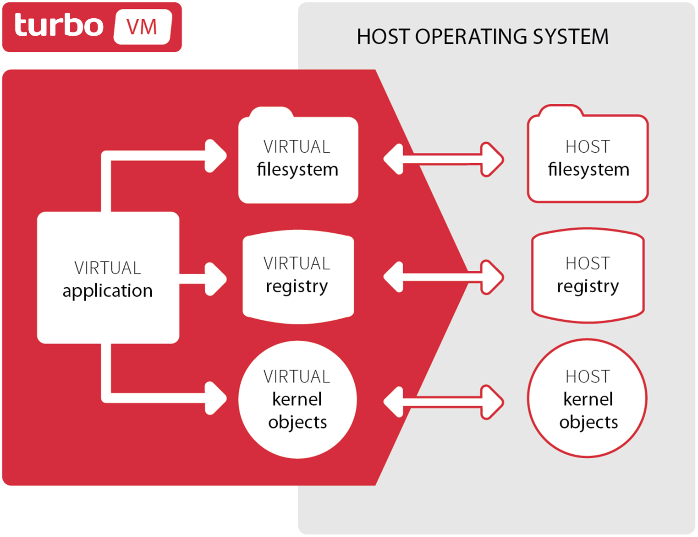

## What is Turbo?

Turbo allows you to package applications and their dependencies into a lightweight, isolated virtual environment called a "container." Containerized applications can then be run on any Windows machine that has Turbo installed, no matter the underlying infrastructure. This eliminates installs, conflicts, breaks, and missing dependencies.

Turbo containers are built on top of the Turbo Virtual Machine, an _application virtualization_ engine that provides lightweight
namespace isolation of core operating system objects such as the filesystem, registry, process, networking, and threading subsystems.

### Why use Turbo?

Turbo dramatically simplifies and makes more reliable all phases of the software creation and deployment lifecycle:

#### For Developers

With Turbo, developers can:

- Develop and package applications in isolated containers that contain all dependencies, including runtimes such as .NET and Java, and databases such as SQL Server and MongoDB
- Automate testing and share test environments with QA, developers, and beta users with the [Turbo Hub](https://hub.turbo.net/hub)
- Simplify development and eliminate bugs by deploying applications in a "known good" configuration with a fixed set of components and dependencies
- Containers obviate the need for installers and prevent conflicts with natively installed software

#### For QA

With Turbo, testers can:

- Run development code in a pre-packaged, isolated environment with software-configurable networking
- Rapidly rollback changes and execute tests across a span of application versions and test environments
- Test in multiple client, server, and browser environments concurrently on a single physical device
- Accelerate test cycles by eliminating the need to install application dependencies and modify configuration

#### For IT Managers

With Turbo, system administrators can:

- Remove errors due to inconsistencies between staging, production, and end-user environments
- Allow users to test out new or beta versions of applications without interfering with existing versions
- Simplify deployment of desktop applications by eliminating dependencies (.NET, Java, Flash) and conflicts
- Improve security by locking down desktop and server environments while preserving application access

### How does it work?

Turbo containers are built on top of the **Turbo Virtual Machine Engine**, an application virtualization engine which provides lightweight implementation of core operating system APIs, including the filesystem, registry, process, networking, and threading subsystems. Applications executing within the Turbo virtual machine interact with a virtualized filesystem, registry, network, and process environment supplied by the SVM, rather than directly with the host device operating system.

The image below illustrates how the SVM is isolated from the host environment.

The Turbo VM is required to implement containerization on the Windows platform since the underlying OS does not provide appropriate containerization primitives. Put another way, Turbo VM plays the same role for Turbo containers as LXC does for Docker containers.

Unlike hardware virtualization systems like Microsoft Virtual PC and VMWare, or hypervisor systems such as Hyper-V, Turbo VM operates on top of the base operating on the execution stack and virtualizes specific operating system features required for application execution. This enables virtualized applications to operate efficiently, with the same performance characteristics as native executables.

There are several advantages in choosing Turbo containers over hardware virtualization systems:

- _Optimal performance:_ Turbo containers run at the same speed as applications running natively against the host hardware, with a minimal memory footprint. In contrast, applications running within hardware-virtualized environments experience significant slow-downs and impose a large memory footprint due to the need to run multiple instances of a base operating system.

- _Dramatically reduced virtual environment size:_ Turbo containers require a footprint proportional to the size of the virtualized application, data, and included components. As a result, Turbo containers are small enough to be quickly downloaded by end-users. Hardware virtualization requires an entire host operating system image, including many basic subsystems that are already present on the end-user device. Each virtual machine may occupy several gigabytes of storage.

- _Application density:_ You can run multiple simultaneous Turbo environments per processor. Due to the high overhead of hardware virtualization, only a small number of hardware-virtualized environments per processor can run simultaneously.

- _Reduced licensing costs:_ Turbo does not require the purchase of separate operating system licenses to use a container. Hardware virtualization systems require a host operating system in order to function, which can impose additional licensing costs and restrictions.

- _User mode implementation:_ The Turbo application virtualization engine is implemented entirely in user mode and does not require administrative privileges. Note that applications requiring hardware device drivers or other non-user-mode software may require a hardware-virtualized environment to function properly.

### FAQ

**Do Turbo containers work by running a full OS virtual machine?**

No. Turbo containers use a special, lightweight _application-level VM_ called Turbo VM. Turbo VM runs in user mode on top of a single instance
of the base operating system.

**How long does it take to start Turbo containers?**

Turbo container startup time is very fast -- on the order of seconds or less. (Startup time excludes any time required to download images.)

**What is the performance overhead of running inside a Turbo container?**

Containerized applications consume only a small percentage of additional CPU and memory consumption relative to native applications. In nearly
all cases, Turbo overhead is negligible.

**When I run a container with multiple base images, does it link multiple containers or make a single new container?**

Running with multiple base images creates a single container with all of the base images combined. However, this is implemented in an optimized way that avoids explicit copying of the base image container contents into the new container.

Turbo then stores deltas on top of the base images as the container state evolves. The `,` operator works left-to-right, so files or settings in later arguments override files or settings in previous arguments.

**Does Turbo support virtual networking?**

Yes. Controlling both inbound and outbound traffic is supported. See the `--route-add`, `--route-block`, `--link`, `--hosts`, and `--network` commands. For details relating to binding and routing container ports or IPs see [Networking](../../getting-started/administrators/networking.html).

**Does Turbo support linking multiple containers?**

Yes. See the `--link` and `--network` commands.

**Is there a difference between server and desktop application containers?**

No, there is no special distinction. And desktop containers can contain services/servers and vice versa.

**How does Turbo handle licensing?**

Turbo does not modify the licensing behavior of any applications running virtualized or within a container. Running on Turbo is identical
to running on a regular PC, or running on virtual hardware such as Virtual PC or VMware. And Turbo runs on a single instance of a base
operating system.

**Does Turbo provide a mechanism to track licenses?**

[Turbo Server](https://turbo.net/server) includes a licensing module which will actively track and/or enforce licensing. For example, you can grant/deny privileges based on Active Directory or LDAP membership and define licensing constraints on a total user, total device, concurrent user, or concurrent device basis. Turbo Server also provides an analytics module that allows administrators to track application consumption and validate compliance
with licensing requirements.

**Where is the Turbo container hub?**

The public Turbo Hub is hosted at [https://hub.turbo.net/hub](https://hub.turbo.net/hub).

**What is the Turbo.net pricing model?**

Turbo.net offers Turbo Server for free for up to 5 users. Additional user seats may be purchased on a subscription basis. See [Pricing](https://turbo.net/pricing) for more information on Turbo.net pricing options.

**What if I don't want to host my repositories hosted on Turbo.net?**

Turbo is also available as an on-premises enterprise server. Please see **[Turbo Server](https://turbo.net/server)** for more information or to request
an evaluation license.

**Does Turbo support file associations and shell extensions?**

Yes. Turbo images and containers with shell extensions or file associations can be installed onto the host operation system. Use the `installi` or `install` command with the `--register-extensions` flag.

\*\*How do I pass parameters/arguments to the underlying container's cli?

Pass the arguments directly after the image or containers name: `turbo run clean ping google.com`. If the command line interface uses dash flags which requires escaping use `--` to pass parameters directly: `turbo run chrome -- -incognito`. This applies to the `run`, `try`, and `start` commands.
