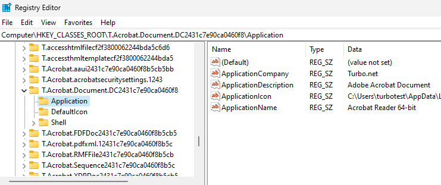
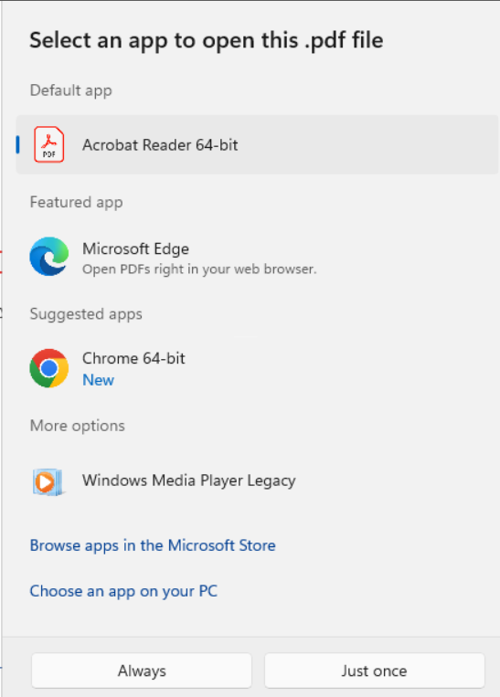

## Setting Default App Associations using ProgIDs

When a Turbo application is installed either using the `installi` command or when a Workspace is `registered`, the application will create a Turbo specific ProgID for each ProgID captured in the image.

The ProgIDs created will start with `T.` and can be found in the registry under HKEY_CLASSES_ROOT.



These ProgIDs can be used to set default application associations using the following methods.

#### DISM

```
Dism.exe /online /import-defaultappassociations:C:\windows\system32\DefaultFileAssoc.XML
```

- [Microsoft DISM Default Applications](https://learn.microsoft.com/en-us/windows-hardware/manufacture/desktop/dism-default-application-association-servicing-command-line-options?view=windows-11#import-defaultappassociations)
- [Optional GPOs](https://admx.help/?Category=Windows_10_2016&Policy=Microsoft.Policies.WindowsExplorer::DefaultAssociationsConfiguration)
- [Enable or Disable Open with when New App Installed in Windows 11 Tutorial | Windows 11 Forum (elevenforum.com)](https://www.elevenforum.com/t/enable-or-disable-open-with-when-new-app-installed-in-windows-11.5292/)

#### DEM

The easiest way to get the correct ProgID is to set the defaults after installing the application or registering the workspace and exporting them to an XML file. Then follow the steps in [Default Applications using VMware Dynamic Environment Manager](https://blog.eucse.com/default-applications-file-type-associations-and-protocols/)

### Workspace Registration

1. Subscribe the workspace:

```
turbo subscribe <workspace> --pull
```

2. Register the workspace:

```
turbo subscription register <workspace>
```

3. Launch the Windows Default Apps settings
4. For each file extension or protocol you want to set a default for type it into the search box, select the Turbo application you want to set as default and click `Set default`
5. Once you have set each default, open an Administrator command prompt and run:

```
Dism.exe /Online /Export-DefaultAppAssociations:C:\AppAssoc.xml
```

6. Editing the C:\AppAssoc.xml file in Notepad you can see the Turbo generated ProgIDs for the extensions:
   
   These ProgIDs are specific to the workspace application so if you delete a workspace application and recreate it, you would need to update the ProgIDs.

### Setting Defaults using DISM

Using DISM requires domain joined workstations.

1. Once you have generated the AppAssoc.xml file, you can import it using DISM to set the default associations for new user profiles. From an elevated command prompt:

```
Dism.exe /online /import-defaultappassociations:C:\AppAssoc.xml
```

2. Confirm the defaults by running the command:

```
Dism.exe /online /get-defaultappassociations
```

3. Optional: Set the group policy to apply the default associations at logon time.
   **Computer\Windows Components\File Explorer\Set a default associations configuration file**
   This policy will reset the user defaults during logon to whatever is set in the XML file.
4. Optional: Set the group policy to prevent the user choice prompt when new apps are installed.
   **Computer\Windows Components\File Explorer\Do no show the ‘new application installed’ notification**
   Enabling this policy will prevent the User Choice prompt when users first launch files associated with Turbo applications if multiple apps share the same extensions. For example, I have set the default for .PDF to Acrobat Reader, but because the workspace also installs Chrome which has the .PDF capability, Windows sees this as a new application and will prompt me which app to use:
   

### Setting Defaults with DEM

DEM also uses an XML file which requires the ProgIDs but the format is slightly different than DISM.

We suggest using the same method from the DISM solution to generate and export the XML file and use the ProgIDs from that file to create your DEM configuration file.

Follow [this guide](https://blog.eucse.com/default-applications-file-type-associations-and-protocols/) to implement the DEM solution.
