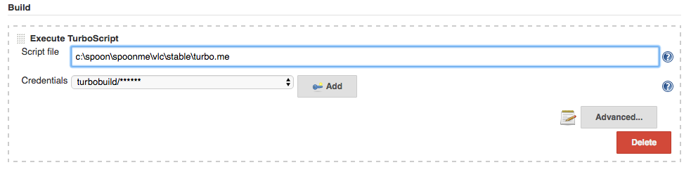
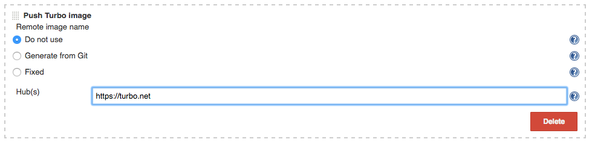
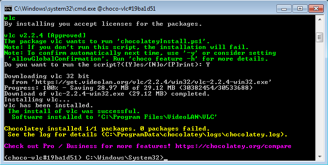
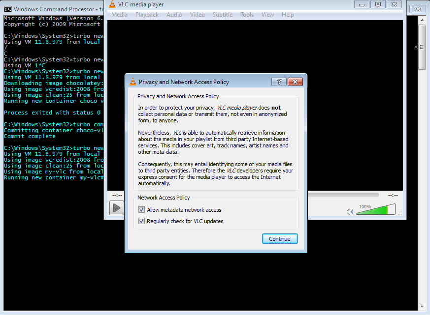

## Automation

When operating in a developer environment, the recommended practice is to automate creation of Turbo images.

Turbo supports a flexible scripting language called TurboScript. In this section, we’ll see how to use TurboScript in conjunction with different external tools to automate container builds.

### Building images with TurboScript

In this example, we’ll use TurboScript to automatically build **VLC Media Player**, a popular media player for Windows.

To execute a TurboScript build, we use the turbo build command. The script reference can be either a local path or a URL.

```
> turbo build https://raw.githubusercontent.com/turboapps/turbome/master/vlc/stable/turbo.me
```

We have provided the build script for this application at that URL. (More on this later.) Notice that by convention the TurboScript name is **turbo.me**.

If you have run this script before, you should add the `--overwrite` flag to the command to allow the build to overwrite the previously created image.

After a couple minutes, a new **vlc** image should be created. Try running it to confirm it works!

```
> turbo run vlc
```

### Inside TurboScript

Let’s look at what this script does. It starts by defining the _namespace_, _name_ and _title_ of the container image that will be created.

```
meta title="VLC stable"
meta namespace="videolan"
meta name="vlc"
```

Next we want to fetch the VLC homepage, parse the contents and extract the download link and version number for the latest release. The tools we chose for the job are [wget](https://app.turbo.net/hub/gnu/wget) and [Python](https://app.turbo.net/hub/python/python). Both of these tools are available in the Turbo.net Hub.

We bring these into the script’s scope as _transient dependencies_. Transient layers are available while the script is executing but are automatically removed when the final image is saved. Transient layers are applied with the `using` command.

```
# we'll use wget to download files and python to fetch and parse VLC homepage
using gnu/wget,python/python:3.4.1
```

```
# we'll need the 'requests' python module
cmd pip install requests --quiet
```

The `cmd` verb executes the given command. Here we use the Python **pip** package manager to install additional components.

With our tools ready we parse the download URL from the homepage and fetch the VLC setup file:

```
batch
 echo import requests >> getUrl.py
 echo import re >> getUrl.py
 echo host = "http://www.videolan.org/vlc" >> getUrl.py
 echo headers = {'User-Agent': 'Mozilla/5.0 (Windows NT 6.3; WOW64; rv:41.0) Gecko/20100101 Firefox/41.0'} >> getUrl.py
 echo r = requests.get(host , headers=headers, timeout=10) >> getUrl.py
 echo url = ''.join(list(re.findall('(get.videolan.org\/vlc\/.*exe)', r.text)[0])) >> getUrl.py
 echo print(url) >> getUrl.py

cmd python getUrl.py
 var url = last

# Download
 cmd "wget --no-check-certificate --no-verbose -O VlcSetup.exe %url%"
```

Notice another great TurboScript trick here — the `batch` block! The `batch` verb lets us inline script files within the script itself, avoiding the need to pull in an external **.py** file and allowing us to keep our script self contained. Scopes in TurboScript are determined by whitespace alignment, similar to Python.

Also notice the `last` keyword. This special variable is substituted by TurboScript with the return value from the previous command. Here it is used to capture the output from the Python script and place it into a TurboScript variable.

The next step is to install VLC. When using automation, be sure to use silent install options (the `/S` flag in this case).

```
# Install
 cmd VlcSetup.exe /S
```

With VLC installed the container image is ready. We do some final Python scripting to parse out the version number and set that as the container version tag:

```
batch
 echo import requests >> getVersion.py
 echo import re >> getVersion.py
 echo host = "http://www.videolan.org/vlc" >> getVersion.py
 echo headers = {'User-Agent': 'Mozilla/5.0 (Windows NT 6.3; WOW64; rv:41.0) Gecko/20100101 Firefox/41.0'} >> getVersion.py
 echo r = requests.get(host , headers=headers, timeout=10) >> getVersion.py
 echo version = ''.join(list(re.findall('(get.videolan.org\/vlc\/(.*)\/win.*exe)', r.text)[0][1])) >> getVersion.py
 echo print(version) >> getVersion.py

cmd python getVersion.py
 var version = last
```

We were only able to cover some TurboScript basics here. To learn more, view the [TurboScript Reference Guide](../../reference/turboscript/turboscript.html).

### Scripting builds

Now that we have our TurboScript and a command to run the build, we need to automate the rest of the build process.

Add the follow commands to your automated CI build script:

```
# Log in to your Turbo.net account
turbo login <username> <password>

# Execute the TurboScript and build a new image
turbo build -n=<name> C:\path\to\turbo.me

# Push the image to our repo
turbo push <name>
```

(You may want to use an API key instead of your password for automated logins. We'll discuss API keys in just a moment.)

Once the image is pushed, other users and processes can pull and run it instantly!

### Integrating with MSBuild and Visual Studio

Now let's integrate our container build step with MSBuild, Visual Studio's build system. (The same basic steps will work with any IDE.)

The easiest way to integrate with Visual Studio/MSBuild is to add a **Post-build event** to your project.

Right-click on your project in Visual Studio and select **Build Events** from the left-hand menu.

In the **Post-build event command line** box, add the line:

```
turbo build -n=$(SolutionName) $(SolutionDir)\turbo.me
```

For solutions with multiple projects, we recommend only triggering a post-build event for the last project in the build chain. This may require customizing your TurboScript to also pull in the build outputs from these other projects.

As before, you could also optionally add a `turbo push` event to automatically generate a repository version on each build. This is the recommended practice for continuous integration style development.

### Automating with Jenkins

Jenkins is a popular and free open source continuous integration (CI) system. Turbo directly integration with Jenkins that allows container images to be built as part of the CI process.

To follow along with this section, you'll need to install the [TurboScript plugin for Jenkins](https://wiki.jenkins-ci.org/display/JENKINS/TurboScript+Plugin) into your Jenkins environment. Install it by opening the **Jenkins Plugin Manager** and install the latest **TurboScript plugin**.

First we need to setup the Jenkins job. Save the script file on the Jenkins host machine. Change [line #15](https://github.com/turboapps/turbome/blob/master/vlc/stable/turbo.me#L15) to use your own Turbo.net username.

From the Jenkins Dashboard create a new Jenkins job of type **Turbo Project**. Add an **Execute TurboScript** build step and connect it to the script just saved.



We want to push the container image created to the Hub, so we add a **Push Turbo Image** build step:



Save the new Jenkins job and trigger a run to see your automated build in action!

### Automating Turbo with Chocolatey

Chocolatey is a package manager for Windows desktop applications. We can use TurboScript to leverage Chocolatey to create Turbo images. This is powerful since any application with a Chocolatey package can be used to create a Turbo container. As of this writing there are nearly 3,000 distinct Chocolatey packages available.

Let's repeat our VLC example using Chocolatey instead of a native TurboScript:

```
> turbo new --name=choco-vlc clean --using=chocolatey/chocolatey
```

This command creates a new container named **choco-vlc**. The `--using` flag lets applies Chocolatey as a transient layer within the container. Recall that this will allow us to use Chocolatey within the container but remove it from the final image. We saw this earlier in the TurboScript but here we see how to apply using from the command line.

In some cases other dependencies may be required to install the chocolate package such as PowerShell. In this case, just add additional transient layers: `--using=chocolatey/chocolatey,microsoft/powershell`.

In the command window that opens run:

```
choco install vlc -y
```

The VLC package should start to download and install successfully within the container.



When the install has completed, close the command window.

```
> exit
```

In the original command window used to create the container, we commit our image.

```
> turbo commit choco-vlc my-vlc --startup-file="@PROGRAMFILESX86@\VideoLAN\VLC\vlc.exe"
```

Note we set the appropriate startup file using the `--startup-file` flag so the container runs VLC on startup (rather than a command prompt containing VLC).

We can now test the image by launching it in a new container. In a command window, enter:

```
> turbo new my-vlc
```

VLC should launch:



### Sample TurboScripts on GitHub

TurboScripts for many popular applications have been open sourced and are available in the [turboapps GitHub repository](https://github.com/turboapps/turbome).

Looking at examples is a quick way to pick up the basics of TurboScript. Pull these down, customize your builds -- and remember to contribute your own TurboScripts back to the community by sending a pull request!

### API keys for scripting and authentication

To allow authentication in the context of scripting and automation, Turbo supports authentication via _API keys_. API keys eliminate the need to hard code passwords or pass them as parameters to your scripts.

The first step is to create an API key. To do this, go to your organization settings, and then select **Devices & API Keys** on the right menu. (You can also generate and manage API keys for an individual account on the [Account Settings](https://turbo.net/settings) page.)

Once here, click **Add API Key** to generate a new key.

Notice that when you hover your mouse over an API key a **Remove** button is shown. Use this button to remove the key and revoke its access to your organization.

There is no limit to the number of keys you can generate. You may decide to create and manage different keys for different teams or for different user access, allowing you the flexibility to revoke them independently without disrupting all key users.

Click **Copy Key** and head back to the command line.

Using the API key is easy -- just include the key in the `turbo login` command using the `--api-key` flag:

```
> turbo login --api-key=9ZoKH_336g0MqP2yptwfrv9B1XUm8YFPnCZNugVQNr4
testorg logged in at 2/26/2016 3:53:31 PM
```

The session is now authenticated in the organization account context. The account will stay logged in until the API key is revoked or the session is closed with the `turbo logout` command.
