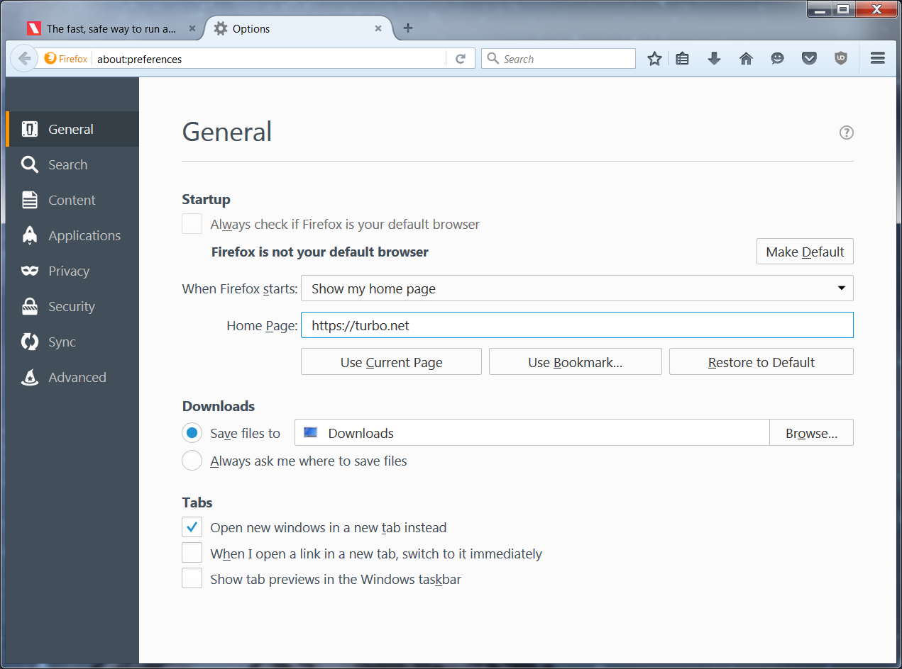
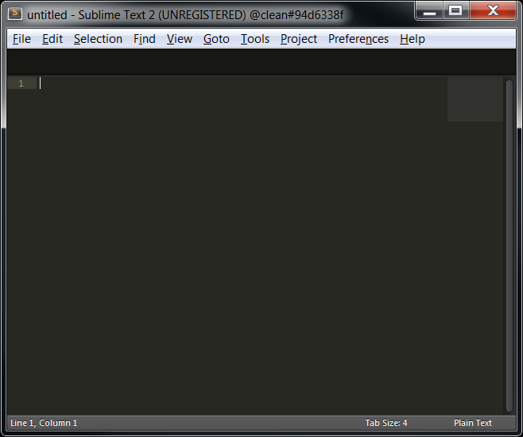

## Creating Images

In the previous section, we used several ready-to-use images from the Turbo.net Hub. But what if we want to create or customize our own images?

### Customizing applications

Recall that in the previous section we launched several Firefox containers from the Turbo.net Hub. Applications in the Hub are configured with installer defaults. Let’s see how to customize images with our own preferred settings.

Launch a new Firefox container as before:

```
> turbo new firefox
```

In this example, we modify the Firefox container by setting the homepage to a new URL from the **Options** menu:



Close the browser window to stop the container.

We suggest restarting the container to verify the all of the settings are configured as desired. This will be the same experience as your users when they launch the final image:

```
> turbo start e4a84281
Using VM 11.8.960 from local
Using image vcredist:2008 from local
Using image clean:25 from local
Using image firefox:47.0.1 from local
Using image firefox-base:47.0.1 from local
Running existing container firefox#e4a84281 with visibility private
```

Notice that if we use the `new` command to start a new Firefox container, the default home page still appears.

```
> turbo new firefox
Using VM 11.8.960 from local
Using image vcredist:2008 from local
Using image clean:25 from local
Using image firefox:47.0.1 from local
Using image firefox-base:47.0.1 from local
Running new container firefox#b05176b2 with visibility private
```

To publish our modified Firefox container, we must create a new image. To create an image from a container, use the turbo commit command:

```
> turbo commit e4a8 firefox-turbo
```

The first argument to commit is the identifier of the container being committed. Observe again that we used prefix matching to shorten the container identifier. The second argument is the name of the new image. By convention, modifications to a base image are named following the pattern **<base image>-<modification name>**.

Finally, we can launch a new instance of our custom image!

```
> turbo new firefox-turbo
```

Notice that a new container identifier has been assigned. Even though the configuration is the same as our initial container `e4a84281`, the container we just launched is a new instance of a container instantiated off the `firefox-turbo image`.

### Removing images

Since we only created the `firefox-turbo` image for testing purposes, we’d like to remove it to keep our local repository clean.

Images can be removed using the `rmi` (remove image) command:

```
> turbo rmi turbo-clean
Image firefox-turbo was removed
```

The `rmi` command also accepts wildcards. For example, all images can be removed from a device with the command `turbo rmi *`.

### Installing custom applications

So far we have been using applications that were already available in the Turbo.net Hub. But what if we want to install completely custom applications into our containers?

In this example, we’ll install Sublime Text editor into a container. (Sublime Text is a popular text editor.) To follow along with this demo, you’ll need to download the Sublime Text installer:

[Download Sublime Text 2.0.2a Setup.exe](https://app.turbo.net/tour/Sublime%20Text%202.0.2a%20Setup.exe)

We assume in this example that the installer is downloaded to the folder `C:\Installers`.

You can install applications into containers just like you would a normal desktop. However notice we have a small problem — how do we get the installer binary into the container?

The `--mount` flag causes the specified directory to be mounted within the container. Mounted directories on the host device are accessible from within the container context exactly as they would be on the host device.

```
# Mount a host folder into the container that contains the setup file
> turbo new clean --mount="C:\Installers"

# The native C:\Installers folder is now accessible from the container command prompt
(clean#94d6338f) C:\>cd "C:\Installers"
(clean#94d6338f) C:\Installers>dir
 Volume in drive C has no label.
 Volume Serial Number is DADA-BCA1

 Directory of C:\Installers

07/01/2016 01:58 PM <DIR> .
07/01/2016 01:58 PM <DIR> ..
07/01/2016 01:58 PM 5,601,488 Sublime Text 2.0.2a Setup.exe
 1 File(s) 5,601,488 bytes
 2 Dir(s) 114,467,921,920 bytes free
```

Notice that unlike a normal `clean` image, this container has a `C:\Installers` directory visible that contains the Sublime Text setup file.

Next, launch the setup and click through the installer as you would normally. Once it’s complete, you can navigate to the `C:\Program Files (x86)\Sublime Text 2` folder to confirm that Sublime Text has been installed in the container:

```
# Run the installer to install the program into the container
(clean#94d6338f) C:\Installers>"Sublime Text 2.0.2a Setup.exe"

# Verify the install
(clean#94d6338f) C:\>cd "Program Files (x86)\Sublime Text 2"
(clean#94d6338f) C:\Program Files (x86)\Sublime Text 2>dir
 Volume in drive C has no label.
 Volume Serial Number is DADA-BCA1

 Directory of C:\Program Files (x86)\Sublime Text 2

07/01/2016 02:01 PM <DIR> .
07/01/2016 02:01 PM <DIR> ..
09/15/2010 10:06 PM 71,680    bz2.pyd
09/15/2010 10:06 PM 1,852     Microsoft.VC90.CRT.manifest
09/15/2010 10:06 PM 572,928   msvcp90.dll
09/15/2010 10:06 PM 653,136   msvcr90.dll
07/31/2012 09:54 PM 4,206     PackageSetup.py
07/01/2016 02:01 PM <DIR>     Pristine Packages
09/15/2010 10:06 PM 153,088   pyexpat.pyd
09/15/2010 10:06 PM 2,145,280 python26.dll
09/15/2010 10:06 PM 1,484,587 python26.zip
09/15/2010 10:06 PM 11,776    select.pyd
03/10/2012 08:23 AM 10,838    sublime_plugin.py
07/08/2013 11:25 AM 3,921,408 sublime_text.exe
09/15/2010 10:06 PM 585,728   unicodedata.pyd
07/01/2016 02:01 PM 13,381    unins000.dat
07/01/2016 02:01 PM 1,179,960 unins000.exe
07/01/2016 02:01 PM 20,903    unins000.msg
09/15/2010 10:06 PM 73,728    _ctypes.pyd
09/15/2010 10:06 PM 86,016    _elementtree.pyd
09/15/2010 10:06 PM 286,208   _hashlib.pyd
09/15/2010 10:06 PM 40,448    _socket.pyd
09/15/2010 10:06 PM 665,600   _ssl.pyd
 20 File(s) 11,982,751 bytes
 3 Dir(s) 114,456,604,672 bytes free
```

Finally we can launch the `sublime_text.exe` executable!

Take note of the full path to the startup file as we’ll need it later.

```
# Run the program inside of the container
(clean#94d6338f) C:\Program Files (x86)\Sublime Text 2>sublime_text.exe
```



### Saving new images

Now we have a useful container that has Sublime Text installed.

As before, we’ll use the `commit` command to create an image that we can distribute. But in this case we do not want the command prompt to open by default. An alternate startup file can be specified at commit time using the `--startup-file` flag.

Here we commit the container to a new image using the startup file path we noted previously:

```
# Save changes to the container to an image.
# The startup-file flag allows the image to automatically run an executable instead of opening a command prompt.
> turbo commit 94d6338f sublimetext --startup-file="C:\Program Files (x86)\Sublime Text 2\sublime_text.exe"
Committing container clean#94d6338f to image sublimetext
Commit complete
```

Now launch a fresh `sublimetext` container using the image we just created:

```
# Run the new image, the run command is similar to the new command but instead runs an existing container of the same image name if they exist
> turbo run sublimetext
```
