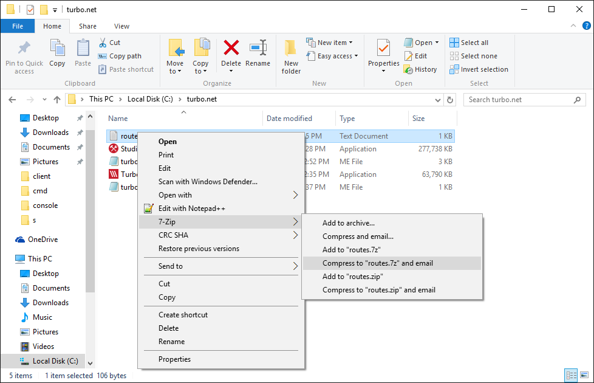

## Desktop Integration

Sometimes we want containers to behave as isolated environments. Other times, we want the container to interact (in a managed way) with the host desktop.

Turbo lets you to control the level and types of integration with the host desktop.

### Accessing local files

You may have noticed in previous examples that you could not access the **My Documents** or **My Downloads** file when using containerized applications. This is because the container has its own instance of the filesystem by default. In many cases, we may want to allow access to these built-in folders.

Turbo allows you to selectively de-isolate individual folders between the container and host device. We saw an example of this earlier with the `--mount` flag. But explicitly mounting all of the user folders would be tedious. Also, user folder names vary between operating system variants.

To solve this, Turbo provides a built-in isolation mode that de-isolates all major user folders:

```
> turbo run notepadplusplus --isolate=full+merge-user
```

When **Notepad++** starts, notice that you can view and edit files in your user folders.

### Shell integration

Full desktop integration extends beyond just the ability to access the host filesystem. For example, we may want the application’s Start Menu shortcuts, file associations, and other shell integrations to work as if the application was natively installed.

Turbo lets you “install” images via the `installi` (install image) command. Installed images are “wired up” to the shell and behave as if they are installed on the host device. But note that these applications are not actually installed — they are still running in the Turbo container environment, just with shell interactions and different isolation settings.

To install an image, we use the command:

```
> turbo installi 7-zip
Shortcut 7-zip created in Start Menu

>turbo installi notepadplusplus
Shortcut notepadplusplus created in Start Menu
```

If you press the Windows key, you will notice that **7-Zip** and **Notepad++** appear in the Start Menu! You can launch these applications through the normal Windows application launch experience.

Also, notice that if you right-click on a file in the Windows Explorer, you see the shell extensions normally associated with installed versions of **7-Zip** and **Notepad++**:



Installing a container does not automatically cause the image contents to download. The contents will download automatically when the application is first run. Container installation is intentionally designed this way so that many applications can be registered on the desktop very quickly.

To remove the applications, use the `uninstalli` command:

```
> turbo uninstalli 7-zip
Shortcut for 7-zip removed from Start Menu

> turbo uninstalli notepadplusplus
Shortcut for notepadplusplus removed from Start Menu
```

You can check that the Start Menu shortcuts, file associations, and shell extensions have been removed.

Installed containers can also be removed through the **Add/Remove Programs** section of the **Control Panel**.
