## Turbo on Citrix and RDS

System administrators can use Turbo to quickly deploy applications and custom containerized environments on Citrix, Parallels RAS, Workspot, Windows Remote Desktop Services (RDS), and other remote desktop systems.

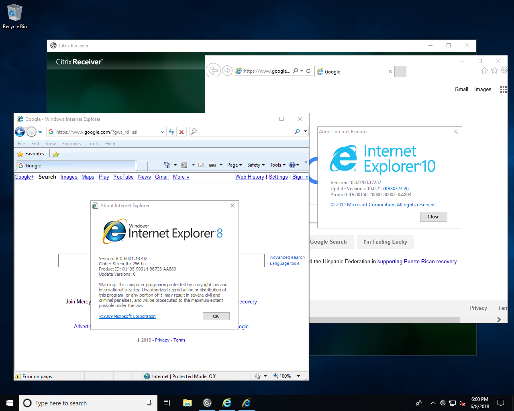

### Prerequisites

To get started, you will need to [download and install Turbo for Windows](https://turbo.net/downloads) for all users on the system.

If users will be streaming the application window rather than the whole desktop, we recommend hiding the Turbo GUI using the `--hide-gui` flag.

```
> start /wait turbo-client.exe --all-users --silent --hide-gui
```

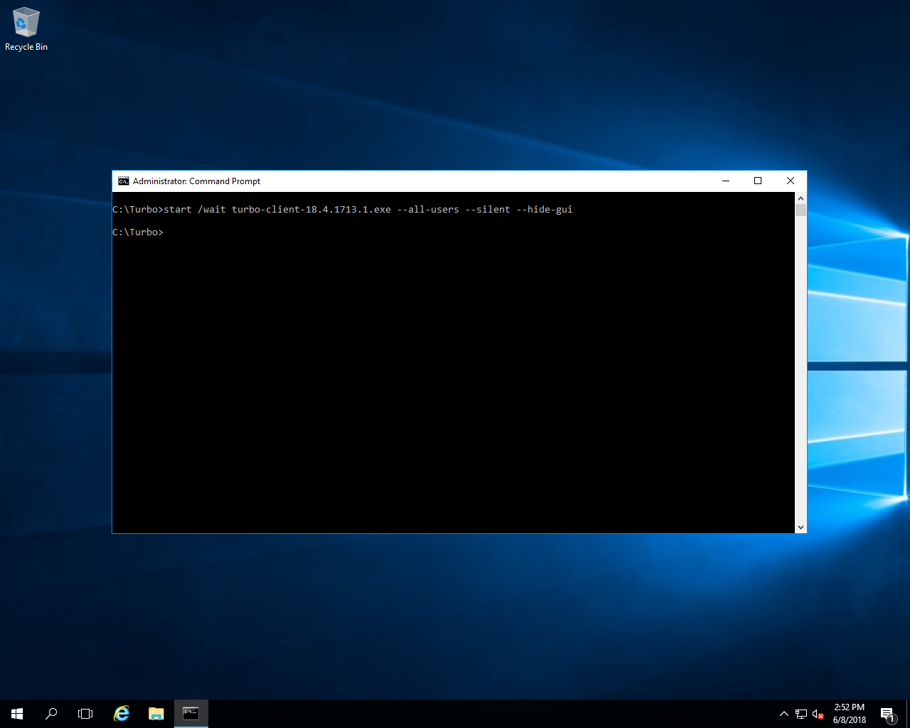

### Adding Applications to the Start Menu

Turbo application desktop integration, including Start Menu, desktop shortcuts, and file associations, can be enabled with the `turbo installi` command along with the `--all-users` flag. If you omit the version from the application identifier, then the latest version will be used.

```
# Sign in to Turbo.net (sign up at https://turbo.net/signup)
> turbo login

# Add the latest Firefox ESR browser to the Start Menu
> turbo installi --all-users mozilla/firefox-esr

# Add the latest Google Chrome browser to the Start Menu
> turbo installi --all-users google/chrome

# Add Internet Explorer 8 with Java 6.45 to the Start Menu
> turbo installi --all-users microsoft/ie:8,jre:6.45
```

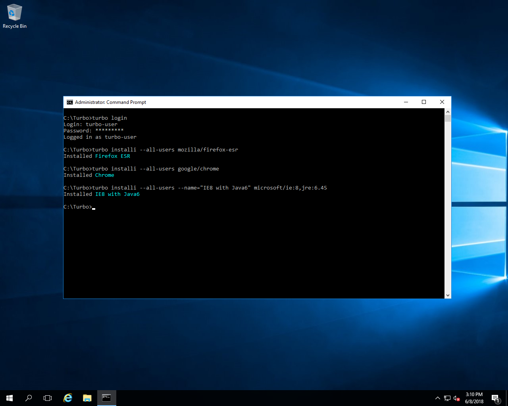

The _Firefox ESR_, _Chrome_,and _IE8 with Java6_ applications will appear in the Start Menu of the server.

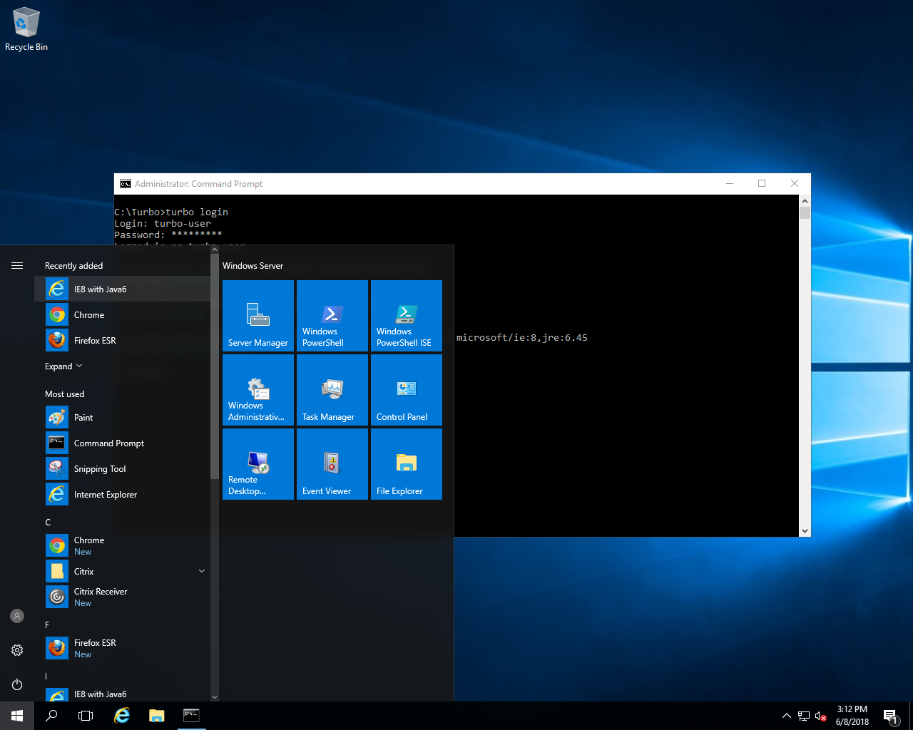

### Adding Applications to the Delivery Platform

Depending on the delivery platform in use, you may also need to add the applications in the delivery system’s administration interface.

In this example, we will add applications to Citrix XenApp using Citrix Studio.

Start **Citrix Studio** and go to **Applications** > **Add Applications**.

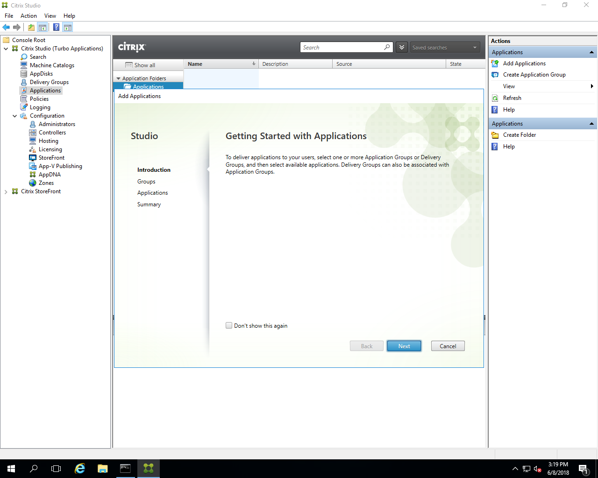

Select the option to **Add** applications From **Start Menu**…

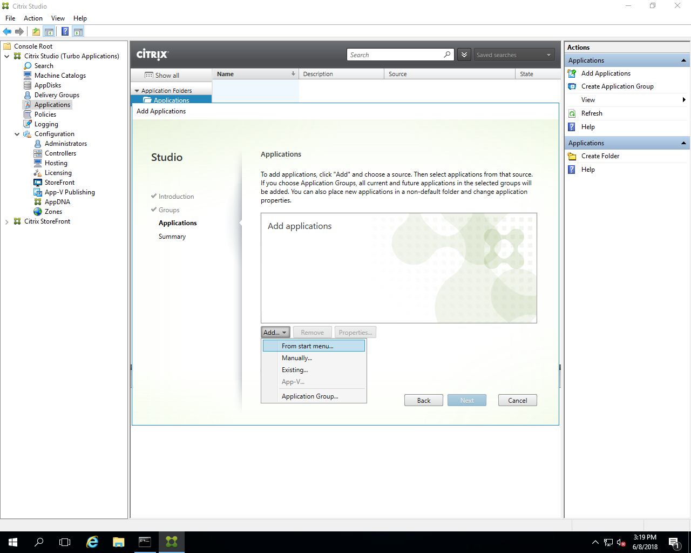

Then select the **Firefox ESR**, **Chrome**, and **IE8 with Java6** applications.

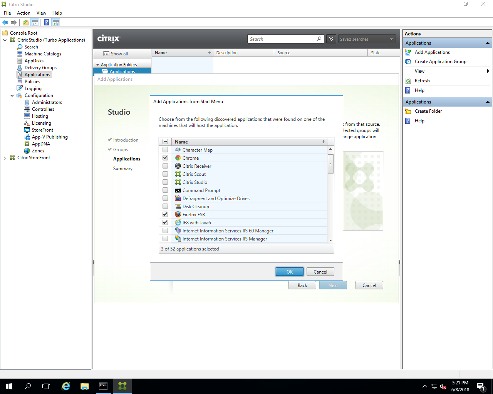

Click through to **Finish** to complete the process.

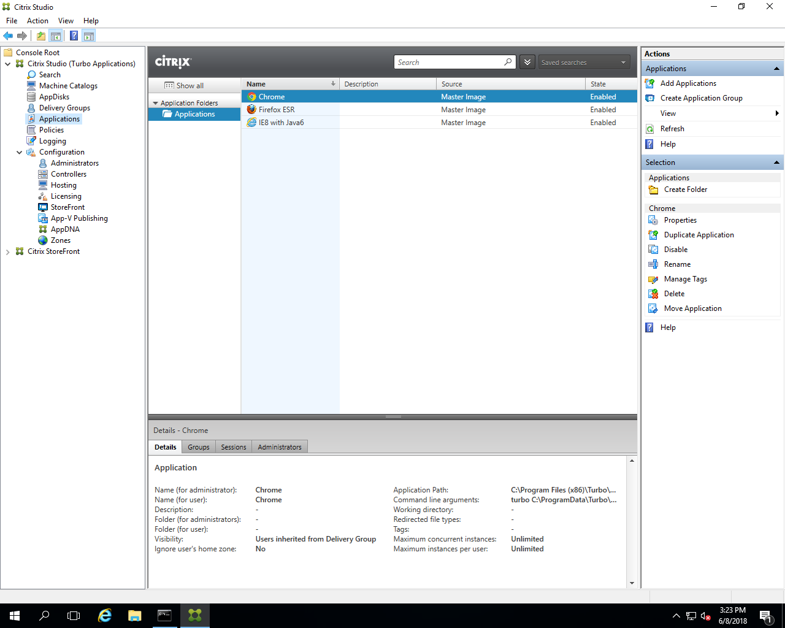

### Running the Applications

Once added to Citrix Studio users can access the applications from the Citrix StoreFront website or the Citrix Receiver application.

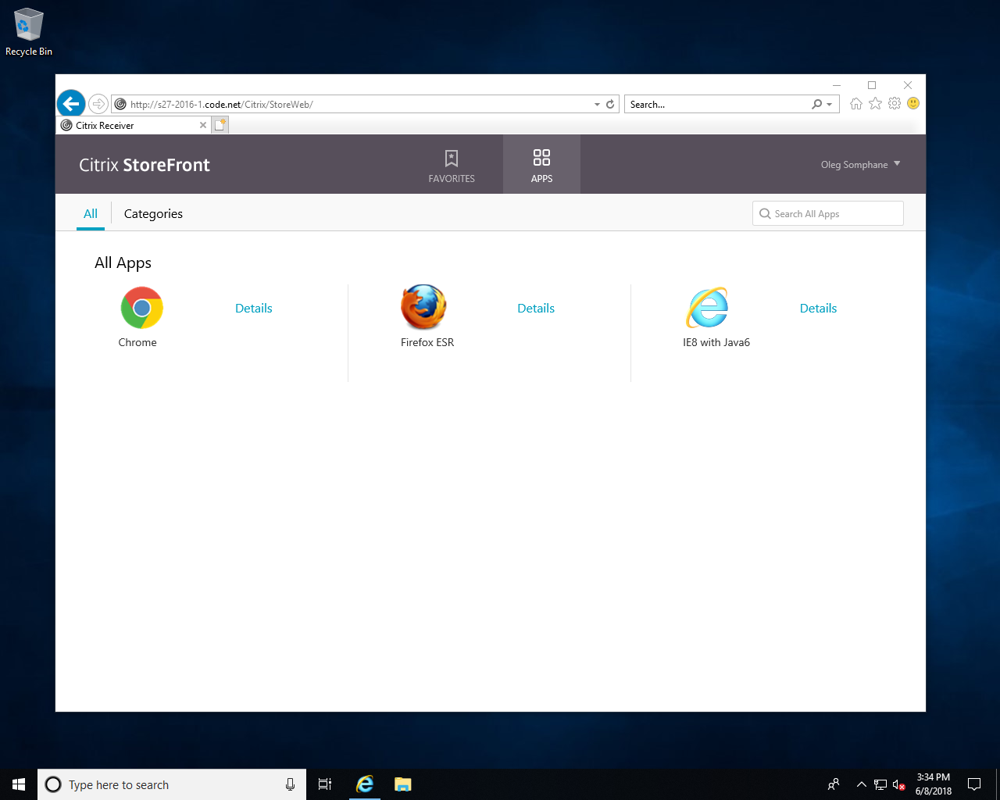

Click on an application to launch it.

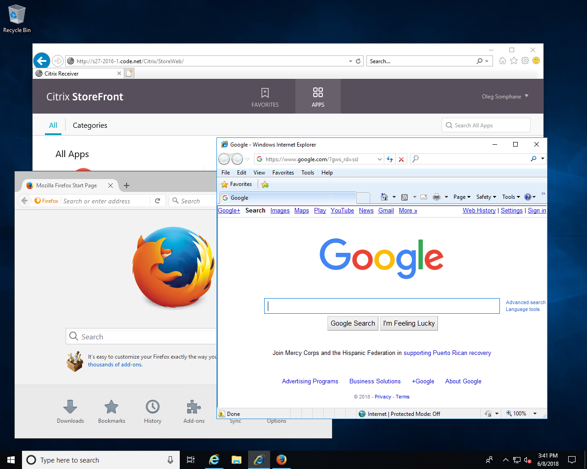
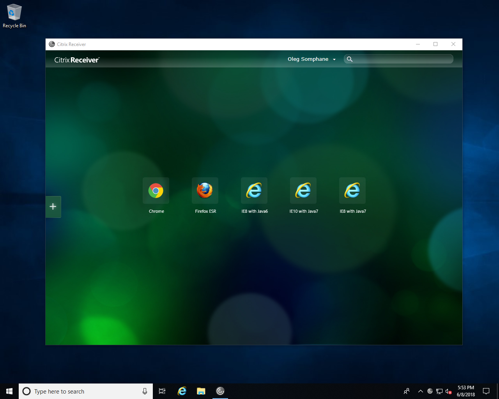

Note that because applications are executed in isolated Turbo container environments, any combination of browsers, plugins, and runtimes can run side-by-side on the same server.

For example, an **Internet Explorer 8 with Java 6** environment can run alongside an **Internet Explorer 10 with Java 7** environment or another **Internet Explorer 8 with Java 7** environment:


This allows elimination of Citrix siloing and consolidation of servers to a single version of Citrix using a single base image.
