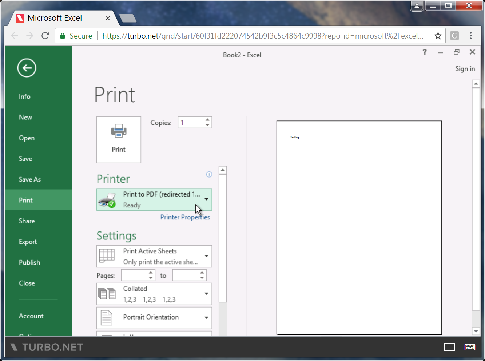
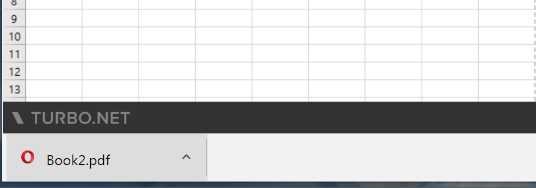
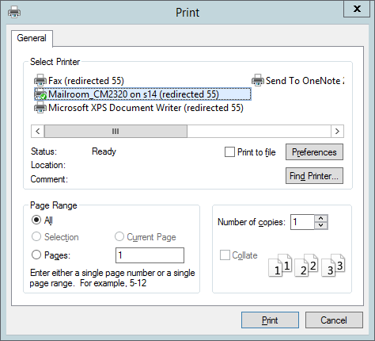

## Printing

Turbo supports printing both from the HTML5 and native client interfaces.

For the best experience, we recommend installing a Turbo native client to allow direct use of local printers.

### From a Web Browser

To print from the HTML5 client, select the **Print to PDF** printer:

The printer will download a PDF file through the browser. Open the PDF and print using your local printer.

### From Native Clients

If the Turbo application is executing on the local machine, the printer should automatically be visible to the application.

If the application is running in the cloud, local printers will be automatically redirected and visible to the application.

