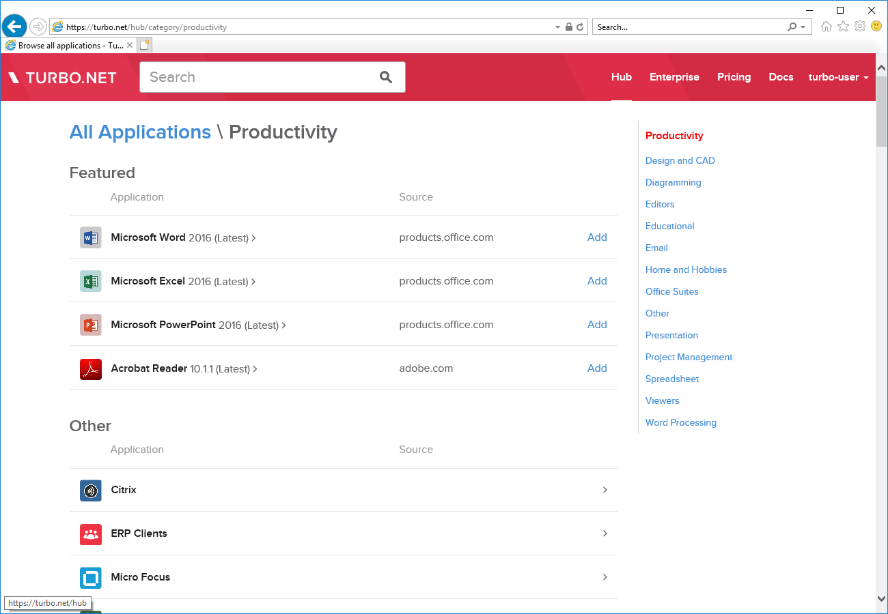

## Hub

The Turbo.net Hub is a public Hub server hosted on app.turbo.net that maintains thousands of publicly available applications. Users may pull and run public applications on their local machine or publish their own private applications.

On-premises Hub servers are also available with [Turbo Server](https://turbo.net/server), which allows enterprises to deploy and manage their own applications.

Users may browse the applications available on the Turbo.net Hub by clicking on the [Hub](https://app.turbo.net/hub) link at the top of the Turbo.net homepage.

For more information on running applications from the Turbo.net Hub, see [Running Applications](../../getting-started/getting-started/running-applications.html).
