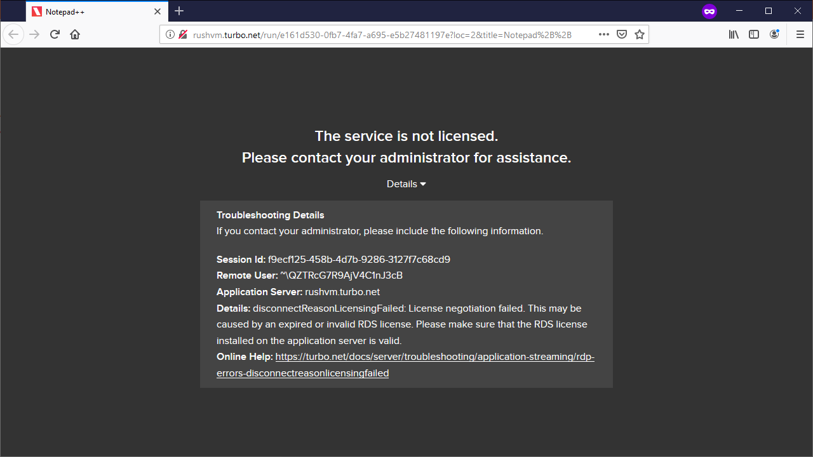
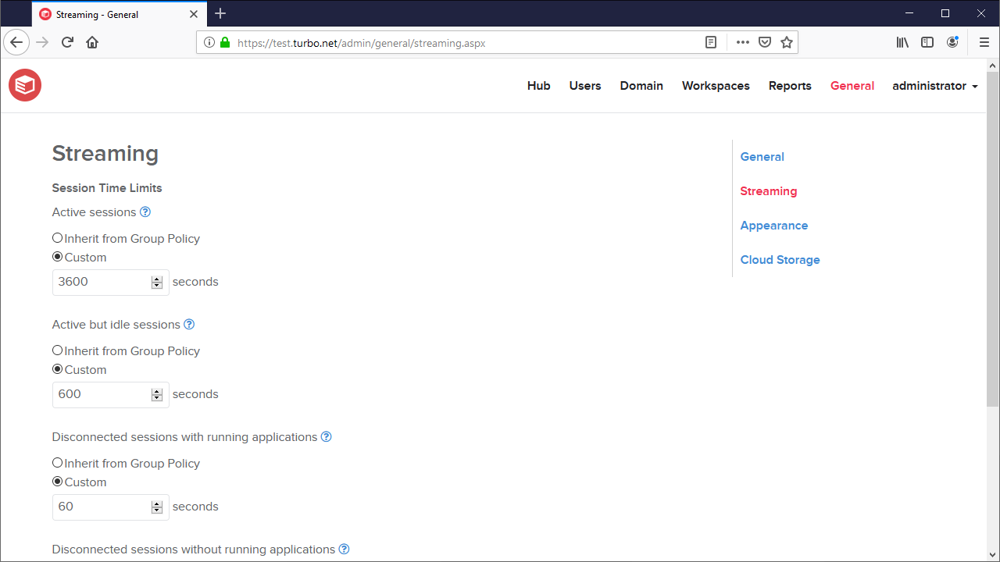
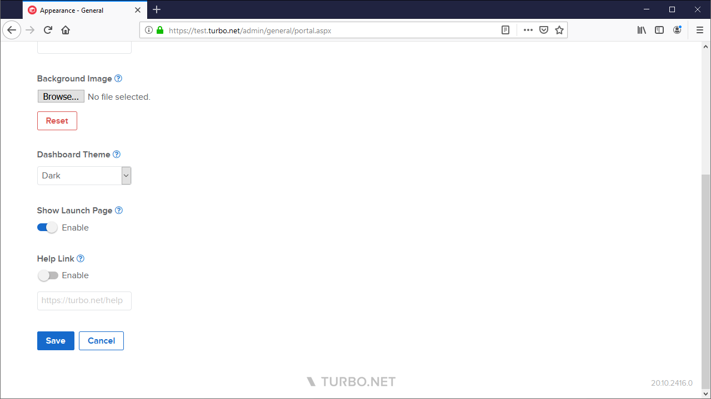

The November 2020 Turbo Server release includes the following major new features:

- HTML5 client and SSO logon errors now include additional troubleshooting details to simplify error resolution.

- Session time limits can now be configured from the administration site **Streaming** page.

- New **Show Launch Page** setting allows administrators to configure applications to launch directly from the dashboard or in a new browser tab.

Other improvements include:

- **RDS Licensing Tools** are now included when installing the Application Server.
- The workspace administration **Share Application** dialog now includes a **Name** field.
- HTML5 client launches from the workspace administration **Test** dropdown now enable diagnostic** **client logging by default.
- Workspace application command line now reports errors on invalid isolation modes.
- Improved install path validation during installation.
- Improved **Import Repository** input validation from the administration site.

This update includes fixes for the following issues:

- Fixed Single Sign-On (SSO) login errors caused by an invalid login state cookie.
- The HTML5 client login form no longer appears when using **Anonymous** authentication under certain error conditions.
- HTML5 client error text cannot be copied to the clipboard
- Incorrect scroll behavior on the administration site **Add Members **dialog
- Database connection strings are reset when clicking **Back** during installation
- Sorting order of workspace administration links in **Portal** account dropdown
- SSL gateway error when using multiple domain URLs in a multi-server farm
- Application launches may fail Intermittently after a server restart

