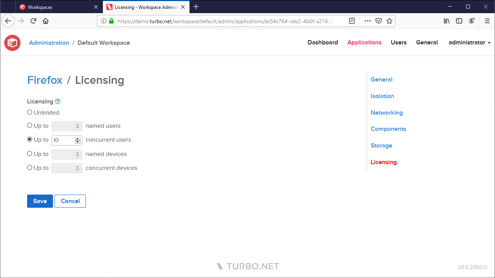
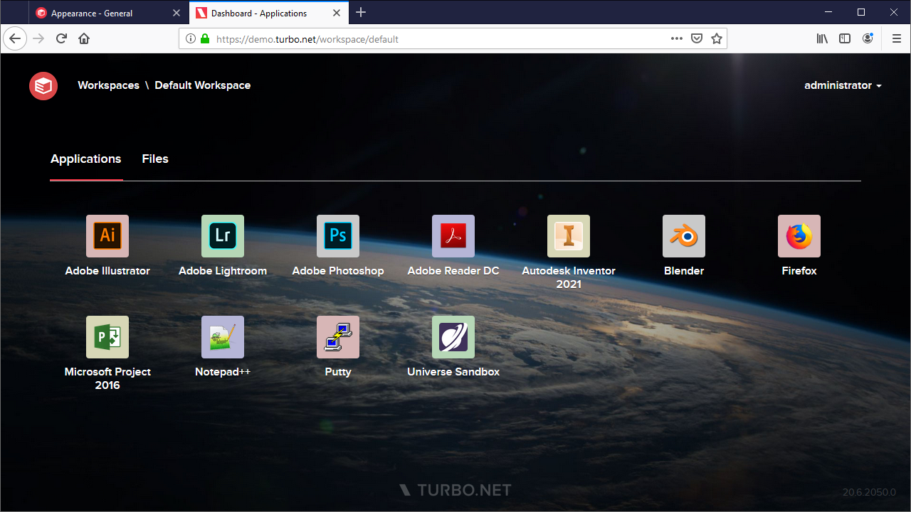
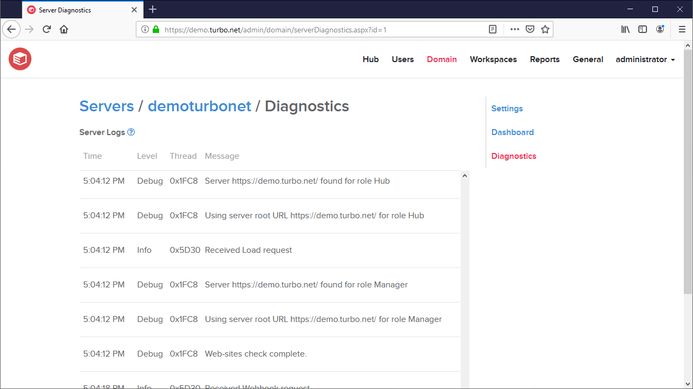
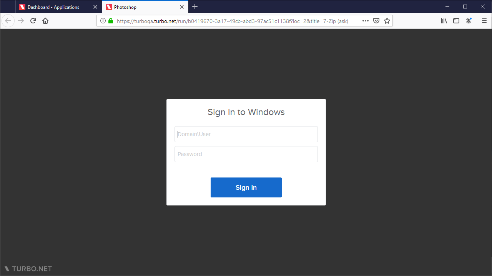

The June 2020 Turbo Server release includes the following major new features:

- **Application Licensing** controls are now available as part of Workspace Administration. Administrators can configure license controls based on named or concurrent users or devices.

- Light and dark **Portal Theme** options are now available on the **Appearance** settings. This allows for use of dark wallpaper images.

- **Server Logs** can now be viewed and downloaded from the Administration site.

- Added support for **Windows Domain User Logins** when launching applications in the cloud.

Other improvements include:

- The **Device Keys** table now includes a **Windows User** column.
- Drag & Drop now supported in the HTML5 client file browser.

This update includes fixes for the following issues:

- The Portal now redirects users with expired credentials back to their previous page after a successful Single Sign On.
- The Workspace Administration site now shows the user's full name, when available, in the top right instead of the login name.
- Fixed a T: drive connection issue, HTML5 permissions error, and incorrect help text on server farms with a single Domain URL configured.
- The Turbo Server service may intermittently fail to start on Windows Server 2012r2.
- Performance monitoring does not function properly for non-administrative service accounts.
- Incorrect **Database is not empty** warning during installation under certain circumstances.
- SAML logout may not complete successfully when the **HTTP-POST** binding is configured on the identity provider.

