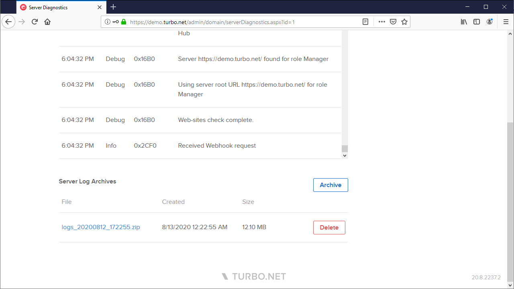
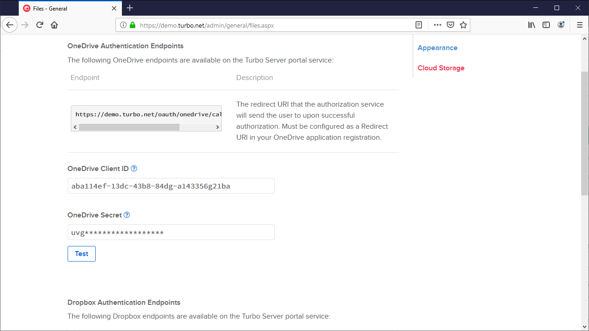
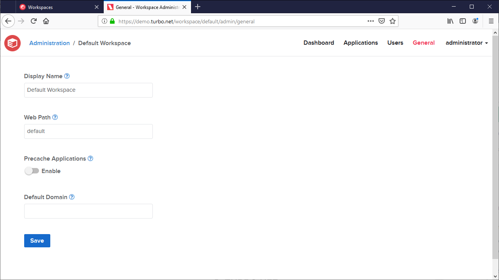

The August 2020 Turbo Server release includes the following major new features:

- New **Server Log Archives** feature allows administrators to create and download log archives directly from the administration site.

- New Cloud Storage **Test** feature allows administrators to test their storage configurations before committing any changes.

- New **Precache Applications** and **Default Domain** settings have been added to workspaces. The precache settings controls which workspaces are automatically cached to the Application Server; the Default Domain setting sets the default domain used to login when launching applications in the cloud with non-temporary profiles.

Other improvements include:

- Custom date range selector added to the **Reports** page.
- CSV and PDF download options added to the **Reports** page.
- Improved administration site loading speeds, navigation behavior, input validation, and error handling.
- Cloud Storage service secrets can now be edited in place.
- Daily log file rotations enalbed on proxy service logs. Logs are now moved to the **ProgramData** directory.
- Moved the Application Server logs directory from **ProgramData** into the Turbo Server install directory.

This update includes fixes for the following issues:

- HTML5 file transfers may fail when logged in as a domain user.
- RXP service logs were not being saved to the Turbo Server install directory when using a non-default install directory.
- **Optimize Storage** was not automatically restarting the Hub server to complete the optimization.
- Single Sign On client secret input was not obscured on the administration site.

