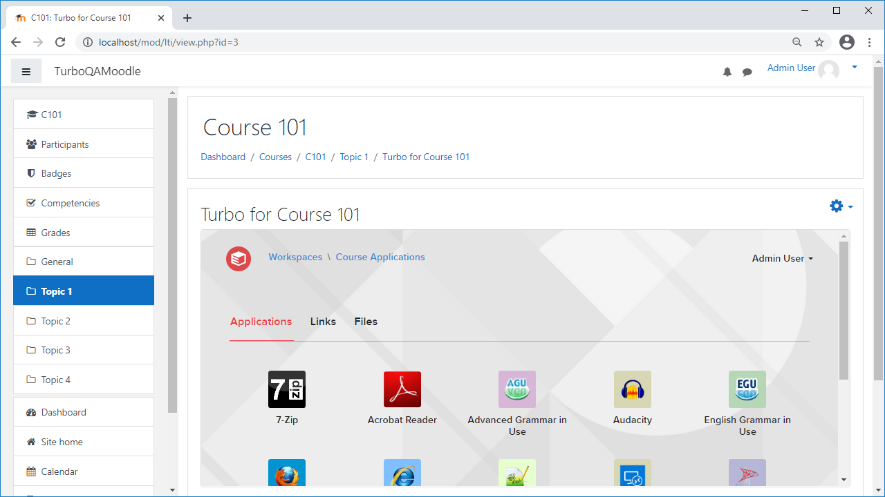
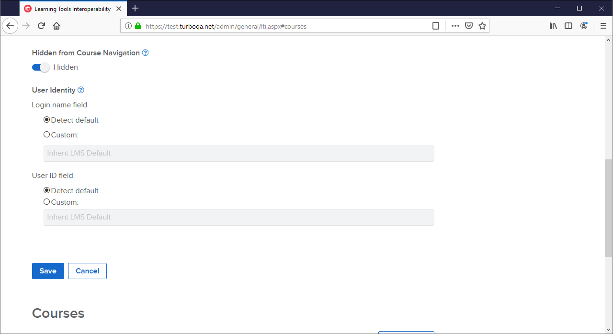
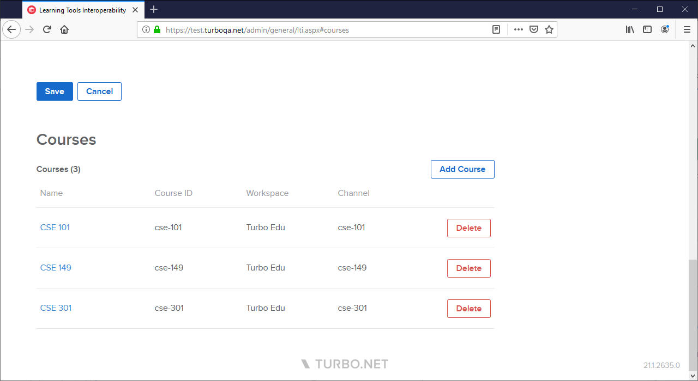

The January 2021 Turbo Server release includes the following major new features:

- Support for **Moodle **and **Blackboard **Learning Management Systems (LMS).

- Learning Tools Interoperability (LTI) **User Identity** settings now supports custom LMS user fields to login and create Turbo Server internal users.

- New LTI integration **Courses** settings map LMS courses to individual Turbo workspace channels, allowing multiple courses to share workspace content and configurations.

- New **Temporary User Profile Lifespan** setting allows administrators to specify the length of time that a temporary profile will be cached on the application server. The default value is 7 days.

Other improvements include:

- Initial page load times on the administration site have been significantly decreased.
- Administration site forms now warn about unsaved changes before navigating away from the page.
- New **Service Health Check** monitors and restarts unresponsive services.
- New **Content Security Policy** header has been added to the Portal site.
- Group policy errors now generate administration alerts.
- The **LTI Secret** may now be reset from the administration site.
- The **Directory Service** settings page has been split into multiple tabs with improved form control behavior.
- The HTML5 client now reports more descriptive errors on remote application errors, missing application versions, and application licensing limits.
- Updated various strings and administration site styles.

This update includes fixes for the following issues:

- Share links with user authentication did not redirect correctly after login.
- The Workspace Administration **Test** button did not appropriately display a Permission Denied error message.
- The application server settings page was incorrectly causing the Hub server to restart.
- Hub database migration could fail if the source path contained a locked file.
- Deleting a repository that was in use by a workspace item could cause broken icons and repository references.
- Workspace channels, channel items, and channel permissions were not being replicated correctly during Workspace federation.
- Directory Services could fail to sync if they were federated from a different server.
- Application server availability detection was incorrect after deleting an application server with pre-cached applications.
- The Portal server administration link was broken on servers with multiple domain URLs.
- Frame security error could cause cloud storage service logins to fail on servers with multiple domain URLs.
- Web Applications were being installed with the repository name instead of the application display name.
- Server administration site failed to load when accessed from an iframe.
- User Group management could fail when managing large user groups, and in rare cases incorrectly remove users.
- Users were not displayed correctly on the administration site if they were missing a display name.
- Channels could be created with conflicting web paths.
- Changing a Workspace web path would navigate to the incorrect URL.

