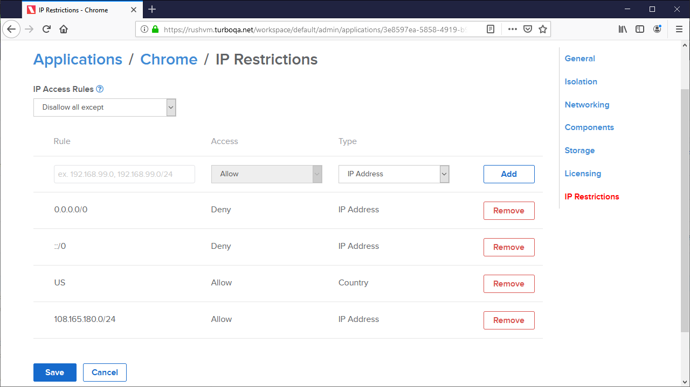
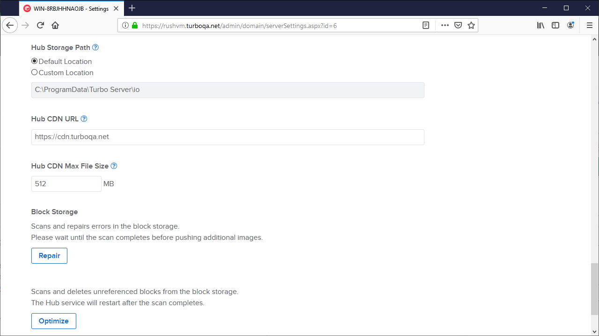

The November 2021 Turbo Server release includes several major new features:

- New! **IP Access Rules** feature allows access control to Workspace applications based on IP addresses and countries.

- New! **Hub CDN **feature allows Turbo images to be delivered from a configurable content delivery network (CDN).

Other improvements include:

- Administrators may now login to the administration site using Single Sign-On (SSO).
- Significantly improved performance of repository listings in Server administration and Workspace administration sites.
- **Import Repository** now imports images in descending release order, instead of upload time. A new **Release** input allows specifying the release to be imported.
- Deleting a repository now deletes all associated images from the Hub image cache.
- **Azure AD** Single Sign-On method has been replaced by **OpenID Connect**. Existing Azure AD settings will migrate automatically.
- **Hub Optimization** now shows an error before running if there is not enough disk space to perform the operation.
- The **Server Diagnostics** display now lists the server start time, up time, and pending Windows updates.
- New **Preemptive Authentication** setting can be disabled to hide the HTML5 client credentials dialog when using **Ask for Credentials** authentication, instead displaying the native Windows login screen.
- New **Reset **button on the Streaming settings page resets application server group policies to their Turbo Server default values.
- Improved Broker **Active Sessions** resource allocation strategy when applications are launched in rapid succession.
- User login and logouts now generate additional audit logs.
- Improved client analytics when launching Workspace applications
- Deleting your own Workspace or Channel permission now shows an additional warning.
- The Workspace Administration site shows a warning when editing a federated workspace.
- Users with active remote sessions will no longer be disconnected when their login expires.
- Significantly reduced size of the Turbo Server installer
- Turbo Server installation now creates Start Menu shortcuts for the Administration Site and an Administration CLI Console.
- The HTML5 client now displays an appropriate error message when an application configuration fails to download.
- The HTML5 client now uses the application icon as the favicon in application tabs
- Updated Turbo VM to 21.12.1626.2
- Various text, visual, and error message improvements

This update includes fixes for the following issues:

- Hub database migration can fail when changing the **Hub Storage Path** to a virtual file path.
- Identity replication can duplicate SSO user groups under certain circumstances.
- **Proxy Redirect** setting changes do not generate audit logs.
- Visiting the Workspace Administration site quickly after Workspace creation can result in a permission denied error.
- **Ask for Credentials** authentication can fail due to cached Windows credentials.
- Portal requests can fail when Turbo Server is configured with a **Let's Encrypt** SSL certificate.
- Reconnecting the HTML5 client to an existing session can result in a long loading splash display if the remote Turbo client is showing a dialog that requires user interaction.
- Mount points can fail to mount if the paths are not using folder aliases.
- Users with spaces in the username field are unable to launch remote applications.
- **Run in Cloud (Windowed)** on a Windows 10 Multi-Session server could fail to show the Windows login dialog when streaming with certain native clients and using **Ask for Credentials** or **Kerberos** authentication.

