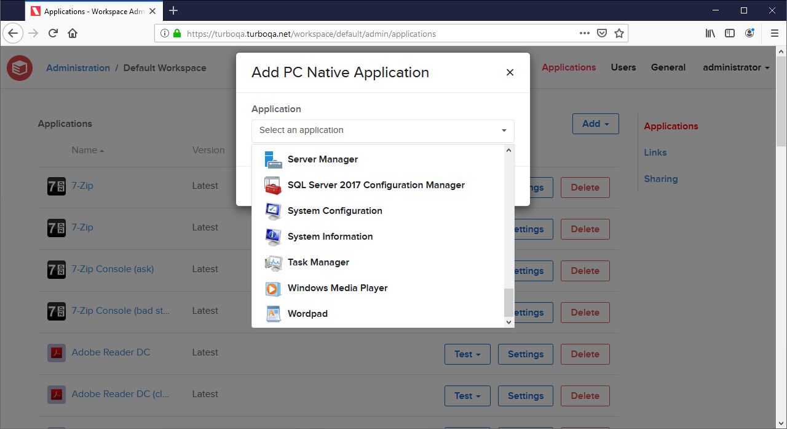
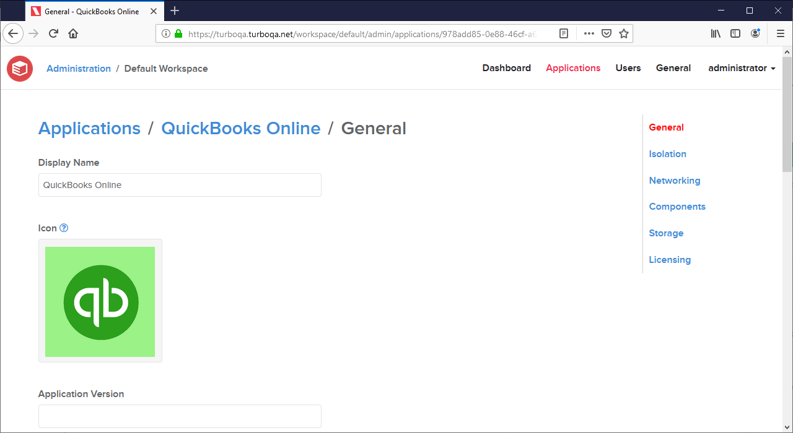

The March 2021 Turbo Server release includes the following major new features:

- This release introduces **PC Native Applications** as a Workspace object type. PC Native Applications launch Windows desktop applications that are installed *natively* on the application server in a containerized environment.

- **Custom icons** can now be configured on all workspace application types from the application settings page.

- **Web Applications** have been updated to improve customization and consistency with other application types. Please read our migration guide for information on how to migrate your existing Web Applications:

Other improvements include:

- A new **Integrations** section has been added to the administration site, which contains the Cloud Storage and Learning Tools Interoperability (LTI) integrations.
- The **Directory Service Schema** section has been moved to the **Directory Service** Items page.
- Portal user sessions recover more quickly after encountering server errors.
- The **Domain URL** may now be set from the command line administrative tool.
- Improved command line administration help text.
- Improved input and HTML sanitization on the LTI course page and during application installations.
- Updated various strings and administration site visuals.

This update includes fixes for the following issues:

- **SAML authentication** did not automatically assign user group permissions on login.
- Application licensing error messages did not always display correctly in the HTML5 client.
- User reports did not properly display the user name for deleted users.
- Assigning multiple group permissions with the same name could cause the portal dashboard to fail to load.
- The links on the Workspaces administration page were not using the proper domain URL.

