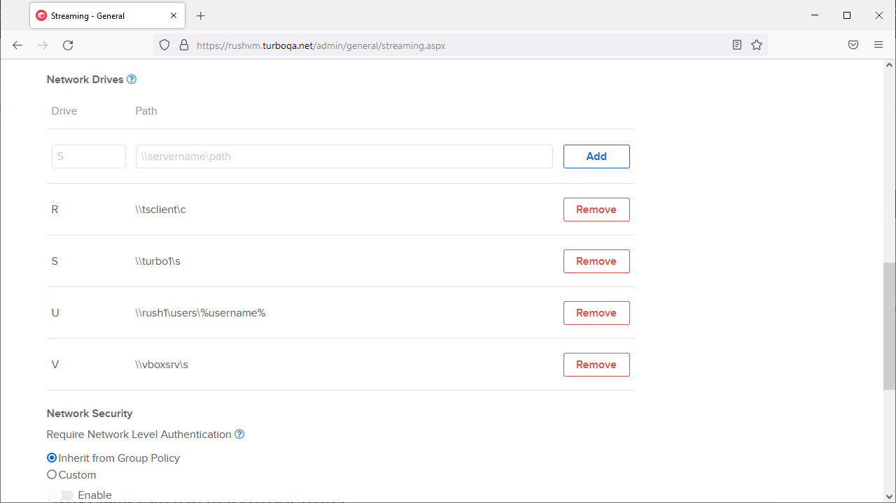
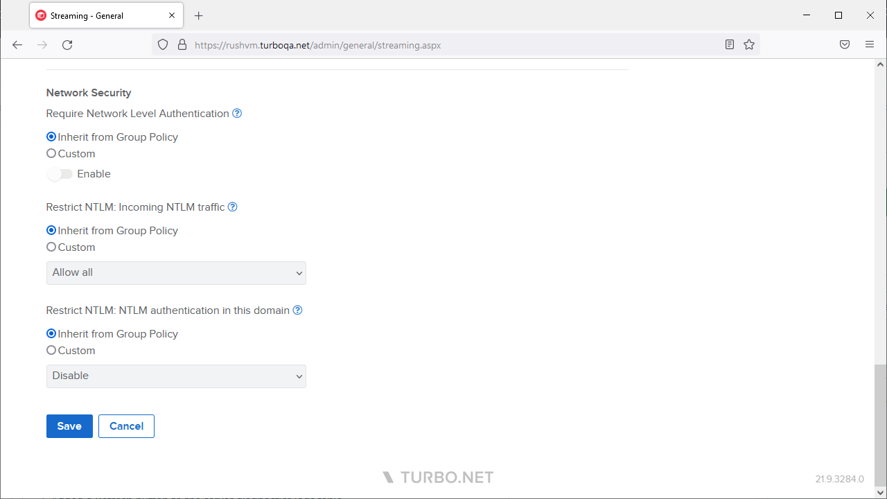
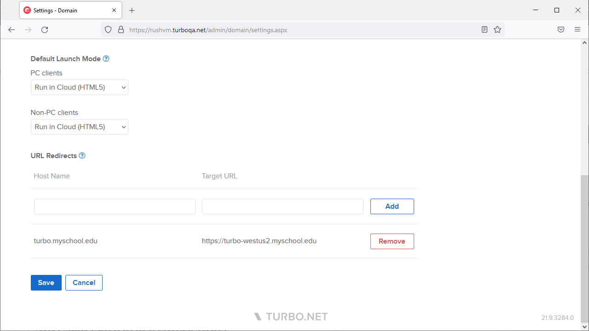

The September 2021 Turbo Server release includes several major new features:

- **Network Drives** option allow administrators to automatically map network drives into sessions when streaming remote applications.

- **Network Level Authentication (NLA)** and **NTLM** network security group policies can now be configured for remote application streaming.

- **DNS-based Load Balancing** is now supported via **URL Redirects** configuration. This allows setting up a single URL for DNS load balancers to redirect users to the appropriate Turbo domain.

- New **Synchronize across devices** and **Sessions are persistent** workspace application settings provide improved control over session storage.
- **Microsoft Windows 10 Enterprise Multi-Session (Azure)** is now a supported platform.

Other improvements include:

- **All** selection in workspace federation allows federation of all current and future workspaces.
- **Refresh** button added to the server **Diagnostics Logs** table.
- Improved **Status** column display for long domain server status messages.
- Images in the **Hub Image Cache** are now automatically deleted if the repository's revision is deleted from the Hub.
- Added **Update Cache** action that manually updates the Hub Image Cache.
- Disabling **Cache Temporary User Profiles** will now immediately delete temporary user profiles after logoff.
- **Reports** now include application display names.
- **Notice and Consent** dialog can now use Markdown formatting.
- Added a source repository link to the workspace application settings.
- Dashboard session details tooltip shows an expiration timer for disconnected sessions.
- Improved HTML5 client error display when a DRM error occurs.
- Portal Mac client download links now always download the latest package version.
- Increased the number of default **request threads** in the Apache reverse proxy to support larger concurrent loads.
- Disabled IIS trace logging by default to improve performance.
- Portal accessibility and support for screen readers, keyboard navigation, and other accessibility software has been improved to conform to Web Content Accessibility Guidelines (WCAG) 2.1.
- Improved input validation on various administration and Portal site forms.
- Updated various strings and logs on the Portal and administration sites for improved clarity

This update includes fixes for the following issues:

- Installer does not check the subject alternative name when validating certificates.
- Federation can fail if the Hub server is configured with a **self-signed certificate**.
- Disabling federation for a workspace does not fully disable federation for associated workspace applications and channels.
- Federation workspaces form can fail to load under certain circumstances.
- **HTTP to HTTPS** redirect uses the internal web service root instead of the domain URL.
- Favicons do not load correctly from certain URLs when adding a web application.
- Certain dashboard hover styles do not render correctly in Mac Safari.
- Session event webhook subscriptions can fail in rare circumstances, resulting in missing session tracking for a short time.
- Certain workspace application setting changes are not applied to users with cached remote sessions until service restart or cache expiration.

