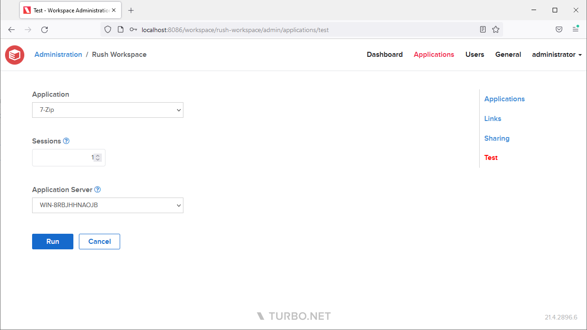
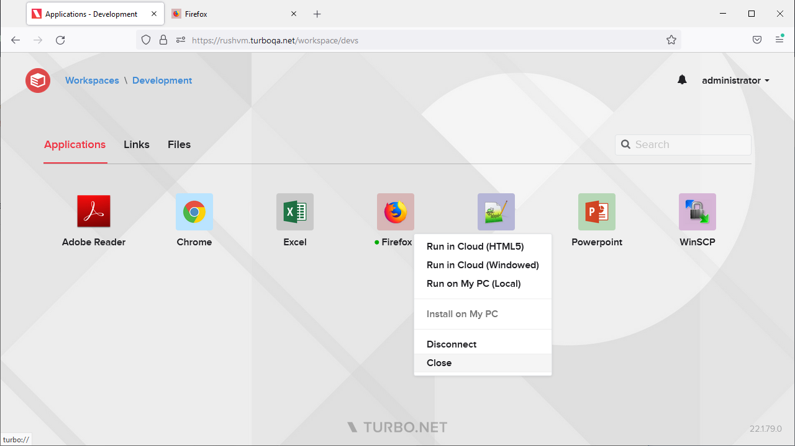

The January 2022 Turbo Server release includes several major performance and features enhancements:

- **Application launch times have been dramatically reduced**, with launches typically completing in under 3 seconds. Turbo achieves this by pre-configuring a pool of ready-to-use user profiles that are dynamically assigned to a user and application when a launch request arrives.

- New! **Advanced Testing** provides integrated load testing by automatically launching a large number of sessions against specific application servers concurrently.

- New! **Disconnect** and **Close** actions have been added to the HTML5 client and Portal dashboard when running remote applications, allowing sessions to be easily transferred between clients without restarts. HTML5 client tab closures now logoff the remote user session by default.

Other new features include:

- **Include Administrator Group** setting allows automatic federation of the Administrator group.
- Increased password security requirements for internal users.
- New **Show Password** icon has been added to all password inputs.
- New **Compromised Password** setting shows a warning when attempting to set a known breached password on an internal user.

Other improvements include:

- HTML5 client clipboard control now includes a close button
- Turbo Server logs are now automatically archived on service restart
- Reduced Turbo Server installer file size
- Improved workspace administration navigation on mobile devices
- Various text and style changes on the administration sites
- Updated Turbo VM to 22.1.9

This update includes fixes for the following issues:

- Applications launched in rapid succession could fail if synchronization is enabled.
- The **Domain Sessions** graph could display incorrectly for certain data sets.
- New dashboard notifications not displayed on the user dashboard under certain circumstances.
- The HTML5 client window switcher control could select the wrong window under certain circumstances.
- Remote application launches using temporary profiles could result in authentication errors due to cache synchronization issues.
- Some workspace administration web functionality did not support Internet Explorer 11.

