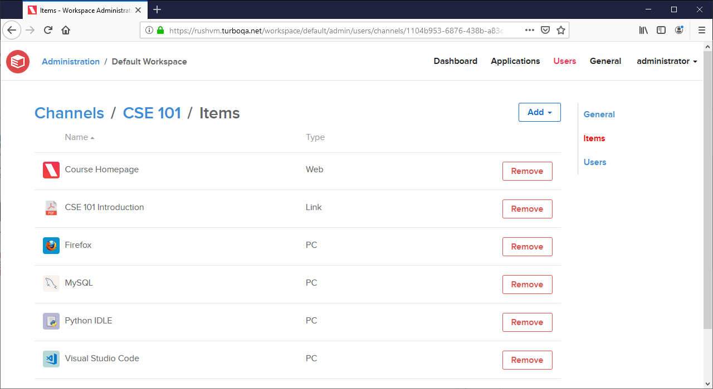
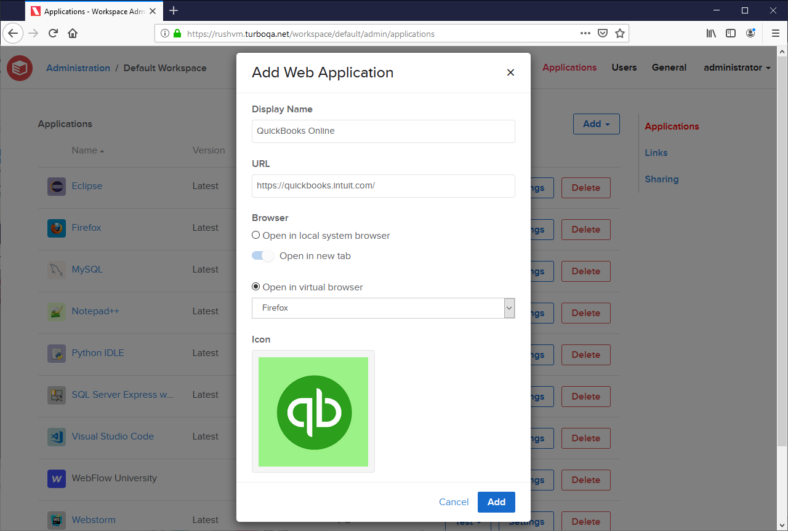
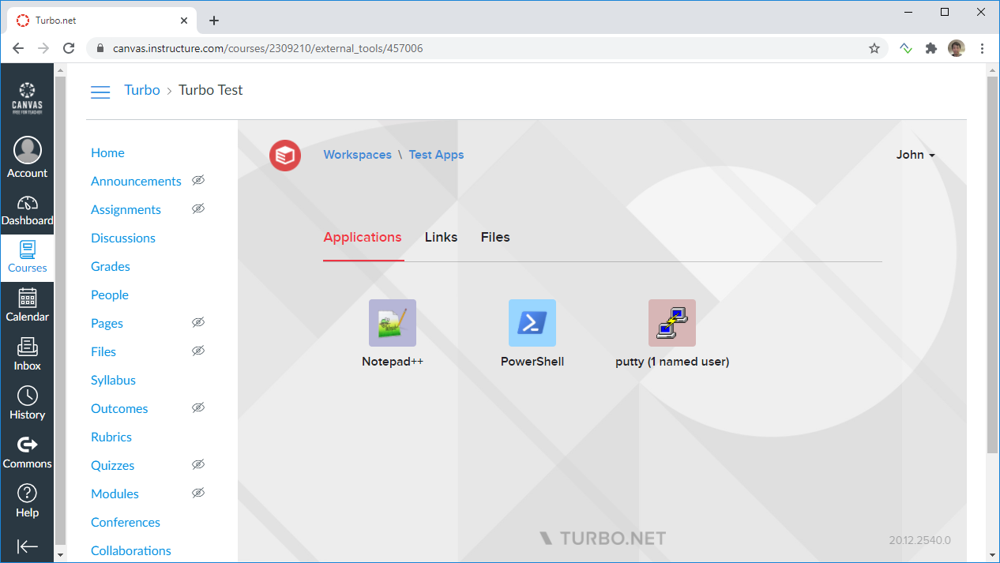

The December 2020 Turbo Server release includes the following major new features:

- Workspace items can now be grouped into **Channels** with customizable user and group permissions. Channels are ideal for assigning entitlements to specific classes, teams or departments. Channels are listed on the Portal Dashboard to permitted users.

- New **Web Application** and **Link** item types can now be added to workspaces, allowing users to open configurable URLs in a virtual browser sessions or in their native browser.

- New **Learning Tools Interoperability (LTI)** integration allows students and instructors to access course applications directly within **Canvas** and other LTI-compliant Learning Management Systems (LMS).

Other improvements include:

- **Google LDAP** authentication is now supported.
- New **Enable Drive Redirection** setting configures the visibility of mapped drives when streaming remote applications.
- New **Ticket Expiration Time** setting configures the expiration time for user logins.
- New **Up Time** statistics and a **Reboot Server** action have been added to the **Server Diagnostics** page.
- **OCSP Stapling** has been enabled to improve SSL certificate verification.
- SSL certificate fields now allow **.PEM** file extensions.
- New **Application Type** selector has been added to the **Repository Settings** page.
- The workspace permissions form now supports user and group search.
- Streaming settings now update the application server's local group policies and no longer require a server restart.
- Broker resource allocation strategy allows falling back to unresponsive but potentially functional application servers.
- Portal authentication recovers faster when the API service restarts or has connectivity issues.
- The Last Modified Date is now preserved in Server log archives.
- Improved service user database permission checks during server installation

This update includes fixes for the following issues:

- HTML5 client text input lost when running Powershell and Xencenter.
- The **Test** button on the administration site uses cached application settings under certain circumstances.

