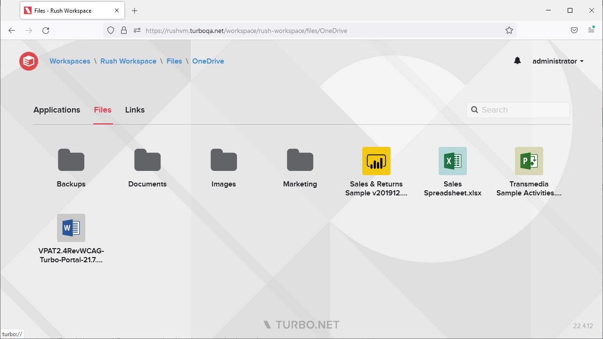
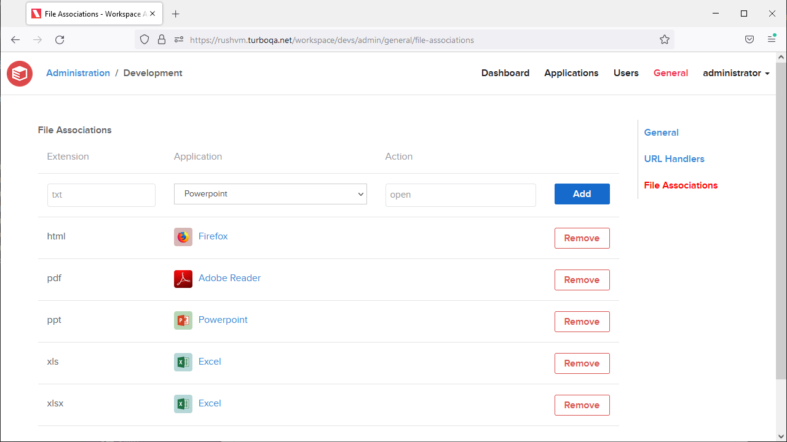

The April 2022 Turbo Server release includes several major new features:

- New! **HTML5 File Browser** lets users browse, open, and edit files directly within the Portal web interface. Users can easily interact with any connected T: drive storage provider via an associated Turbo application.

- New! **File Associations** can be added from the administration site to configure how users open or edit files from the file browser.

Other new features include:

- New **API Rate Limit** setting allows administrators to configure the maximum number of API requests allowed per IP address per second.
- New HTML5 client **Remember Me** option and an **Authentication** user settings page allow users to remember their login credentials when launching cloud applications.
- New **Read-Only Administrator** workspace permission role grants read access to workspace administration APIs.
- **Active Sessions** may now be viewed and managed from the application server dashboard.
- The **Portal Client Download Banner** may now be disabled.

Other improvements include:

- Improved **Reports** page load performance for large data sets.
- Improved administration site performance while the **Hub** is loading.
- Workspace **Application Version** and **VM Version** settings are now dropdowns.
- Improved **URI Validation** and default scheme for various administration URI inputs.
- Enabled the **User Profile Cache** by default.
- Improved server logs with additional diagnostic information.
- Improved various visuals and text.

This update includes fixes for the following issues:

- The Portal server administration link was incorrect in certain domain configurations.
- The Portal workspace channel dropdown was missing from the root Portal URL if exactly one workspace existed.
- Reconnecting to an existing application session could fail when specifying server tag restrictions.
- The HTML5 client file browser did not load correctly if the user logged in using certain Windows username formats.
- Cloud application launches could fail to use a newly added application version under certain circumstances.
- SSO logins for existing users could fail if the user identifier changed casing in the identity provider.
- Configuring SAML 2.0 single sign-on authentication could fail under certain circumstances.
- Some administration site tables were not sorting correctly.

