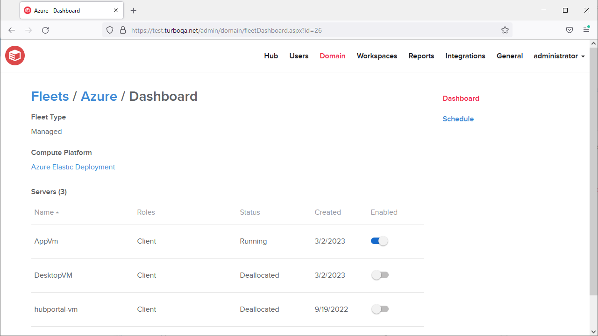
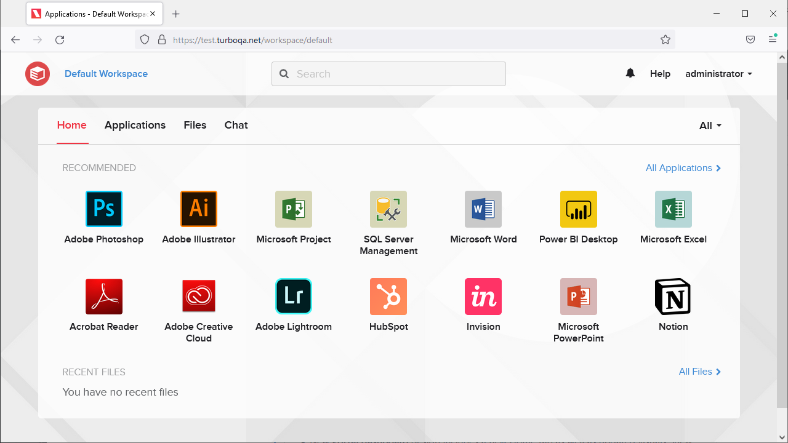
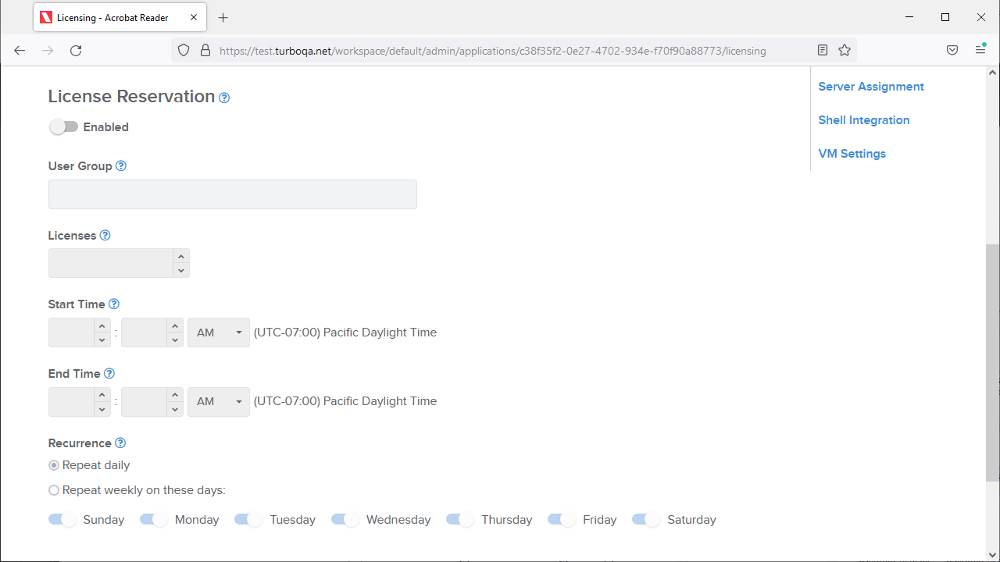

The June 2023 Turbo Server release includes several major features:

- New! **Fleets** streamlines resource management by organizing groups of servers into a single management unit. Create on-premises fleets or use managed fleets that directly integrate with cloud infrastructures like Azure. Assign applications to fleets based on resource requirements.

- New! **Portal Dashboard** design has been refreshed with a new Home tab that summarizes key applications and documents as well as new visuals.

- New! (Beta) **AI Chat** feature allows end-users to talk with AI chatbots such as OpenAI's GPT-3.5 and GPT-4 directly within the workspace interface.

- New! **License Reservations** feature allows licenses to be reserved for specific user groups during a configurable time period.

- New! **Web Applications** are now a first-class application type that appear alongside other applications in the Portal. Web applications can open the client browser to an external site or launch within a virtualized browser environment. Web applications inherit the same management features as other application types.

Other new features include:

- New! **Initial Window State** workspace application setting determines the initial window state when launching the application, such as full screen
- New! **Run as Administrator** workspace application setting allows applications to launch the application with administrative privileges
- New! **VM Settings** workspace and workspace application settings allow configuring advanced virtual machine runtime settings
- Users now receive a warning notification if one of their storage provider connections fails to connect, which may result in a T: drive mount failure

Other improvements include:

- Turbo Server has been upgraded to use **.NET Framework 4.8**. It is required to install .NET 4.8 before running the Turbo Server installer.
- Server settings relating to storage have been moved to a new **Storage** tab
- The **Reboot Server** button has been updated with a confirmation dialog and reboot status in the administration site diagnostics page
- **Session reports** have been updated to report an error if the HTML5 client takes longer than expected to start
- **User Group Restrictions** are now enforced on installed applications
- The **Hub Image Cache** will now target the `images` subfolder, unless already specified, when referencing precached assemblies. This behavior is now consistent with the Turbo for PC client.
- The Turbo Hub will now automatically populate the assembly cache and relevant metadata when an image is pushed to the Hub or when the image cache is updated.
- Images will no longer be written to the image cache path if the image already exists
- Improved performance of the **Reports** page for certain data sets
- Improved Hub Server performance during periods of high launch volume
- Improved service reliability when encountering SQL errors
- Workspace application `merge-user` setting has been added to the administration CLI tool
- Error messaging has been improved when providing an invalid license to the administration CLI tool
- The Portal logs now use UTC time
- The base and clean images have moved to `windows` namespace

This update includes fixes for the following issues:

- Session reports did not accurately track session duration for HTML5 client sessions if the user closed the tab shortly after launch.
- The **Advanced Testing** page could fail to override server assignments if the application was already running
- Installed workspace applications with **Inherit from Workspace** isolation settings could fail to correctly inherit
- In rare cases users could be automatically logged out of the Portal despite having a valid ticket
- Channel selection could be lost when navigation to and from the **Files** tab

