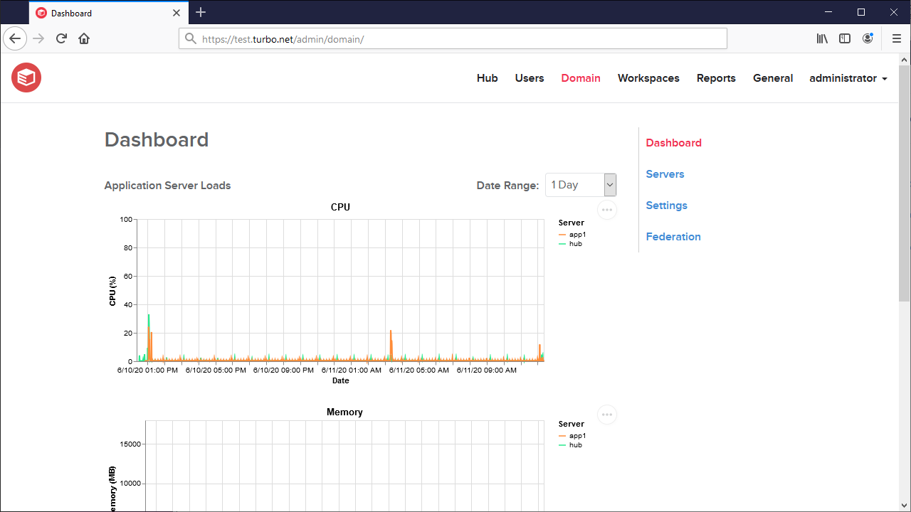
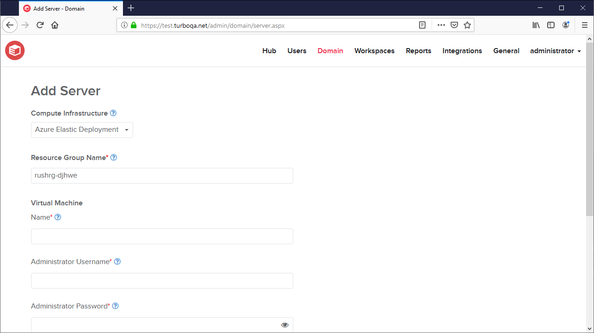
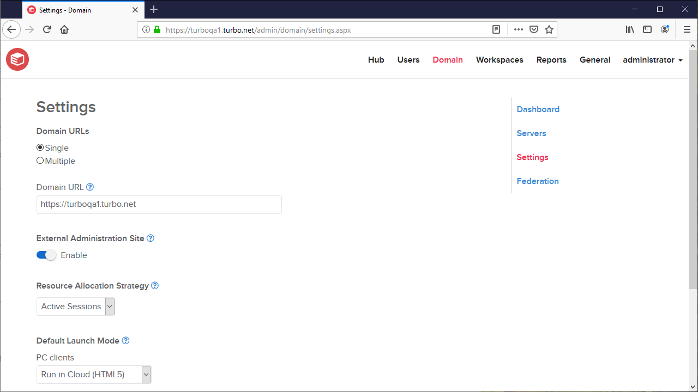
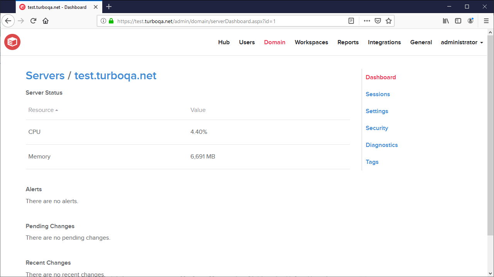
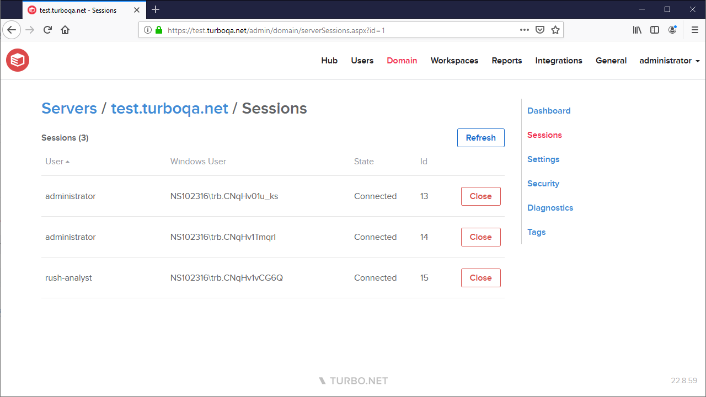
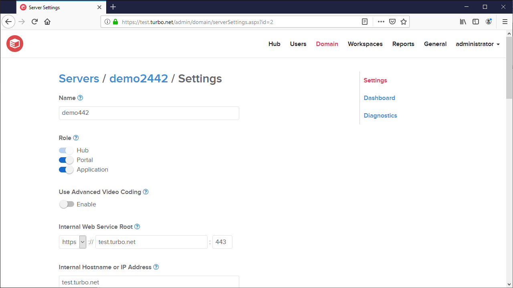
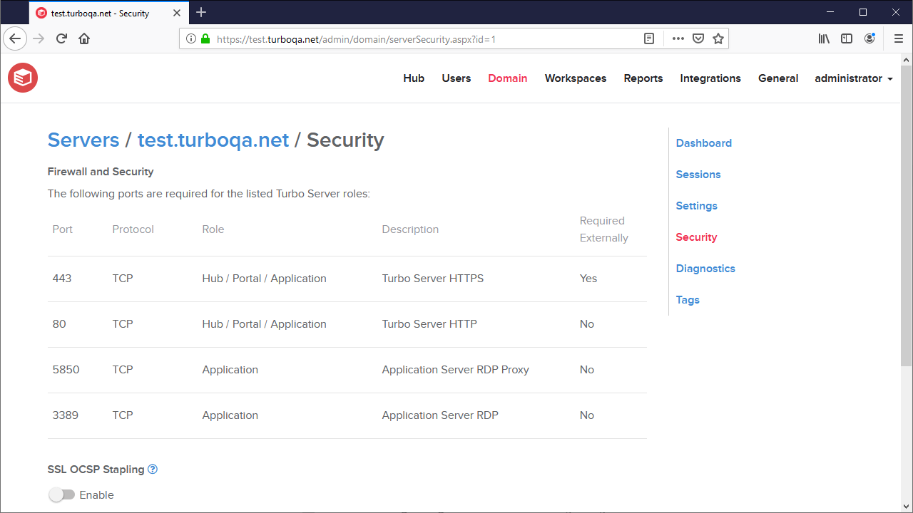
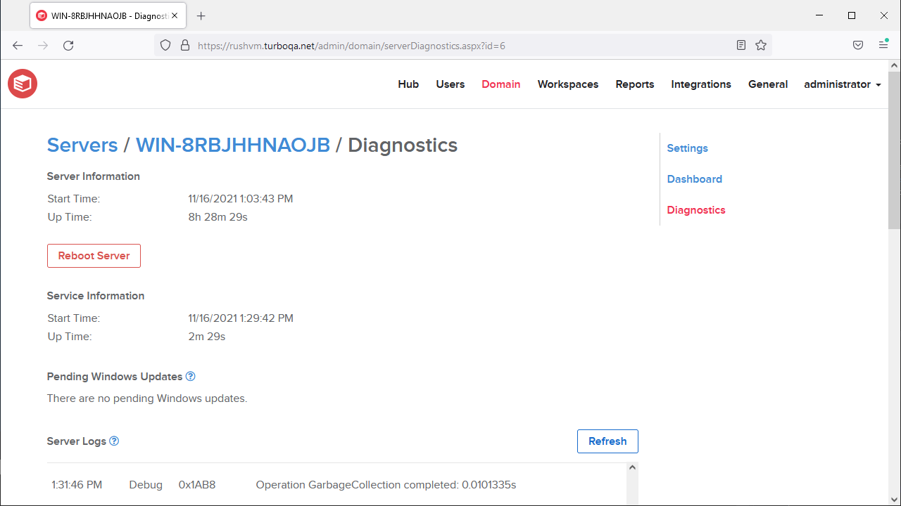
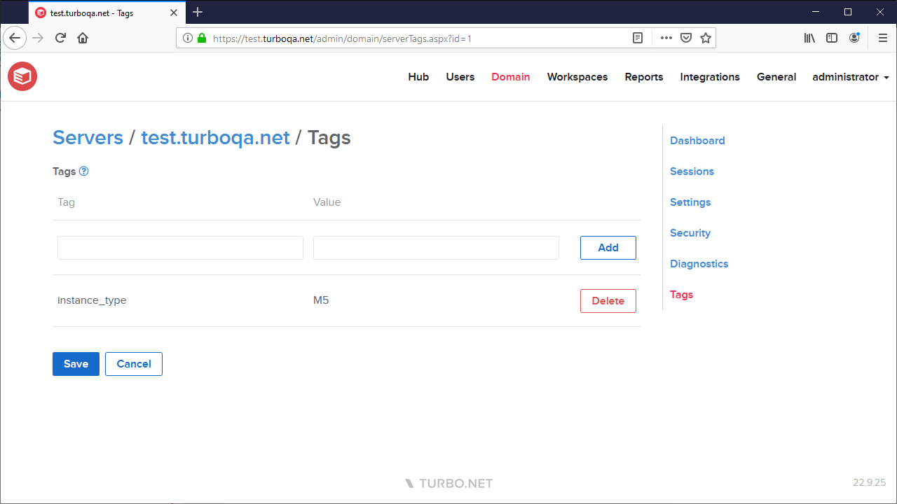

## Domain

The **Dashboard** page shows real-time graphs detailing the total CPU, memory, number of sessions, and other resource usage information for the application servers.

### Fleets

The **Fleets** page displays a list of all the fleets in the domain. A fleet is a group of application servers. Fleets can be deleted, but not modified. The default fleet comprises all Application Servers in the domain and cannot be deleted. Clicking a fleet will navigate to the fleet dashboard page.

#### Add Fleet

The **Add Fleet** page allows administrators to add additional fleets to the current Turbo Server farm. [Applications](../../server/administration/workspaces.html#workspace-applications) can be assigned to launch on a specific fleets.

- **Fleet Type**: Manual or Managed. Selecting "Manual" allows the addition of any application server in the domain. Choosing "Managed" will include all servers in a [Compute Infrastructure](../../server/administration/integrations.html#compute-infrastructure) to the fleet.
- **Name**: A unique name must be given for the fleet.

#### Fleet Dashboard

This page provides a comprehensive view of the servers' status within the fleet.

For compute infrastructures that are supported, it is possible to turn servers on or off from the fleet dashboard page.

#### Fleet Schedule

The Fleet Schedule page enables administrators to establish a schedule for turning on and off the fleet computers (excluding the Hub server). This feature is only available for compute infrastructures.

- **Start Time**: Specifies when fleet servers will power on.
- **End Time**: Specifies when fleet servers will power off.
- **Recurrence**: The frequency at which the schedule will reoccur.

### Domain Servers

The **Server** page lists all servers that are included as part of the current Turbo Server installation, along with their current status. Clicking a server name will navigate to the server configuration page.

#### Add Server

The **Add Server** page allows administrators to add additional application servers to the current Turbo Server farm.

##### Prerequisites

The **Add Server** feature allows you to deploy application servers to Azure environments. However, please note that it currently only supports Azure environments unless you have set up an external SQL connection.

If you have not set up an external SQL connection, you must ensure that the Turbo Server farm is running in Azure and connected to an Azure SQL Database.

In order to add a server you must first setup a [Compute Infrastructure](../../server/administration/integrations.html#compute-infrastructure) and follow the [Setup Guide](../../server/administration/integrations.html#compute-infrastructure-azure-setup-guide). This feature is only available in Turbo Server 23.1 and above.

##### Deploying an Application Server

To deploy an application server, complete the Add Server form with the following values:

- **Compute Infrastructure**: Select the compute infrastructure configured in the [Compute Infrastructure](../../server/administration/integrations.html#compute-infrastructure) section
- **Resource Group Name**: Leave as default to use the same resource group that is configured in the compute infrastructure setting, or enter a new resource group name. A new resource group will be created if the specified resource group is not found.
- **Server Name**: Enter any descriptive name for the application server (ex `turbo-app1`)
- **Administrator Username**: Enter any desired administrator username that conforms to the compute infrastructure's username requirements
- **Administrator Password**: Enter any desired administrator password that conforms to the compute infrastructure's password policies
- **Confirm Password**: Re-enter the password from above
- **Public IP Address**: It is recommended to disable the Public IP address in production environments

Once you have completed the form, click **Add** to deploy the application server. After a short delay a new tab will open to the Azure deployment status page. The deployment will take several minutes, you may view the current status as well as any deployment errors on the Azure deployment status page.

Once the deployment is complete the application server will automatically be added to the Domain server list and start accepting application loads.

### Domain Settings

The **Settings** page lists allows you to configure domain-wide settings, including:

- **Domain URL**: The public facing URL intended for end users to access Turbo. The firewall or load balancer should resolve this to your portal instances. For more information, see [Understanding the Domain URL](../../server/network-and-load-balancing/network-and-load-balancing.html#understanding-the-domain-url).
- **Hub Domain URL**: The public facing URL for Turbo Hub web services. If this field is not specified, the Domain URL is used.
- **Portal Domain URL**: The public facing URL for Turbo Portal web services. If this field is not specified, the Domain URL is used. Users must use this URL to access the portal and is typically the same as the Domain URL.
- **External Administration Site**: Allows external network access to the administration site from the domain url.
- **API Rate Limiting**: Limits the maximum number of API requests allowed per IP address per second. If this limit is exceeded, the request is rejected with a 429 Too Many Requests error response. Rate limiting is enabled by default with a limit of 20 requests per IP address per second. Enable rate limiting to deter denial of service or brute force password cracking attacks. The rate limit should be disabled if there will be many users attempting to use the service from a single IP address.
- **Resource Allocation Strategy**: The load balancing strategy used to allocate applications to application servers. The available strategies are:

  - **Active Sessions**: New application requests will be allocated to the active application server with the lowest active session count. Note that active session counters may be delayed until the application is fully launched and may not be balanced if a user launches many applications at the same time.
  - **Total Sessions**: New application requests will be allocated to the active application server with the lowest total session count.
  - **CPU Load**: New application requests will be allocated to the active application server with the lowest CPU load.

- **Default Launch Mode**: The default launch location used when launching applications from the dashboard. If an application is configured with its own launch location, that setting will take precedence. The available options are:

  - **Run in Cloud (HTML5)**: Application launches will open a new browser tab to which the application will stream from the application server.
  - **Run in Cloud (Windowed)**: Application Launches will open a new browser tab and attempt an auto-launch. If a native client is installed, the application will stream from the application server.
  - **Run on My PC (Local)**: Application Launches will open a new browser tab and attempt an auto-launch. If a native client is installed, the application will run on the local machine.

- **URL Redirects**: Redirects requests from the host name to the target URL with a permanent redirect response (301). The host name must resolve to the domain in order for the redirect to occur.

### Domain Federation

The **Federation** page allows you to configure federation across multiple domains to reduce setup time and keep domain resources in sync. According to these settings, the server will will periodically check the source domain for updates and replicate any changes.

A domain federated server replicates the source server's workspaces, workspace permissions, and the workspaces' associated image repositories. In addition, the source server's users, groups, directory services, and identity method are also replicated to allow the users to run applications from workspaces using the same login identity. If the identity method is an external authentication method such as Azure AD, the subdomain's redirect url must be added in the Azure Portal.

If an existing login name or built in group, directory service, or user exists on the server, it will not be replicated. For example, the built in SYSTEM user will not be replicated. Replicated users will automatically belong to the 'Everyone' built in user group, but not the Anonymous or Administrator built in user groups.

If an existing workspace with the same url friendly ID exists on the subdomain, it will be overwritten. If the source workspace permission references a built in group (Anonymous, Administrators, or Everyone), it will be normalized to reference the subdomain's built in group and automatically apply to the users belonging to those groups.

The available configurations are described below:

- **Source Domain URL**: A federation source URL from which domain resources will be replicated.

- **System API Key**: The API key used to access federation resources from the federation source. This API key must be configured as a system-level key on the source server. See [Managing API Keys](../../server/administration/hub.html#managing-api-keys) for information on configured API keys.

- **Default Synchronization Frequency**: The frequency at which this server will check the federation source for updates.

- **Identity**: Federate identity data from the source domain, including users, groups, directory services, and authentication settings.

  - **Include Admininistrators Group**: Identity federation will also include the Server Administrators group permissions.

- **Workspaces**: Federate all or selected workspaces from the source domain. All repositories associated with the selected workspaces will also be federated. The available options are:

  - **Enable**: Federates all workspaces on the source domain, automatically adding new workspaces.
  - **Custom**: Federates selected workspaces from the source domain. New workspaces from the source domain must be manually added.

- **Repositories**: Federates all repositories from the source domain.

- **Request Forwarding**: Automatically pull repositories from the federated domain when a local repository is not found.

- **Revision History Length**: Number of application revisions to pull from the remote repository.

### Managing a Server

#### Server Dashboard

The **Server Dashboard** page displays a summary of the server load, alerts, and setting updates.

The **Alerts** table lists important status alerts such as server health warnings. Servers with Fatal alerts may fail to perform their given role or may cease operation completely. To resolve a Fatal alert, follow the action recommended in the alert Event to repair the server then click the **Clear** action to restore server operation.

The **Pending Changes** table list server setting changes that have been saved but have not yet been applied to the server. The **Recent Changes** table lists server setting changes that have been applied in the last 10 minutes. Setting changes that occurred more than 10 minutes ago are located in the audit logs under **Reports > Events**.

#### Server Sessions

The **Sessions** section lists all user sessions that are running on the server except for the local system user. This section is only available for servers with the application role.

Administrators may manually log off users by clicking the **Close** action, which will issue a log off command from the Turbo service user. In order for this action to succeed, the Turbo service user must have permission to log off the user. Please be aware that logging off users may result in the loss of unsaved data.

#### Server Settings

- **Name**: A display name for the server, shown in the Administration Site.

- **Role**: The roles for which this server is responsible, including: Hub , Portal, and Application Server. Changing the server role will trigger a service restart which may take a few minutes to complete.

- **Internal Web Service Root**: Configures the web service bindings for where the hub, portal, broker, and public web services will be hosted.

- **Internal Hostname or IP Address**: The hostname or IP address used to resolve all internal services, such as RDP. If this field is not specified, the Internal Web Service Root is used.

- **Web Service SSL Certificate**: Configures the SSL certificate files that are used for HTTPS web service bindings. The provided file paths must point to permanent locations that are available to the service account.

- **Use Advanced Video Coding**: Enables the use of Advanced Video Coding (H.264) for remote application streaming if the Application Server supports it. This setting is only available for servers with the Application role enabled.

- **User Profile Pool Size**: Number of pre-created user profiles on the application server. The default size is 25. The recommended size is the number of concurrent launches expected for the server.

- **Cache Temporary User Profiles**: Enables caching of temporary profiles for application server role indefinitely. If disabled, any files saved by a temporary profile user on the application server will be removed along with the profile 10 minutes after the session ends. Users should be instructed to save to cloud storage or a redirected network drive. All non-administrative local accounts will be removed according to the Temporary User Profile Lifespan setting.

- **Temporary User Profile Lifespan**: Length of time since last login that a temporary profile will be cached, if cache temporary user profiles is enabled. Default to 7 days. Profile expirations are checked in 10 minute intervals.

- **Java Virtual Machine Settings**: Configures the JVM settings for the Hub and Broker Java processes. Available settings include:
  - **Heap Space**: Configures the maximum JVM heap space allocated for the Hub and Broker Java processes. This setting is only available for servers with the Hub or Portal roles enabled.
  - **Proxy Server**: Configures the JVM proxy server for all outgoing http(s) requests from the Hub Java process. This setting is only available for servers with the Hub role enabled.

#### Server Storage

- **Application Image Path**: The path where the application server will store SVM images. The default value is 'allusers'. Leave blank to prevent the service from setting the value. If the value is changed to a different folder such as 'E:\turbo-images', it must be changed to 'allusers' to restore the default value. Clearing the textbox will leave the value to 'E:\turbo-images'. Multiple application servers may share the same folder.

- **Image Cleanup**: Removes images on the server after the given interval. Leave blank to disable image cleanup. Target image cache size must be specified if image cleanup is enabled.

- **Hub Image Cache**: Configures an image cache path where the Hub will store SVM images. This prevents the redownload of the same application when ran by different users. This can be a local file path which will be shared by all users on the same device, or a network path which may be shared by all users across multiple devices. This setting is only available for servers with the Hub role enabled.

  The **Cache** action may be used to manually populate the image cache with the latest revision of all repositories in the Hub.

  Images in the cache are removed if the repo's revision are deleted from the Hub. Cached images may be manually removed from the server by deleting the file from the Windows Explorer.

- **Peer-to-peer Image Distribution**: Enables peer-to-peer image sharing through the torrent protocol. Requires port 6881 to be open.

- **Hub Storage Path**: Sets the hub storage path to a custom path. Ensure the target path is empty and not used by other applications, and has sufficient storage for storing all images and persisted data. The path can be changed later, but will require momentary downtime of the hub depending on how much data will be moved. The service user must have full access to the target path. Please see the [Backup and Recovery](../../server/backup-and-recovery/backup-and-recovery.html#backup) documentation for additional details and troubleshooting.

- **Hub CDN URL**: The Hub block storage CDN URL. The Hub CDN URL must be a valid absolute http(s) URL. If the URL is not specified, blocks will be fetched from the original Hub URL.

  For more information on the Hub CDN and common CDN configurations, see [Configuring Content Delivery Network (CDN)](../../server/network-and-load-balancing/network-and-load-balancing.html#configuring-content-delivery-network-cdn)

- **Hub CDN Max File Size**: The maximum file size supported by the CDN provider, in megabytes. Supporting clients will download files exceeding this size using the Turbo synchronization protocol.

- **Block Storage**: Scans and repairs errors in the block storage. Images should not be pushed to the server until the repair is complete. This action is only available for servers with the Hub role enabled.

- **Optimize Storage**: Scans and deletes unreferenced blocks from the block storage. This action is only available for servers with the Hub role enabled. Optimize storage requires free space equal to the current size of the block storage size to complete successfully.

#### Server Security

The **Server Security** page displays the required Windows Firewall configurations as well as other configurable security settings.

- **Firewall and Security**: A list of ports that are required by the selected server roles. For a full list of ports that are used by Turbo Server, please refer to [Firewall and Security](../../server/setup-and-deployment/prerequisites.html#firewall-and-security).

- **SSL OCSP Stapling**: Enables OCSP Stapling for SSL. SSL must be enabled with the intermediate certification file specified.

- **HTTP Strict Transport Security**: Enables the HTTP Strict Transport Security (HSTS) header on all requests. The HSTS header uses a 1-year expiration and leaves all other options as default. The header is disabled by default.

  NOTE: If you downgrade your server to HTTP, the HSTS setting must be cleared from the client browser in order to re-enable access the server.

#### Server Diagnostics

The **Server Information** section displays the start time and up time of the Windows server that Turbo Server is installed on.

Clicking the **Reboot Server** button will reboot the server (shutdown and restart Windows). Any sessions running on the restarting server will be terminated without warning, and any Windows updates listed in the **Pending Windows Updates** section will be installed. Use the **Reboot Server** button in case the server appears unresponsive as a last resort.

The **Service Information** section displays the start time and up time of the Turbo Server service.

The **Pending Windows Updates** section displays all Windows updates that require a system reboot and are pending install on the Windows server.

The **Tracker Status** section displays peer-to-peer image distribution tracker status.

The **Operations** table lists all operations that are managed by the Turbo service as well as their last know status. If an operation failed to complete successfully, the operations table will report an Error status and a short description of the error.

The **Server Logs** section displays the most recent Turbo service logs. From this page administrators can create and download log archives directly from the administration site.

Clicking the **Archive** button will gather all of the logs across the various Turbo Server services and compress then into a single .zip file. Once compressed, the archive will be made available for download and the original log files will be cleaned up.

The **Diagnostic Logging Level** setting allows administrators to configure level of diagnostic information that will be included in the server logs. For example, the Portal logs will include additional information about memory usage and active connections.

#### Server Tags

**Server Tags** are user-defined name value pairs that can be used to organize, manage, and filter servers. Server tags must include a name and may optionally include a value. Server tag names and values are case-insensitive.

For example, tags may be used to restrict workspace application launches to application servers that meet certain requirements, such as GPU capabilities or licensing.
