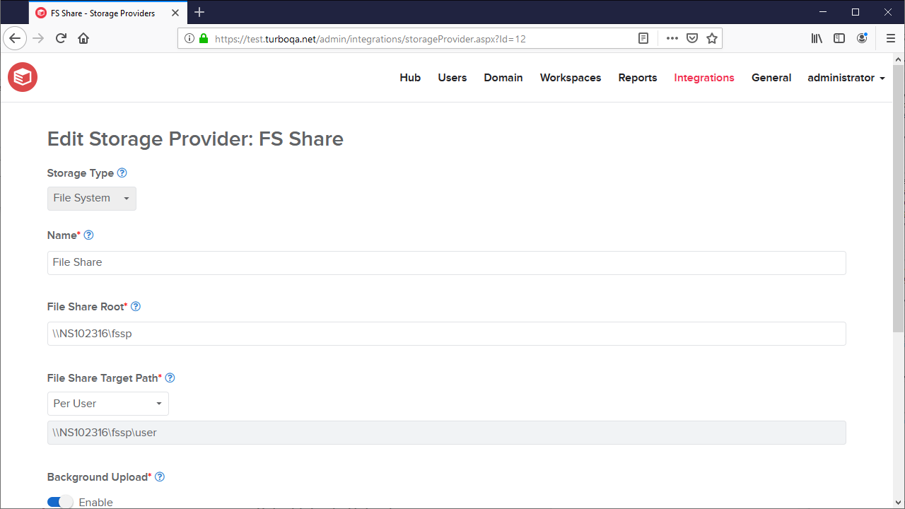

## File Share

The file system storage provider integration allows users to store their files on a local file system folder or a network share (SMB) through the T: Drive. The files under the configured path can be set to read only, or scoped to each individual user's private folder.

### Configure the File Share

The SMB file share must be accessable by each Portal server via a UNC path such as `\\SERVERNAME\path`. The Portal service user must have full control access to the SMB file share.

If you are using a single portal solution, the storage path can be a local drive path, such as `D:\shared`.

#### Quota Enforcement

Storage quotas can be enforced via the underlying OS's quota enforcement tools. A quota error message will be displayed to the user when they upload a file that exceeds the configured quota to the Portal files shell or T: Drive with Background Sync disabled.

For Windows Server, quotas can be configured using the **File and Storage Services** server role.

To install this role:

1. Launch the **Server Manager** and click on **Manage > Add Role and Features**
2. Continue to **Server Roles** and select **File and Storage Services > File and iSCSI services > File Server Resource Manager**
3. Complete the wizard and wait for the role install

Then, to configure the storage quota:

1. Click on **Tools > File Server Resource Manager**
2. Open **Quota Management > Quota Templates**
3. Select your desired template then click **Create Quota from Template…**
4. Enter your root share path into **Quota path**.

If you are using Shared storage it is recommended to select **Create quota on path**.

If you are using Per User storage it is recommended to select **Auto apply template and create quota on existing and new subfolders**. This will automatically apply the quota to each user subfolder.

6. Complete the dialog making any desired changes then click **Create**.

### Configure Turbo Server

1. Go to the Turbo Server Administration site **Integrations** > **Storage Providers** page.
2. Click on **Add**.
3. Select **File System** as the storage type.
4. Enter the file system provovider **Name**.
5. Enter the file system **File Share Root**.
6. Select the desired **File Share Target Path**.

- **Per User** mode restricts access to the user's sub folder under the path.
- **Shared (Read-Only)** mode allows read-only access to all files and folders under the path.
- **Shared (Read-Write)** mode allows read-write access to all files and folders under the path.

7. Select the desired **Background Upload** setting, which determines whether files will be uploaded to the storage provider asynchronously or synchronously when using the T: Drive. Synchronous uploads will display upload error messages to the user.
8. Enter the desired **T: Drive Path**.
9. **Save** your settings. Setting changes may take a couple minutes to take affect.

Users can access their file share from the portal dashboard Files tab and Turbo Client's T: Drive.
