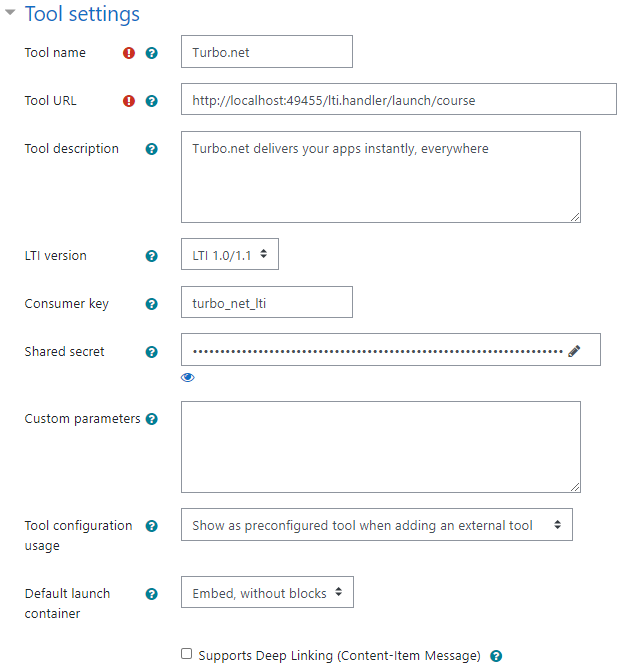
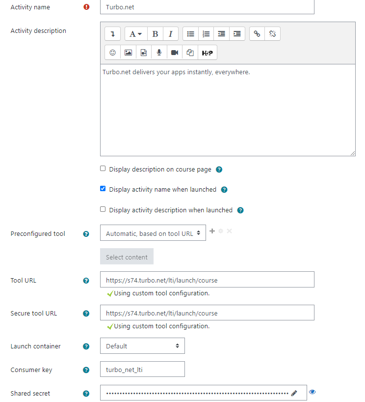

## Moodle Integration

Configuring Turbo Server with Moodle allows students and instructors to access their Portal Dashboard with one click from Moodle.

Turbo Server uses the open Learning Tools Interoperability (LTI) specification (version 1.0) to communicate with Moodle.

### Getting Started

Download Moodle from [moodle.org](https://moodle.org/) then follow the [installation instructions](https://docs.moodle.org/310/en/Installation).

Moodle requires the following to connect to Turbo Server Application:

- Consumer Key
- Shared Secret
- Tool Provider URL

The values can be obtained from the Turbo Server administrator site. Navigate to **General > Learning Management System**.

### Adding Turbo to Moodle

Instructors will be able to add Turbo to their courses with a few clicks. Administrator privileges within Moodle are required.

Navigate to **Site administration > Plugins**. Navigate to **Manage tools**, listed under **Activity modules > External tool**.

Select **configure a tool manually**.

Fill in the following fields:

- Tool name: “Turbo.net”
- Tool URL: enter the Tool Provider URL from the Turbo Server administrator site
- LTI version: LTI 1.0/1.1
- Consumer key and Shared secret: enter values from the Turbo Server administrator site
- Tool configuration usage: “Show as preconfigured tool when adding an external tool”
- Under Show more…
- Icon URL and Secure icon URL: https://start-c.turbo.net/images/turboiconlarge.png
- Privacy > Share the launcher’s name with tool: Always
- Privacy > Share the launcher’s email with tool: Always

### Activate Turbo on a Course

Turbo must already be configured by a Moodle administrator. Instructor level privileges are required for the course.

Browse to the desired course in Moodle. Select **Turn Editing On**.

Locate the place Select **+ Add an activity or resource**.

Under Activities, select **External tool**.

Under General, select Turbo.net from the **Preconfigured tool** dropdown. Set **Activity Name** to Turbo.net.

Click **Save** and return to course.

### Configure Turbo for a specific Course

If Turbo has not been configured site-wide by a Moodle administrator, instructors can configure Turbo specifically for their course. Instructor level privileges are required for the course.

Browse to the desired course in Moodle. Select Turn Editing On.

Locate the place Select **+ Add an activity or resource**.

Under Activities, select External tool.

Under General, click **Show more…** and configure as follows:

- Activity name: Turbo.net
- Preconfigured tool: “Automatic, based on tool URL”
- Tool URL and Secure tool URL: set both to the Tool Provider URL from the Turbo Server administrator page
- Consumer key and Shared secret: enter values from the Turbo Server administrator site
- Icon URL & Secure Icon URL: https://start-c.turbo.net/images/turboiconlarge.png

Under Privacy, ensure “Share launcher’s name with tool” and “Share launcher’s email with the tool” are both checked.

Click **Save** and return to course.
