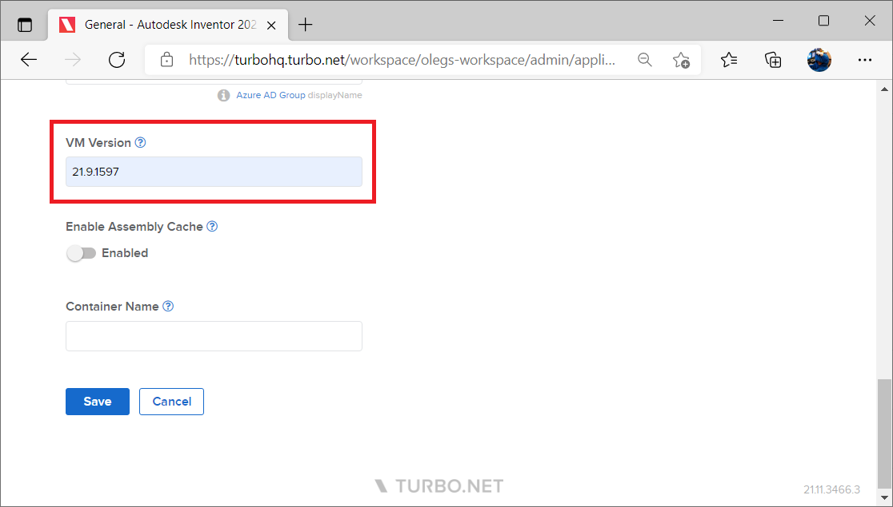

# Turbo Server Releases

Turbo Server releases are scheduled for 2-3 month release cycles. Turbo Server releases will support upgrading from previous release versions, unless specified. Any incompatible release upgrade features will be documented in a migration guide.

The release change list can be found in [Releases](https://turbo.net/server/releases).

Release downloads can be found in [Downloads](https://turbo.net/download#enterprise-and-developer).

## Release Patches

Release patches will be provided for any major defects (regressions) for a specific release. Patches must be installed using the install executable similar to an upgrade.

## Security

Security issues are treated as major defects and may be immediately patched in the current release. If a customer cannot wait for a release patch, the installation may be directly patched by Turbo.net support.

## Dependencies

Dependencies included as part of the Turbo Server installation will also be patched and upgraded when appropriate. End users does not need to worry about patching as they are upgraded during installation or upgrade. The SQL Server instance used in conjunction with Turbo Server should be patched by the administrator, and not by Turbo. The operating system should also be patched by the responsible party of the machine.

# Turbo Client Releases

Turbo Client releases follow the server release schedule. Turbo Clients will automatically upgrade to the latest release when installed on end user devices using the standard software upgrade process for the device's operating system.

# Turbo VM Releases

Turbo VM updates are published regularly to the [Turbo.net Hub](https://app.turbo.net/run-global/xvm/releases) to provide bug fixes, new features, and compatbility support for new Windows releases.

Turbo Server releases include the latest Turbo VM from the Turbo.net Hub at the time the release ships. Server administrators may also manually pull the **/xvm** image from Turbo.net Hub and push it to their Turbo Server environment in order to receive the Turbo VM update without having to upgrade the Turbo Server:

    turbo config --domain=turbo.net
    turbo pull /xvm
    turbo config --domain=https://myturboserver
    turbo login administrator
    turbo push /xvm

By default, Turbo Server uses the latest Turbo VM version from its Hub repository. Note that it may take up to 24 hours for a Turbo VM update, applied as a result of upgrading Turbo Server or manually pushing a new Turbo VM, to propagate to the Application servers and end user devices.

Rarely, a Turbo VM update may cause an issue with a specific application. If this occurs, workspace administrators should set a known working **VM Version** for the affected application in the [Workspace Application Settings](https://app.turbo.net/docs/server/administration/workspaces#workspace-applications-pc-applications) as well as report the issue to Turbo Support so that it gets fixed.

