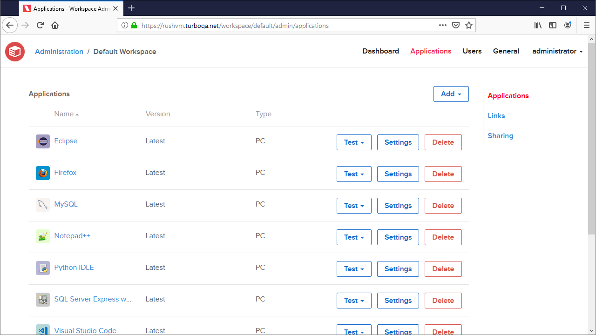

## To Turbo Server

Turbo supports deploying container images as standalone executables, MSIs, and Turbo Virtual Machines (SVMs) to Turbo Server using Turbo Studio or the Turbo Client command line tools. Images added to the Hub can then be added to Workspaces as **Windows Applications**, making the applications available to end-users.

Turbo Server also supports other application types, such as **Web Applications** and **Host Applications**, which can be added directly from the Turbo Server administration site.

### Adding Images to the Hub

#### Using Turbo Studio

Turbo Studio provides a feature to deploy applications directly to your Turbo Server. After completing the build process, see the [Build](../../studio/working-with-turbo-studio/getting-started.html) section for details, click on the **Publish to Server** option on the ribbon menu.

From the publish dialog, click **change** next to the publish server and login to the your Turbo Server. Once you have published the application it will be added to your Turbo Server Hub.

You will now see your application in your hub list in the administration site. Follow the [Adding Applications to a Workspace](#adding-applications-to-a-workspace) instructions to add the application to a workspace and make it available to end-users.

#### Using Command Line


Complete the following steps to add a new application image to Turbo Hub Server:

1. Install the Turbo Client for Windows platform.

2. Connect the client to your hub server using the `turbo config` command. See [Config Command](../../reference/command-line/config.html) for more information.

```
> turbo config --hub=http://[hubserver]
```

3. Log in as a hub administrator account or use a **system** API key. This is done using the `turbo login` command. See [Login Command](../../reference/command-line/login.html) for more information.

```
> turbo login admin-user
-OR-
> turbo login --api-key=6g8BwsIlU7ezl_CMIZ_0PYBwK6WVAUZdx1mxYO1WFOg
```

4. Create your container image. See [Working with Containers](../../studio/working-with-containers/containers.html) for more information on ways to create container images.

As an example, we will make a create an empty container that executes the native notepad.exe application.

```
> turbo new clean -n=test-container
(exit the container window that is shown)
> turbo commit test-container test/notepad:1.0 --no-base --startup-file=notepad.exe
> turbo push test/notepad:1.0
```

You will now see your test image in your hub list in the administration site.
Follow the [Adding Windows Applications to a Workspace](#adding-windows-applications-to-a-workspace) instructions to add the application to a workspace and make it available to end-users.

**NOTE:** If you do not specify a namespace in the image name (ex, "test" in "test/notepad") then the image will be pushed to the user's private namespace. This image will only be accessible by the user who pushed it and it will not show in the hub list on the administration site.

##### Troubleshooting

The push command is denied with following error message:

```
> turbo push mozilla/firefox-base:68.0.1
Pushing image mozilla/firefox-base:68.0.1 to mozilla/firefox-base:68.0.1
Error: Push failed. This user may not be authorized to push to the mozilla repository.
```

The current logged in user may not be an administrator of the Hub server. Add the user to the administrators group. For more information refer to [Managing Users and Authentication](../../server/administration/users.html).

**NOTE:** If you add the user to the administrators group after already attempting to push an image to the Hub server, you may have to wait up to 5 minutes for the permissions to propagate to the Hub server. Either switch to an API key based login, or restart the Hub server process and try again.

### Adding Windows Applications to a Workspace

A workspace is a list of applications that is shown on the Turbo Portal and on the Turbo Clients to users with sufficient permissions. From this workspace, users will be able to run applications using any Turbo enabled device (Windows, MacOS, iOS, Android, or any HTML5 browser).

Applications must first be added to the Turbo Server Hub before they can be added to a Workspace, see [Adding Images to the Hub](#adding-images-to-the-hub).

If you have not yet created a workspace, you may do so by accessing the Turbo Server administration site at: `https://[server]/admin`. Navigate to the **Workspaces** tab, click **Add Workspace**, and submit your desired workspace settings.


Then open the Workspace administration site by clicking on the **Manage** link. Navigate to the **Applications** tab, click **Add > Windows Application**, and select your application.



The application will now be available on the Turbo Server Portal and on the Turbo Clients to users with sufficient permissions.
