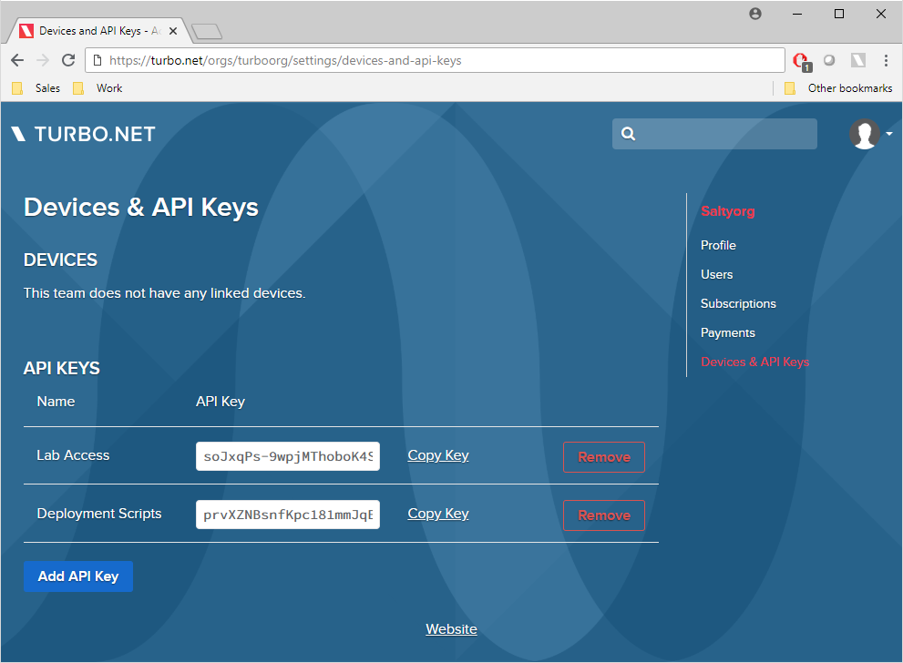

# API Keys

API keys allow you to login to the Turbo.net or Turbo Server hub without the use of a password. This is important for scripting and automation as it eliminates the need to hard code passwords or pass them in as parameters to your scripts. API keys can be revoked or regenerated in case they have been compromised.

### Manage Your Keys

The first step is to create an API key. To do this, go to your account or organization settings page by clicking on the account dropdown on the top right of the page, and then select **Device and API Keys** on the right menu.



Once here, click **Add API Key** to generate a new key. Press the **Remove** button to remove the key and revoke its access to your organization. There is no limit to the number of keys you can generate.  You may decide to create and manage different keys for different teams or for different user access, allowing you the flexibility to revoke them independently without disrupting all key users.

Click **Copy Key** and head back to the command line.

### Turbo Login with an API Key

Using the API key is easy -- just include the key in the turbo login command using the **--api-key** flag.

```
> turbo login --api-key=9ZoKH_336g0MqP2yptwfrv9B1XUm8YFPnCZNugVQNr4
turboorg logged in at 7/26/2018 3:53:31 PM
```

The session is now authenticated in the account context. The account will stay logged in until the API key is revoked or the session is closed with the turbo logout command.
