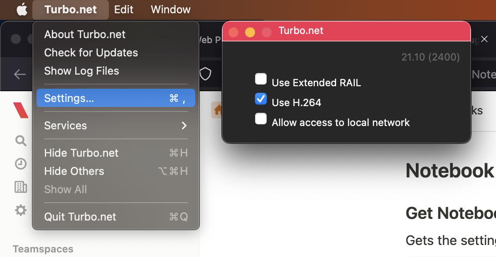

## Advanced Settings

### Turbo for PC

Advanced settings for the Turbo for PC client are managed using the [turbo config command](../../reference/command-line/config.html).

### Turbo for Mac

Click on the **Turbo.net** menu item and select **Settings...** to access the settings for the Turbo for Mac Client.

1. **Use Extended RAIL:** improve visual appearance of streamed application.
2. **Use H.264:** use codec to decrease bandwidth usage for streaming (requires Extended RAIL).
3. **Allow access to local network** allows streaming applications to access the local network of the end user's Mac device.



### FAQ

**How do I save passwords in a browser on Turbo to share with team members?**

This can be achieved by creating an image with the credentials set using the Turbo CLI

```
# Run a browser
>turbo new firefox
Using VM 18.7.1306 from local
Using image clean:26 from local
Using image firefox:61 from local
Running new container firefox#9afe83e2

# Go to a website and log in, saving your credentials, then exit the application
Process exited with status 0

# Save the container into an image
> turbo commit firefox#9afe83e2 ffpassword
Using image firefox:61 from local
Committing container firefox:3.5#a524349c to image ffpassword
Commit complete

# Push to hub
> turbo push ffpassword mynamespace/ffpassword
Pushing image ffpassword to mynamespace/ffpassword
Push complete
Image is private
```
