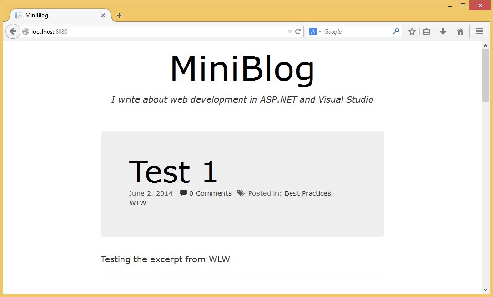
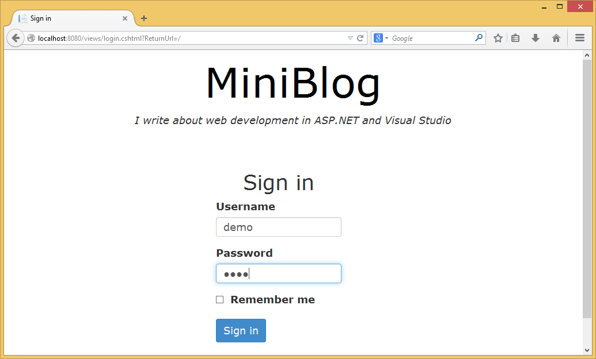
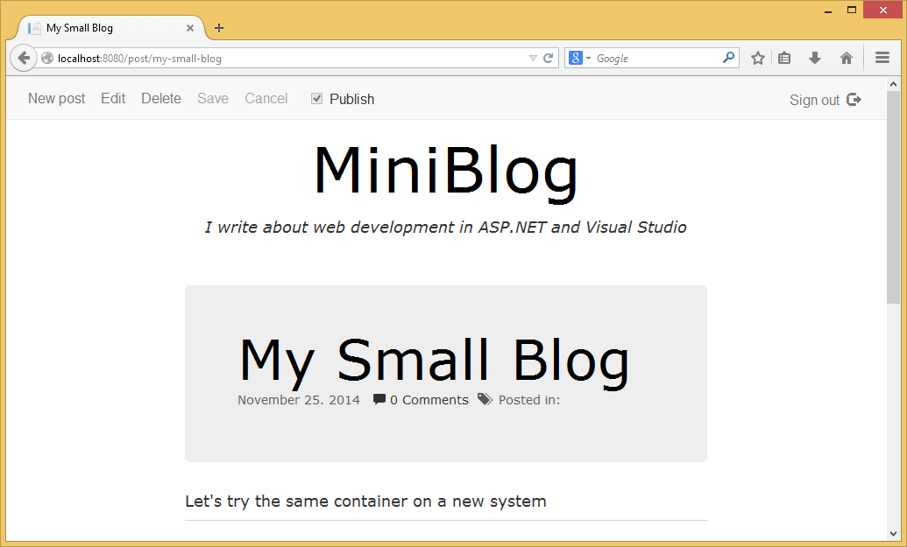

## Web Applications

Turbo can also be used to containerize web applications. Let’s see how to use Turbo with two popular web frameworks — ASP.NET and Node.

### Creating an ASP.NET application container

```
# Create a new container with .NET, ASP.NET, and git
> turbo run microsoft/dotnet,microsoft/aspnet --using=git/git

Downloading dotnet from https://turbo.net/users/microsoft
Downloading aspnet from https://turbo.net/users/microsoft
Downloading git from https://turbo.net/users/git
Running container 249c4f3e with visibility private
```

Inside the container session, use the git clone command to move the application into the container.

```
(249c4f3e) > cd c:\
(249c4f3e) > git clone https://github.com/turboapps/samples
```

We use **IIS Express** to launch the ASP.NET application:

```
# Start the ASP.NET application console
(249c4f3e) > start "MiniBlog" "C:\Program Files (x86)\IIS Express\iisexpress.exe" /path:C:\samples\aspnet-MiniBlog\Website
```

We can see the ASP.NET application start up as the IIS output is logged in the new console window.

```
Copied template config file 'C:\Program Files (x86)\IIS Express\AppServer\applicationhost.config' to 'C:\Users\Administrator\appdata\local\temp\iisexpress\applicationhost2014112420457848.config'
Updated configuration file 'C:\Users\Administrator\appdata\local\temp\iisexpress\applicationhost2014112420457848.config' with given cmd line info.
Starting IIS Express ...
Successfully registered URL "http://localhost:8080/" for site "Development Web Site" application "/"
Registration completed
IIS Express is running.
Enter 'Q' to stop IIS Express
```

Let’s confirm the application is running by opening `http://localhost:8080` in a browser.



Login using username **demo** and password **demo**.



And finally create a new post!



### Creating a Node.js container

In this example we’ll containerize aIRChat, an open source IRC client built on the popular Node.js framework.

Start a new container using the `turbo run` command specifying the Node.js image to be included and applying as before a transient Git layer:

```
> turbo run node --using=git
```

In the container, first create a folder where we can clone the aIRChat project from GitHub.

```
> mkdir projects
> cd projects
```

Use the `git clone` command again to copy the application contents into the container.

```
> git clone https://github.com/redwire/airchat.git
Cloning into 'airchat'...
remote: Reusing existing pack: 2983, done.
remote: Counting objects: 21, done.
remote: Compressing objects: 100% (18/18), done.
Receiving objects:  99% (remote: Total 3004 (delta 9), reused 0 (delta 0)
Receiving objects: 100% (3004/3004), 8.84MiB | 948.00 KiB/s, done.
Resolving deltas: 100% (1302/1302), done.
Checking connectivity... done.
```

Once the application files are present, we can use the standard **npm** package manager to install the aIRChat application:

```
> cd .\airchat\Content
> npm install
```

We are now ready to launch the application!

```
# Launch a Node.js server
> node app.js

connect.multipart() will be removed in connect 3.0
visit https://github.com/senchalabs/connect/wiki/Connect-3.0 for alternatives
connect.limit() will be removed in connect 3.0
Express server listening on port 3000
```

aIRChat is now running on port 3000. You can confirm this by opening a browser to `http://localhost:3000`.
Once you’ve verified that aIRChat is running, stop the Node.js server by entering `Ctrl+C`. At the command prompt type `exit` to shut down the container session.
When you’re finished configuring the container, committing it will create a new merged image.

```
# Specify a name for the new image
> turbo commit 1be755fcfafc4cf0b8e1c0667f6d13f0 aIRChat
```
