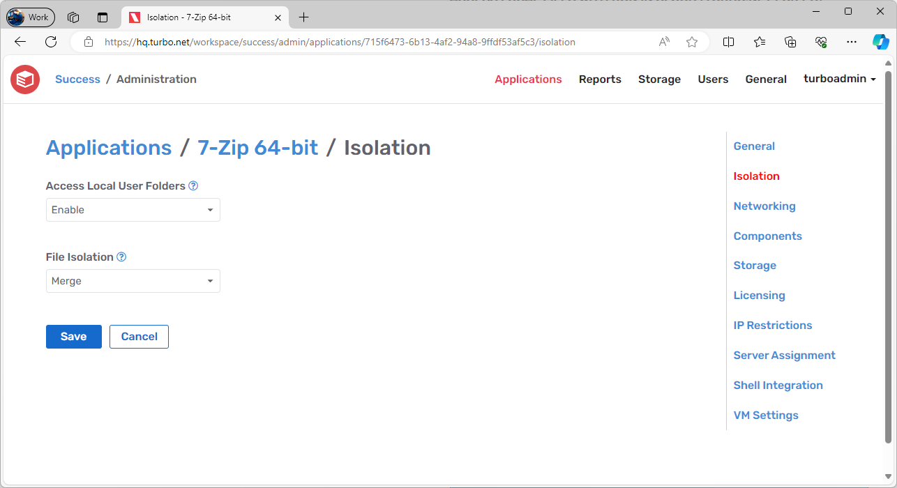
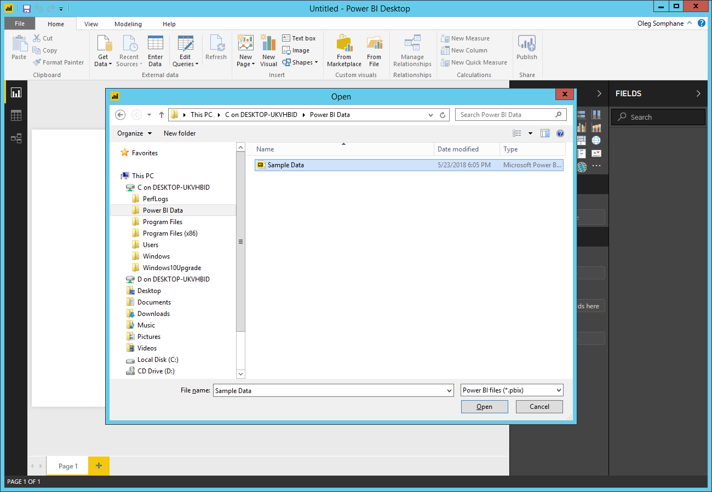
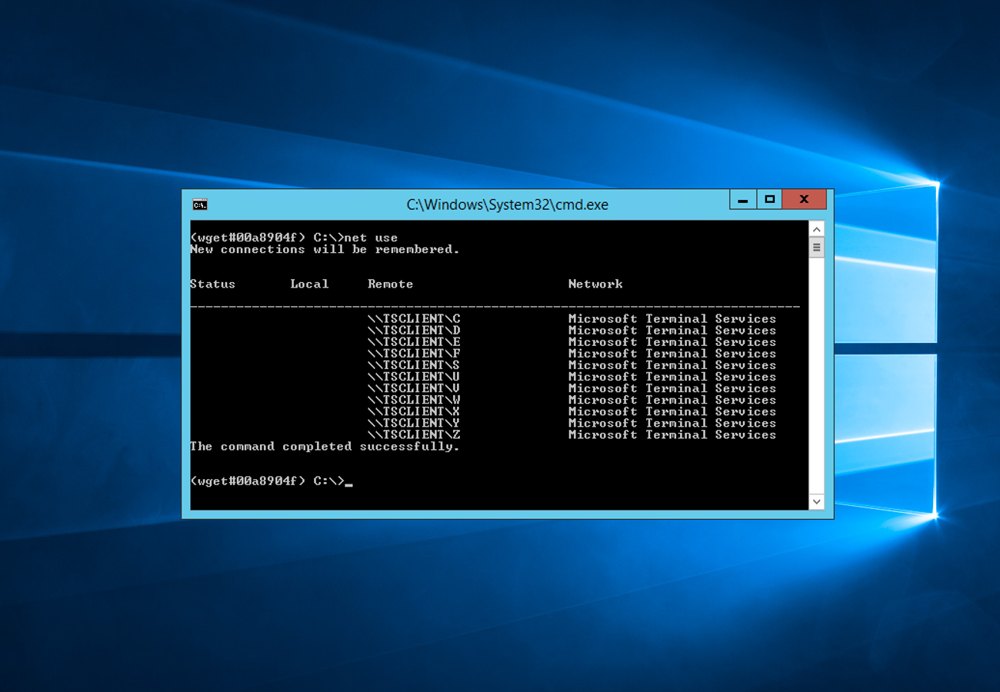
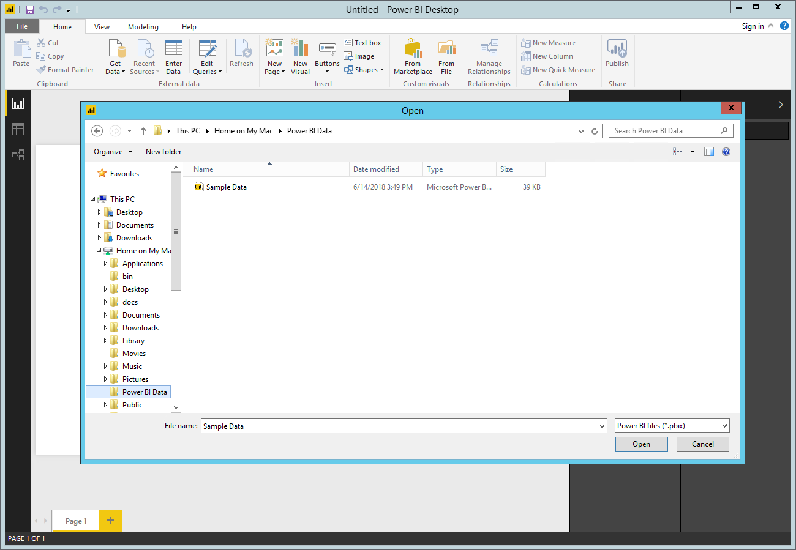
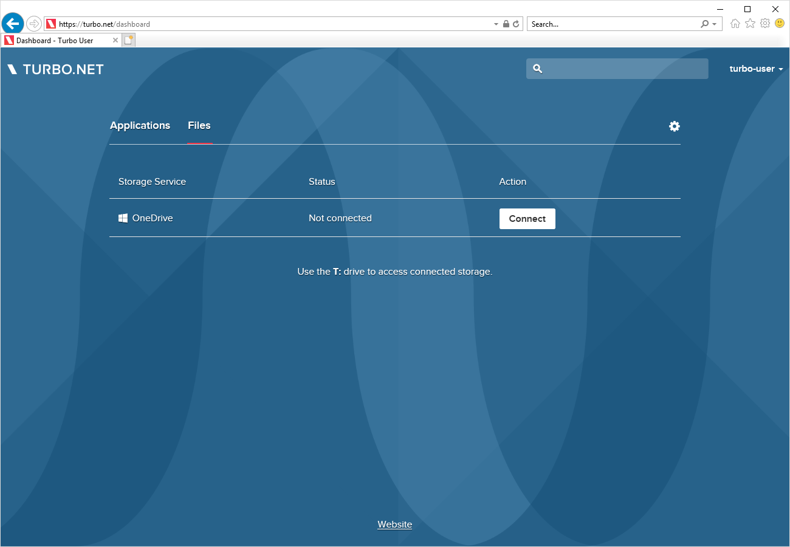
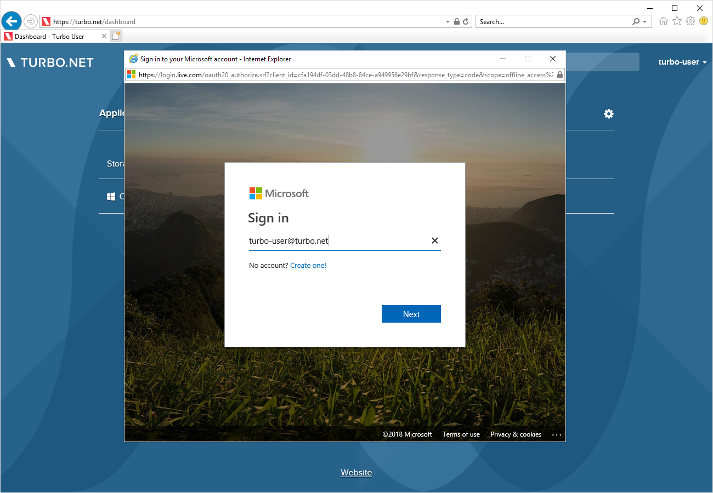
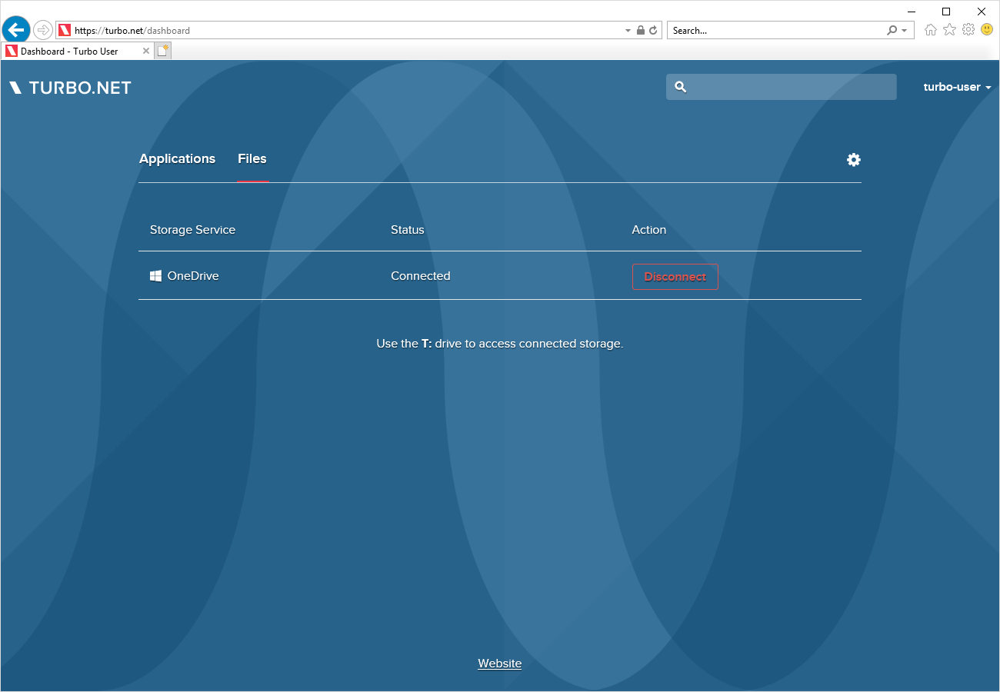
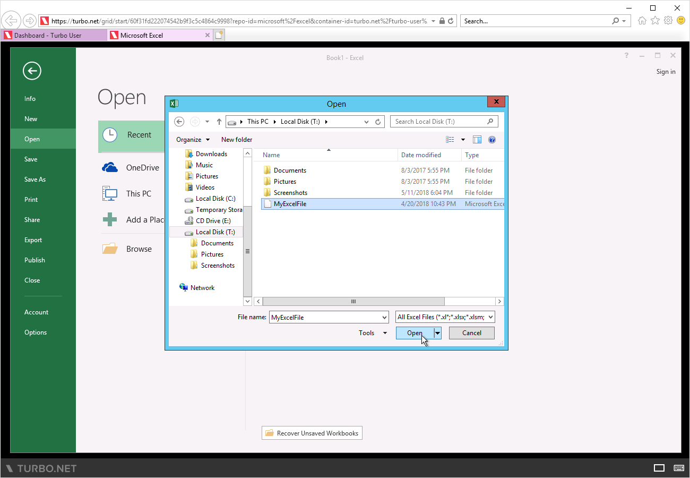

## Using Files

You may access local files when running applications locally via the **Run on My PC** launch mode if the isolation setting for the workspace application is configured to allow it.

For remote launches, also known as the **Run in Cloud** launch modes, files may be transferred between your local device and the remote application via popular online storage providers, such as OneDrive and Dropbox.

### Run on My PC Launch Mode

Users may access their local files when launching an application via the **Run on My PC** launch mode if the workspace application isolation settings are configured to allow it. See [Workspace Applications > Isolation](../../server/administration/workspaces.html#workspace-applications) for more information.

Turbo [storage integrations](../../server/administration/storage.html) that are configured on the Turbo Server can also be made available for the local launch modes if the [WinFSP driver](../../server/cloud-storage/end-user.html#access-from-local-launches) is installed on the end user device and the user has connected their cloud storage account in the portal (if required for the integration).

### Run in Cloud Launch Modes

For remote launches, which are also known as the **Run in Cloud** launch modes, users transfer files between their local device and the remote application via popular online storage providers, such as OneDrive and Dropbox.

The WinFSP driver is added on Turbo Application Servers as part of the Turbo Server installation, so the only requirement is that the [storage integrations](../../server/administration/storage.html) are configured by the Turbo Server administrator and the user has connected their cloud storage account (if required for the integration).

Users can also access files on their device when an application is launched using a Turbo.net native client and the server is configured to [Enable Drive Redirection](../../server/administration/general.html#streaming). On the Portal, this mode is referred to as **Run in Cloud (Windowed)**:

Applications running in this mode will show files from the local device as **Home on My PC** in the File Open and Save dialogs.

Files from the local system may also be accessed using the `\\tsclient\{drive}` remote path.

On Mac systems, applications running in this mode will show files from the local system under the **Home on My Mac** mapped drive in the File Open and Save dialogs.

Files from the local system may also be accessed using the `\\TSCLIENT\Home` remote path.

### Cloud Storage Connections

Connecting a cloud storage service, such as OneDrive or Dropbox, to your applications on Turbo.net is a seamless way to access your files quickly.

From your Portal, click on **Files** to access the storage services for your account.

Then, click on the **Connect** button to link the storage service to your account, allowing Turbo applications to load and save data to the storage service.

You will be asked to authenticate your account with the storage service to link it with your applications.

When the authentication succeeds, the storage service status will show as connected and give you the option to Disconnect.

Files from the storage service will be available under the **T:\\** drive for applications running in the cloud.

