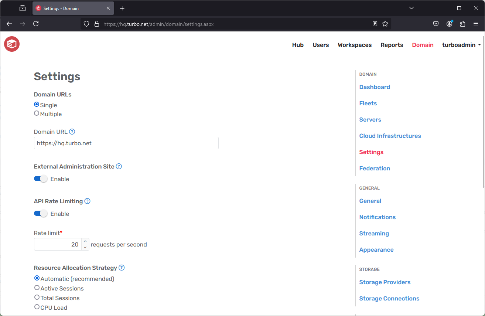
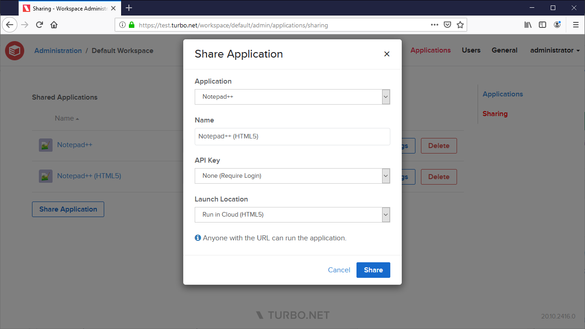

The October 2020 Turbo Server release includes the following major new features:

- **Google Drive** integration is available through the T: Drive.

- User's persisted states can be reset from the administration site **User Sessions** page.

- The administration site can now be reached through the **Portal Gateway** when using single domain URL mode.

- Application **Share URLs** to allow users to launch applications without logging in.

Other improvements include:

- Applications that do not allow the default Portal launch mode now allow users to right-click to select a different launch mode.
- Updated the **Run in Cloud (Windowed)** launch mode to support default Windows domains when launching applications with non-temporary profiles.
- Added search and pagination to the **Hub** repository page.
- The EULA field is no longer part of the Server license file.
- Workspace application command line now accepts release version numbers.

This update includes fixes for the following issues:

- Improved database credential checking during install and upgrade.
- Allow Portal to function under non-standard HTTP (80) ports.
- Users can no longer push images into their own namespace without administrative credentials.
- Changing licenses no longer causes permissions errors when launching on remote cloud.
- Obfuscate sensitive information in logs.
- Improve logoff behavior after setting Turbo Server to anonymous mode.
- Fix group selection state on the Directory Service settings page.
- Show server administration link for users that are added to the administrative group without having to login and logout.
- Bug fixes and improvements to Hub administration site.
- Bug fixes and improvements to Workspace administration site.

