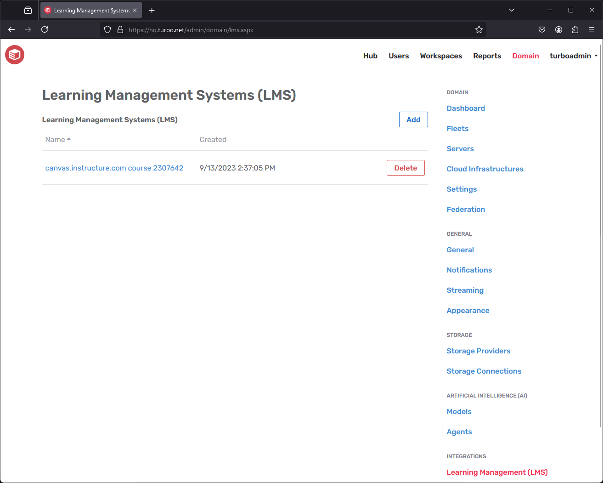

## Integrations

The **Integrations** page provides options to configure integrations with variety of third-party services, such as Compute Infrastructures and Learning Management Systems.

### Compute Infrastructure

The **Compute Infrastructure** page allows administrators to view and manage connections with various compute infrastructures such as Azure. These connections may be used to deploy additional applications servers and join them to the Turbo Server farm.

#### Prerequisites

Compute Infrastructure currently only supports Azure environments. Support for other compute infrastructures may be added in the future.

The Turbo Server farm must be running in Azure with an Azure SQL Database connection. Adding Azure application servers to a on-premises Turbo Server installation is not supported.

For more information on setting up an Azure Turbo Server farm, see the Turbo Server AMI setup docs: [/docs/server/setup-and-deployment/deploying-to-azure#hub-and-portal-role-deployment](../../server/setup-and-deployment/deploying-to-azure.html#hub-and-portal-role-deployment).

#### Azure Setup Guide

Before any application servers can be deployed to Azure, the Azure tenant must be configured with an application registration that has permissions to create new resources.

First, the application registration must be created. This application will be used to generate an access token to the Azure tenant with a limited set of permissions. To create the application registration:

1. Login to the Azure Portal and switch to your desired directory
2. Go to **App Registrations** and click **New Registration**
3. Enter a descriptive name such as `Elastic Deployment` then click **Register**. The other settings can be left as default.
4. Make note of the **Application (client) ID** and **Directory (tenant) ID** for later
5. Go to **API Permissions > Add a permission**
6. Select **Azure Service Management > user_impersonation** then click **Add permissions**
7. Click **Grant admin consent**
8. Go to **Certificates & secrets**
9. Click **Client secrets > New client secret**
10. Enter a desired description and expiration date then click **Add**. Make note of the key value for later.

Next, the application registration must be granted the Contributor role. This will allow the application registration to create Azure resources within the Azure subscription. To grant the Contributor role:

1. Login to the Azure Portal and switch to your desired directory
2. Go to **Subscriptions > Pay-As-You-Go**. Make note of the **Subscription ID** for later.
3. Go to **Access control (IAM) > Role Assignments**
4. Click **Add > Add role assignment**
5. Select the **Contributor** role
6. Click **Members**
7. Click **Select Members** and add the application registration that you created in the previous section
8. Click **Review + Assign**

#### Compute Infrastructure Settings

- **Platform**: The compute infrastructure that is being integrated, such as Azure.
- **Name**: The display name of the compute Infrastructure that will be shown on the Turbo Server administration site.
- **Client ID**: The Client ID from the compute infrastructure application registration. For Azure this is the **Application (client) ID** from the Setup Guide.
- **Secret**: The Client Secret from the compute infrastructure application registration. For Azure this is the **Client secret** value from the Setup Guide.
- **Directory ID**: The Directory ID from the compute infrastructure application registration. For Azure this is the **Directory (tenant) ID** from the Setup Guide.
- **Subscription ID**: The Subscription ID from the compute infrastructure application registration. For Azure this is the **Subscription ID** from the Setup Guide.
- **Region**: The region to which resources will be deployed, such as westus or eastus2. The region must be available in your subscription.
- **Resource Group Name**: The name of the resource group to which resources will be deployed. A new resource group will be created if the specified resource group is not found.
- **Virtual Network Name**: The name of the Virtual Network to which deployed resources will be assigned.
- **Virtual Network Subnet**: The name of the Virtual Network Subnet to which deployed resources will be assigned.
- **Virtual Network Resource Group Name**: The name of the resource group where the Virtual Network is located

The above configurations can be tested by clicking the **Test** button. This will verify that the Client ID, Secret, Directory ID, Subscription ID are present and configured correctly in Azure. It will also check that the Region is available in the subscription.

### Artificial Intelligence (AI)

The **Artificial Intelligence** page allows administrators to view and manage connections with various artificial intelligence services, such as OpenAI. The chatbot is hidden by default and must be enabled from the [Dashboard Tabs](https://hub.turbo.net/docs/server/administration/general#appearance) appearance setting. Once configured, end-users may access the chatbot from the Chat tab on their Portal dashboard.

For more information, see our [OpenAI](https://hub.turbo.net/docs/server/integrations/openai) integration documentation.

### Learning Management Systems (LMS)

The **Learning Management Systems (LMS)** page allows administrators to view and manage connections with various LMSs such as Canvas, Moodle, and Blackboard. Once configured, students may access the Turbo Portal and launch applications through their LMS.

Instructions for setting up an LMS connection are available for [Canvas](../../server/integrations/canvas-lms.html), [Moodle](../../server/integrations/moodle.html), and [Blackboard](../../server/integrations/blackboard-learn.html).

The following sections describe the available LMS configurations:

#### Show in Course Navigation

When the LTI Configuration URL is used, Turbo Server sends user interface instructions to the LMS Platform. These UI instructions include a Turbo icon, description and the following fields:

- Placement location: Course Navigation
- Link text: Apps (customizable)
- Visibility: public
- Default: enabled (customizable)

When **Show in Course Navigation** is disabled, the **Default** setting changes to _disabled_. New courses then hide the apps link from students by default until an instructor chooses to enable it.

**Show in Course Navigation** and **Link Text** settings will not affect LMS Platforms using the LTI Tool Provider URL.

**Turbo must be removed and then re-added to the LMS platform for changes to these settings to take effect.**

#### User Identity

Upon receiving a LTI 1.0/1.1 Launch Request from the LMS platform, Turbo Server must determine the user identity requesting access. Turbo identifies users with two values, both of which must be unique and immutable:

- **Login Name**: User friendly identifier for signing in to Turbo resources.
- **User ID**: User's primary key in your organization's Learning Information System (LIS) or Directory Service.

By default, Turbo will look for these values in LTI Launch Request fields specific to each LMS Product. The following table describes the default fields used for identity for a given LMS.

| LMS        | Login Name                       | User ID |
| ---------- | -------------------------------- | ------- |
| Canvas     | custom_canvas_user_login_id      | user_id |
| Moodle     | ext_user_username                | user_id |
| Blackboard | list_person_sourcedid            | user_id |
| Other      | lis_person_contact_email_primary | user_id |

If your organization has modified the platforms’ identity settings, you may configure Turbo Server to find the Login Name and User ID under custom field names.

Navigate to the LTI page of the Turbo administrator site. Under the relevant value, check Custom to override the default field, then type in the name of the LTI Launch Request field for Turbo Server to use.

#### Workspace

Associating a workspace with the LMS integration allows configuration of where end users will be redirected to when launching Turbo from the LMS. Additionally, this determines the workspace to which channels will be added when **Automatically Create Channels** is enabled.

Selecting "None" will redirect users to the Turbo Portal homepage. If the user has access to exactly one workspace then that workspace will be displayed, otherwise a list of available workspaces will be displayed.

#### Automatically Create channels

Automatically creates a new channel in the specified workspace for unknown courses. A workspaces must be selected to enable this setting.

If the role of the user is an instructor, content developer, or administrator, grant the user administrative permissions to the channel when the channel is created. The instructor will be able to add users and applications to the channel from the portal.

#### Automatically Grant Permissions

Automatically grants user level permissions for the user to the target workspace.

#### Courses

Adding a Course to the Turbo Server allows configuration of a custom link to a particular Workspace or Channel. When a user launches Turbo from a known course, they are routed directly to the configured view.

To add a course to Turbo, it must first exist in the LMS. To edit an existing course, click on its name in the Courses table.

- **Name**: Administrative display name for the course, not seen by users.
- **Course ID**: Unique identifier for the course given by the LMS. Refer to the section below to obtain the value for the desired courses.
- **Workspace**: The Workspace users from the course will be routed to.
- **Channel**: The Channel view that users will be routed to. If left blank, users will be routed to the Workspace view.
- **Default Channel Access**: Automatically grant channel access to users from the LMS course. If the setting is not enabled, users must be granted permissions to the channel manually. Users must also have access to workspace regardless of this setting.

Renaming or deleting a course does not affect the LMS itself; these properties affect only how Turbo interacts with the course.

The following section describes how to locate the course ID for supported LMS.

##### CANVAS

Navigate to any page of the desired course in Canvas. The URL will take a form similar to:

`https://canvas.instructure.com/courses/2307642/quizzes`

The number immediately after /courses/ is the Course ID. In this example, that number is 2307642.

##### BLACKBOARD LEARN

Navigate to the Blackboard Administrator Panel. Under the section **Courses**, click on the **Courses** link.

Locate your course in the table. The Course ID is shown for the course.

##### MOODLE

Navigate to the settings page of the desired course.

The settings page can be reached by clicking the gear icon on the course’s home page or the gear icon on the listing in **Course and category management.**

The Course ID is located under General. If the course does not yet have an ID, one must be given.
