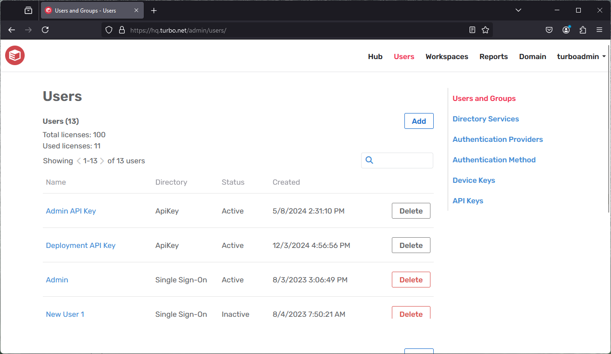
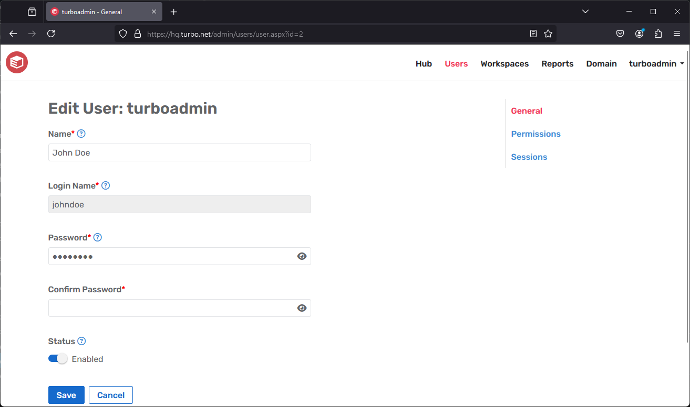
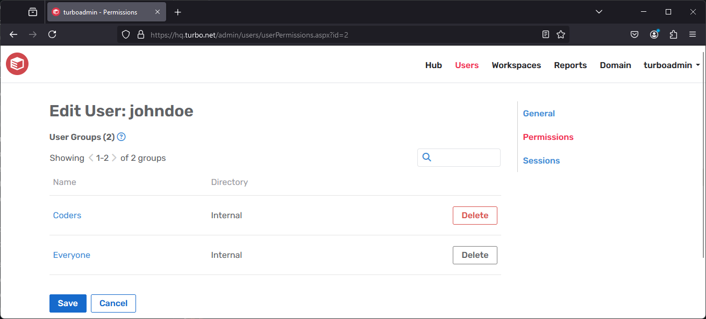
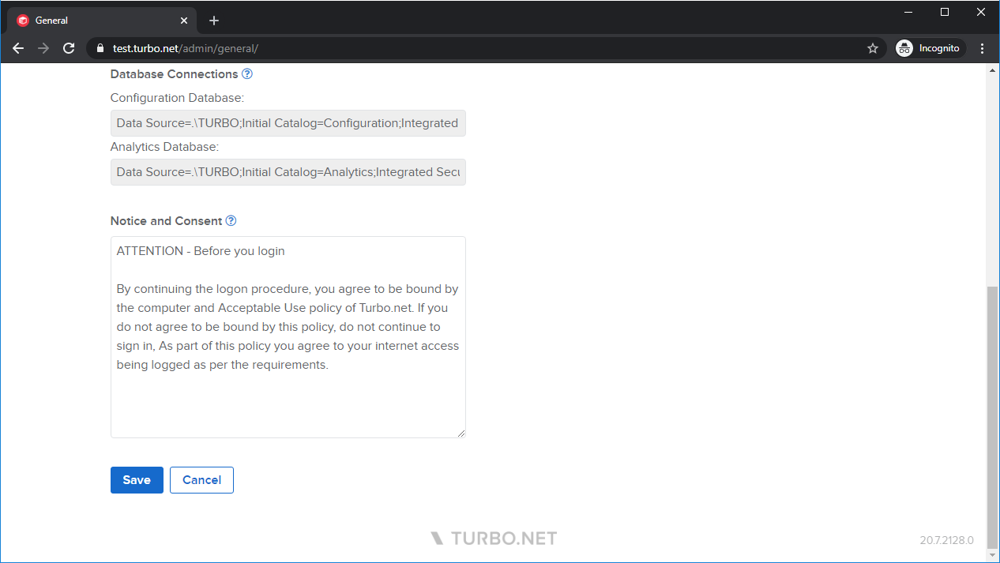

# Users



Turbo Server users are tracked and managed via the Administration Site. Users are entered manually or via automated import from LDAP or Active Directory directory services. Users and user groups can be viewed and managed on the **Users** page. From this page you can view user directories, status, and available actions. Displayed above the user list is the total number of licenses available and the number of licenses currently in use.

Users can be internally created users, synchronized users from external directory services, or a user associated from a API key. API key users cannot be deleted unless the API key is deleted.

### Managing a User



To manage a user, select the user name from the list on the **Users** page. The following fields are displayed on the page:

- **Name**: Full name of the user.

- **Login Name**: The unique login name for the user.

- **Enabled**: Determines whether a user can access Turbo Server. After a user is disabled he no longer consumes a seat.

#### User Permissions



The **Permissions** tab lists all user groups to which the user belongs. User groups determine which workspaces a user can access.

For more user group management options, please see [Managing a User Group](../../server/administration/users.html#managing-a-user-group).

#### User Sessions



The **Sessions** tab lists all persisted sessions for the user. Session persistence is enabled by the [Sessions are persistent](../../server/administration/workspaces.html#editing-a-workspace-application) workspace application setting, which automatically synchronizes the user state and settings with Turbo Server.

**Reset**: Resetting a user session will delete all of the synchronized state and settings from Turbo Server. Sessions that are cached on the user's local device will be reset the next time they run with session persistence enabled.

**Delete**: Deleting a user session will delete all of the synchronized state and settings from Turbo Server. Sessions that are cached on the user's local device will not be deleted. To prevent the locally cached session from synchronizing to the server you may disable session persistence in the application settings.

### Managing a User Group


To create a user group select **Add Group**. The **Add User Group** screen displays. This screen contains the following fields:

- **Name**: The group name that displayed on the user screen.

- **Description**: A group description (optional).

- **Members**: Users and groups that are members of this group. Users and groups are inherited when including other groups as members. Add users or other groups by selecting **Add Members**.

The following groups are special groups that are created automatically and cannot be deleted:

- **Administrators**: This group will be able to log into the administration site and push shared images. Note that changes to the **Administrators** group will require a service restart before they are honored by the hub services. Access to the administration site will be honored immediately.

- **Analysts**: Users in the Analysts group will have access to the [administration reports](../../server/administration/reports.html). No other administrative permissions are granted beyond access to reports.

- **Anonymous**: This group automatically includes any user discovered when the authentication mode is set to **Anonymous**.

- **Everyone**: This group automatically includes all users regardless of authentication mode.

### Adding an External Directory Service


Using Turbo Server you can add an external directory service, such as Active Directory. This enables you to manage users with the touch of a button and easily import existing users and groups into Turbo Hub Server. Complete the following steps to add an external directory service:

1. Open a Turbo Server administration site page in your web browser.

2. Choose the **Users** category from the top navigation bar.

3. Select **Manage Directory Services**.

4. Select **Add Service**. The **Add Directory Service** screen displays.

5. Enter your specific settings into Turbo Server. Each section is detailed below.

**NOTE**: When identity federation is enabled from a source domain to target domain, avoid manual synchronization of directory services in the target domain. Doing so can lead to identity discrepancies, potentially preventing users from receiving updates from the source domain.

**Note**: When synchronizing external directory-services containing of over 5,000 users, the command-line administration utility should be used instead of the Administrator web site. For more information on using the administration utility, see _Manage Turbo Server from the Command Line_. Synchronizing large directory services uses up to 1 GB memory per 500,000 users and groups on the hub server. Ensure that your hub server has enough memory to handle ordinary load when the directory service sync is running.

<table>
      <tr>
         <th data-column="0">
            <div>
               <p>Section</p>
            </div>
         </th>
         <th data-column="1">
            <div>
               <p>Description</p>
            </div>
         </th>
      </tr>
      <tr>
         <td>
            <p><strong>Name</strong></p>
         </td>
         <td>
            <p>This field indicates which service is being added or controlled by the entry. The <strong>Name</strong> field must not be the same as the service or server you are using.</p>
         </td>
      </tr>
      <tr>
         <td>
            <p><strong>Description<br></strong></p>
         </td>
         <td>
            <p>(Optional) <br>Administrators can include a description of the directory service being added, which can be helpful in recording notes about the service.</p>
         </td>
      </tr>
      <tr>
         <td colspan="1"><strong>Login Prefix</strong></td>
         <td colspan="1">
            <p>Login prefixes are given to each user in the directory service to use when they log into the server and are helpful in distinguishing users across different directories. For example, if the directory's login prefix is "acme" and the users name is "aaron", they would log on using the full name "acme\aaron." Once this login prefix is chosen for a directory, it cannot be changed. If you must change the login prefix, the directory service can be deleted and a new one added for the same directory; settings for all users from that directory are lost.</p>
         </td>
      </tr>
      <tr>
         <td colspan="1"><strong>Type</strong></td>
         <td colspan="1">In the <strong>Type</strong> section you can choose the type of the directory service from which to import users and groups. <br> There is variability in location, security, and schema settings for directory services. Turbo Server provides two templates: <strong>Active Directory</strong> and <strong>Other LDAP</strong>. The local Active Directory can be found by selecting <strong>Try Local.</strong> When found, working connection settings are set automatically. <br class="atl-forced-newline"> To synchronize with the local Microsoft Windows domain's Active Directory service, select <strong>Try Local</strong>. This loads default settings into the <strong>Connection</strong> and <strong>Directory Schema</strong> fields. For large directories this can take several minutes. <br class="atl-forced-newline"> If the operation is unsuccessful, continue to the <strong>Choosing Your Connection Settings</strong> section. <br class="atl-forced-newline"> If the operation is successful, continue to the <strong>Choosing the Directories to Synchronize</strong> section.</td>
      </tr>
      <tr>
         <td colspan="1"><strong>Server</strong></td>
         <td colspan="1">
            <p>This section can be used to specify your connection settings to the LDAP directory you are trying to connect to.</p>
            <p>For more on this section, scroll down on this page to <strong>Choosing Your Connection Settings</strong></p>
         </td>
      </tr>
      <tr>
         <td colspan="1"><strong>Binding Type</strong></td>
         <td colspan="1">
            <p>This field is used to specify the form of security being employed by the LDAP server you are connecting to.</p>
            <p>If "Default" is chosen for <strong>Port</strong> in the <strong>Server</strong> section, changing the <strong>Binding Type</strong> will automatically change the port to the standard LDAP port number for that setting.</p>
         </td>
      </tr>
      <tr>
         <td colspan="1"><strong>Synchronization Account</strong></td>
         <td colspan="1">This field specifies the account to use when synchronizing users with the directory services. For more information, scroll down on this page to <strong>Choosing Your Connection Settings</strong>.</td>
      </tr>
      <tr>
         <td colspan="1"><strong>Directory Schema</strong></td>
         <td colspan="1">&nbsp;Allows the administrator to specify which names in the LDAP directory will be imported into the Turbo Server user information. For more information, see <strong>Directory Schema</strong>, further down this page</td>
      </tr>
      <tr>
         <td colspan="1"><strong>Page Size</strong></td>
         <td colspan="1">The page size used when synchronizing the directory service. Typically, the default value for Active Directory services is 1000. Some LDAP implementations do not support the PageSize property, and should be set to 0.</td>
      </tr>
      <tr>
         <td colspan="1"><strong>Synchronized Items</strong></td>
         <td colspan="1">Used to identify items in the directory tree that should be synchronized with Turbo Hub Server. For more information, see <strong>Choosing Items to Synchronize</strong>, further down this page.</td>
      </tr>
</table>  
&nbsp;

**Choosing Your Connection Settings**

Complete the following steps to choose your connection settings:

1. Enter the settings for the **Server** section. The **Host**, **Port**, and **Top directory** are initialized with typical values, but you can customize them to match your directory service settings. They are best discovered using the management tools for the application that hosts them, such as _Microsoft Windows_ or _Apache Directory Services_.

   - The **Top directory** should be specified to avoid potential login issues that are difficult to troubleshoot.

2. Set the **Binding Type**. Changing the **Binding Type** will change the **Port** to the standard LDAP port number for that setting, if you have not specified another port number.

   - Choosing the **Simple** binding type is not recommended if you are binding to Active Directory, but it can be useful while on the page in diagnosing connection problems via the **Test** button.

3. Enter your credentials at the **Synchronization Account** section. To connect with a specific account in the **Synchronization Account** section, specify the username:

   - **Active Directory**: The domain login (e.g. acme\aaron)

   - **Generic LDAP**: The distinguished name (e.g. uid=aaron,ou=acme,ou=system)

4. To test these settings, click on the **Test** button.

5. Once the test is successful, proceed to the **Directory Schema** section.

**Directory Schema**

Directory schema settings are customizable within any directory service; you can change these settings to match the names in your directory service. The most common schema values are tried by selecting **Discover**. You can select **Discover** when you are not satisfied with the result in the **Synchronized Directories** section. Complete the following steps to use the **Discover** functionality:

1. Select **Refresh** from the **Synchronized Directories** section and inspect the results. If the users and groups shown there are accurate, leave the directory schema settings as they are.

2. If the **Synchronized Directories** does not accurately depict the users and groups you expect, select **Discover** and wait for the schema settings text boxes to fill with the recommended values. Test these values at any time from using **Refresh** in the **Synchronized Directories** section.

3. If you know the correct schema name for the given properties, you can enter it manually. If there are more than one name for the same value you can enter each name separated by a semicolon. Each is searched during synchronization.

4. To reset the settings to the Turbo Server default, select Defaults.

**Choosing Items to Synchronize**

You may limit the scope of users and groups that will be synchronized from your directory service, either by choosing specific directories within the service, or by selecting the user groups in which you are interested.

_Choosing directories_

Your directory service might contain some subdirectories that have useful information and others that contain unwanted information. You can choose which subdirectories to synchronize using **Synchronized Items**, selecting the **Directories** option. Complete the following steps to use **Synchronized Items**:

1. Select **Refresh** to use the current connection and directory schema settings to scan your directory service. Information about discovered sub-directories is available via **tooltip popups**. For large directories this operation can take several seconds to complete.

2. To narrow the scope of your synchronization to specific directories complete the following:

   a. Uncheck **Include All**.
   b. Filter results using the search text box (group name prefix).
   c. Check directories to include.

_Choosing groups_

You may have a specific subset of existing users that will use Turbo Server, in a group or groups native to your directory service. You can choose which groups to synchronize using **Synchronized Items**, selecting the **Groups** option. Complete the following steps to use **Synchronized Items**:

1. Select **Refresh** to use the current connection and directory schema settings to scan your directory service. Information about discovered group is available via **tooltip popups**. For large directories this operation can take several seconds to complete.

2. To narrow the scope of your synchronization to specific groups complete the following:

   a. Uncheck **Include All**.
   b. Filter results using the search text box (group name prefix).
   c. Check groups to include. All members of that group will be synchronized, including contained groups and all of their members.

When you are satisfied with your settings, select **Save**. At this point, the users and groups in your directory service are not synchronized with Turbo Server. From the **Manage Directory Services** page, click the synchronization button and verify there are positive counts for users and/or groups when it has finished. For large directories this can take several minutes.

Users created by directory service synchronization are set to disabled by default. These users may still login via the Turbo client using integrated authentication and run commands such as launching applications. The user will be automatically set to enabled once they run an application online. Running an application offline will not set the user to enabled.

**NOTE**: External users synchronized from active directory should not use the login prefix when logging in. User names must be unique, so if there are two users from different active directory sources, only the first one will be synchronized. Password verification is passed through to the active directory service and are not stored on Turbo Server.

#### Troubleshooting

##### Domain identity federation did not update a user's groups

This issue can occur when a user that was previously created by domain identity federation is then synchronized through other means, such as manual directory synchronization in the target domain. In such cases, domain identity federation may bypass updates for the affected user, indicated by a specific log entry in the target domain's service logs:

```
03/25/2024 19:41:08.4550 - Info     - 0x158C: User with login <username> exists with guid <guid>, skipping replication
```

To resolve this, delete the user from the target domain. Then, allow domain identity federation to re-synchronize the user from the source domain, ensuring proper update and synchronization of user group memberships.

### Authentication Method


The **Authentication Method** page configures which Authentication Method is used when an end-user logs into the Hub Site and Turbo Client. The supported methods are:

- **Anonymous**: Anonymous authentication allows users to access the Portal without logging in. All anonymous users are added to the **Anonymous Users** group.

- **Username and Password**: Username and Password authentication requires users to provide their username and password in order to log in. Passwords may be managed from the user settings page.

- **Single Sign-On**: Single Sign-On authentication allows users to login to Turbo Server using an external directory service, such as Azure AD or ADFS. Turbo Server currently supports the following Single Sign-On Methods:

  - **OpenID Connect**: This option will redirect users an identity provider login page that supports OpenID Connect authentication. Upon a successful login, the user will be redirected back to Turbo Server and an account will be created using the basic profile information provided by the OpenID claims. Some example identity providers that support OpenID Connect include AzureAD and Google. For more information, refer to [OpenID Connect](../../server/authentication/openid-connect.html).

  - **SAML 2.0**: This option will redirect users an identity provider login page that supports SAML 2.0 authentication. Upon a successful login, the user will be redirected back to Turbo Server and an account will be created using the basic profile information provided by the SAML response claims. Some example identity providers that support SAML 2.0 include AzureAD and ADFS. For more information, refer to [SAML 2.0](../../server/authentication/saml.html).

- **Accepted Tenants**: Restricts logins to users that belong to an accepted tenant IDs. Leave empty for no restrictions. This field only applies to multi-tenant Azure AD Single Sign-On. For more information on setting up multi-tenant Single Sign-On for Azure AD, see steps for [OpenID Connect](https://hub.turbo.net/docs/server/authentication/azuread-openid-connect#azure-ad-multi-tenancy) and [SAML](https://hub.turbo.net/docs/server/authentication/azuread-saml#azure-ad-multi-tenancy).

- **Ticket Expiration Time**: The amount of time that a login ticket is valid. By default the login ticket when logging in from the Portal will be kept for 7 days if the remember me checkbox is enabled.

- **Check for compromised passwords**: Checks the [haveibeenpwnd](https://haveibeenpwned.com/) database for compromised passwords when creating setting the password for internal users.

- **Integrated Windows Authentication Host**: The IP or hostname of the domain controller for clients using [IWA](../../reference/command-line/login.html). Select **Default** to automatically detect the domain controller's IP address.

### Device Keys


The **Device Keys** page lists all devices that are registered to the Hub Server. Devices are automatically registered with the Hub Server when subscribing or installing applications. Device Keys may be deleted in order to immediately revoke that device's access to the Hub Server.
