## Workspaces

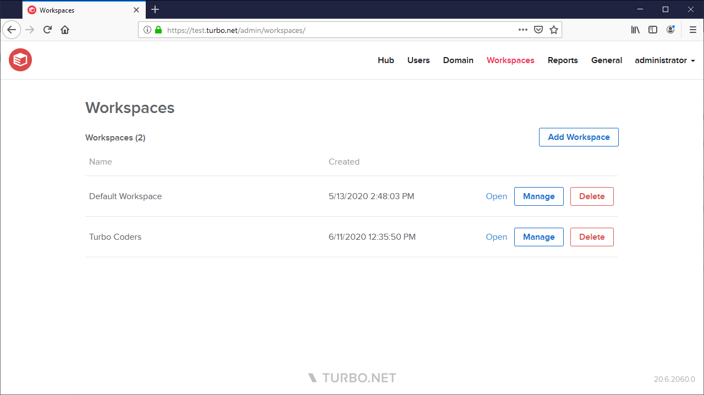

A workspace defines a set of applications and user permissions. These workspaces are shown on the Turbo Portal and on the Turbo Clients to users with sufficient permissions. By default there is a single **Default Workspace** with User permissions granted to the **Everyone** user group, allowing access to all users. Applications, permissions, and analytics can be managed from the the Workspace Administration page.

Server Administrators, as well as users with Administrator permissions to the workspace, may click the **Manage** button to access the Workspace Administration site.

### Workspace Dashboard

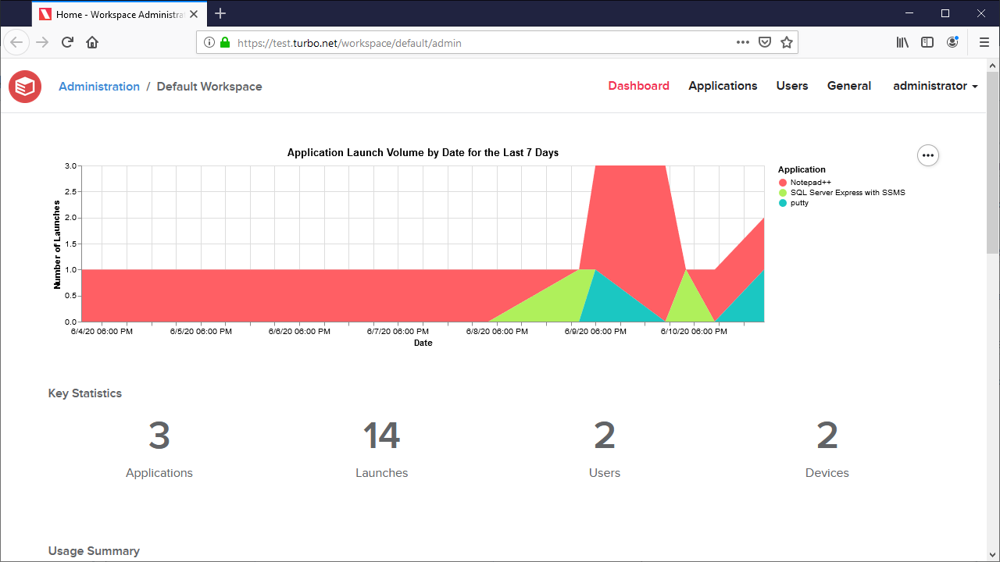

The **Dashboard** page shows application usage analytics for the workspace. The analytics are separated into 4 sections:

- **Application Launch Volume**: A graph visualizing the application launch volume for the past week.

- **Key Statistics**: A summary of the unique applications, launches, users, and devices for the past week.

- **Usage Summary**: A table grouped by application summarizing each application's launch volume for the past week.

- **Recent Activity**: A table detailing the last 100 application launches.

### Workspace Applications

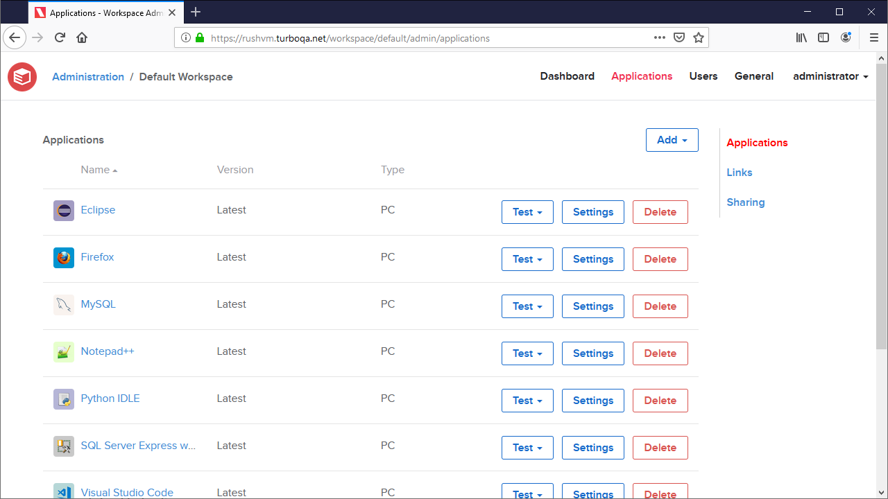

The **Applications** page lists all applications that have been added to this workspace and provides management options such as adding, editing, and deleting applications. Applications added to the workspace will be displayed on the portal to users with sufficient permissions.

Applications are broken down into several different types:

#### Windows Applications

A Windows Application is a Windows desktop application that runs in a containerized environment using the Turbo VM. These applications can be configured with a variety of launch, virtualization, and display settings.

Windows Applications can be managed from the **Application Settings** page and contain the following fields:

##### General

- **Display Name**: The application display name shown on the portal.
- **Icon**: The icon that will be displayed to end users on the portal. The icon must be a valid image type and at most 1MB in size. We recommend using a square icon that is at least 60px x 60px. If no icon is configured, the repository icon will be displayed.
- **Repository**: The name of the image repository used by this application.
- **Application Version**: The application version that will be launched. By default, the latest version will be used. The available application versions are sourced from the base repository.
- **Allowed Launch Modes**: Application launch modes that are available for applications on the portal. Disallowed launch modes will be disabled.
- **Default Launch Mode**: The launch mode the application will use by default if the user does not specify a launch mode. The is the default left-click behavior on the portal.
- **Check for Updates**: Determines when application update checks should be performed.
  - **Automatic**: The application session will automatically check for image updates once every 24 hours or when the application is launched through the portal.
  - **Never**: The application session will not check for any updated images.
- **Video Encoding**: The preferred video encoding used for remote execution. Video encoding support depends on the application server settings and hardware.
- **Initial Window State**: The initial window state of the application window. Default will use the default application behavior, while Maximize will make the application window full-screen. This setting does not affect Run in Cloud (HTML5), which will always use maximize.
- **Startup File**: The startup file that is used when launching the application. By default the image's startup file is used.
- **Startup File Arguments**: Arguments passed to the application startup file.
- **Profile Mode**: The login mode used when launching applications in the cloud. Possible options are:
  - **Temporary Profile**: A temporary user profile will be created on the Application Server. Temporary profile persistance can be configured on the [Server Settings](../../server/administration/domain.html#managing-a-server) page.
  - **Ask for Credentials**: The user will be prompted to enter their Windows credentials for the Application Server. Both down-level and UPN logon names are accepted. Users must enter the [UPN logon name format](https://docs.microsoft.com/en-us/windows/win32/secauthn/user-name-formats) for Windows 10+ Enterprise multi-session. NOTE: HTML5 file integration may not function properly if the down-level domain is entered along with a UPN.
  - **Kerberos**: The user will be prompted to login using [Kerberos authentication](../../server/authentication/kerberos.html).
- **Restrict to User Groups**: Restricts the application's visibility to members of the specified user group. If a value is provided, then only members of that user group will see the application on the portal. If no value is provided, then all users with access to the workspace will see the application.

  If a user installs an application while they have permission, but that permission is later revoked, an error message will be displayed when the application is launched.

- **VM Version**: The VM version is a version string that specifies which Turbo VM version will be used for execution. The available VM versions are sourced from the Turbo Virtual Machine system image. See [VM Version](../../hub/repositories/repository-settings.html#vm-version).
- **Enable Assembly cache**: Enables pre-caching of application assemblies for faster loading, at the cost of additional disk space. Particularly beneficial for complex applications with numerous DLLs and EXEs, but typically not required for smaller applications. See [Use DLL cache](../../hub/repositories/repository-settings.html#use-dll-cache).
- **Launch on Install**: Automatically launch the application when it is registered onto a device, such as when running the `subscribe <workspace> --register` commands from the Turbo client.
- **Run as Administrator**: Runs the application with administrator privileges.
- **Container Name**: The container name that is used when launching the application. By default the image's name is used.

##### Isolation

- **Access Local User Folders**: Allows the application to access the host device's local user folders, such as Desktop, Downloads, Documents, Music, Pictures, and Videos. See [Access local user folders](../../hub/repositories/repository-settings.html#access-local-user-folders).

  Set to **Inherit from Workspace** to inherit this setting from the corresponding workspace setting, or select a custom isolation settings to override the workspace setting.

- **File Isolation**: Determines the level of file visibility and access from the vm to the host environment. By default, local launches use Full isolation and cloud launches use Write Copy isolation. See [Isolation Settings](../../reference/command-line/run.html#isolation-settings).

  Set to **Inherit from Workspace** to inherit this setting from the corresponding workspace setting, or select a custom isolation settings to override the workspace setting.

##### Network

- **Isolate Network**: Isolates the virtualized network environment from the host device's network. See [Isolate network](../../hub/repositories/repository-settings.html#isolate-network).
- **Tunneling**: Tunneling allows the application to tunnel traffic from the virtual environment to the specified targets accessible from the portal server. Tunneling currently supports TCP and IP protocols and requires SSL (https) to be enabled on the domain. UDP is not supported. See [Proxy Settings](../../reference/command-line/run.html#proxy-settings).
- **Network Routes**: A whitelist or blacklist of network routes that are accessible by the virtual network environment. See [Controlling Outbound Traffic](../../reference/command-line/run.html#controlling-outbound-traffic).

##### Components

- **Components**: A list of additional image repository IDs that are added to the base image as layers. See [Components](../../hub/repositories/repository-settings.html#components).

##### Storage

- **Sessions are persistent**: Persists the application state and settings on the host machine, enabling persistence across multiple sessions. Typically this setting should be enabled in order to prevent loss of data. This setting defaults to true.
- **Synchronize across devices**: Automatically synchronizes the application state and settings with the Hub server, enabling persistence across multiple devices. Sessions are persistent must be enabled to change this setting. This setting defaults to false.
- **Drive Visibility**: Controls which drives are visible in the virtualized application environment during cloud runs. This setting does not apply to local runs. By default, only the system drives and T: Drive are visible.
- **Mount Points**: A list of mount points that mount file paths from the host into the container. Supports NTFS paths, UNC paths, and special folder variables (see [Folder Variables](../../vm/virtual-machine/folder-variables.html))

##### Licensing

**User and Device Limits**: Restricts the number of users or devices that can launch the application. The license counters are reset when the setting is modified. Available options are:

- **Unlimited**: No limits to the application. Set to unlimited to reset previously assigned named licenses.
- **Named Users**: Restricts the total number of named user that can run the application. A named user is a distinct Turbo user, which includes anonymous users and api-key sessions.
- **Concurrent Users**: Restricts to the number of users allowed to run the application at a given time.
- **Named Devices**: Restricts the total number of devices that can run the application. A named device is base on the end user operation system SID and MAC address.
- **Concurrent Devices**: Restricts to the number of devices allowed to run the application at a given time.

**License Reservation**: Allows reserving licenses for certain user groups at certain times. Only available for concurrent user licensing.

- **User Group**: The user group for which the licenses are reserved.
- **Licenses**: The number of licenses that will be reserved.
- **Start Time**: Specifies when the reservation will start.
- **End Time**: Specifies when the reservation will end.
- **Recurrence**: The frequency at which the reservation will reoccur.

##### IP Restrictions

- **IP Access Rules**: A whitelist or blacklist of IPs that control access to this workspace application. Clients that access the portal dashboard from a blacklisted IP will not be able to view the application.

  Detailed access control information may be found at [Access Control](../../server/applications/access-control.html).

##### Server Assignment

- **Fleet**: Restrict application launches to a [fleet](../../server/administration/domain.html#fleets).
- **Server Tag Rules**: Restricts cloud application launches to application servers that satisfy the tag rules. An application server must contain the exact tag name and value for all tags in order to qualify. Comparisons are case-insensitive and empty tag values will match against any value.

  For information about configuring Server tags, see [Managing a Server](../../server/administration/domain.html#managing-a-server)

##### Shell Integration

The **Shell Integration** page allows administrators to enable or disable shell integrations that determine how installed applications interact with the host device, such as by adding shortcuts, file associations, and shell extensions. By default, all shell integrations will be enabled except for services and the default start menu shortcut.

Web applications only support the default start menu shortcut and cannot be customized.

Shell integrations are configured in the application image. For more information on configuring shell integrations in Turbo Studio, see [Desktop Integration](https://hub.turbo.net/docs/studio/working-with-turbo-studio/desktop).

For more information on using shell integrations, see [Shell integration](../../getting-started/administrators/desktop-integration.html#shell-integration)

##### VM Settings

The **VM Settings** page lists advanced virtual machine configuration settings that affect application runtime behavior. If "Inherit from Workspace" is selected, then the value defined in the workspace settings will be used instead.

#### Host Applications

A Host Application is a Windows desktop application that launches an existing installed application on the application server or local client host in a containerized environment using the Turbo VM.

When adding a Host Application to a workspace, a list of applications will be recommended based on the link files in the application servers' all users (common) **Desktop** and **Start Menu** folders. Selecting an application will set the launch settings to the link file's target and arguments. The application list is updated on service start and every 30 minutes thereafter.

If you do not see your desired application, check to see if the application has shortcuts in the common **Desktop** or **Start Menu** folders on the application server. This may be the case for Internet Explorer if is not installed on the server (no shortcuts, but still exists in program files). You may also select **Custom** application to manually enter your settings. We recommend setting the **Startup File** to the target file path instead of a link file path to ensure that the path is resolved correctly. Please ensure that the file path exists on the target Application Servers and client hosts, or else the application will fail to launch.

The Host Application isolation must be set to `write-copy` or `merge` in order to access the natively installed application. Using `full` isolation will cause the application to fail to launch.

Host Applications offer the same launch, virtualization, and display settings as PC Applications. These settings may be managed from the **Application Settings** page.

#### Web Applications

A Web Application is a software program that runs on an external website that is opened in the active browser or a new virtual browser environment. Web Applications offer the same launch, virtualization, and display settings as PC Applications, in addition to the following Web Application specific fields. These settings may be managed from the **Application Settings** page:

- **Browser**: Whether the URL will be opened in the active browser or a new virtual browser environment. Virtual browsers will be listed here if the repository contains the browser category. Repository categories can be managed from the **Edit Repository** page. This setting defaults to **Active Browser**.
- **URL**: The target URL that is opened when launching the web application.
- **Open In New Tab**: Whether the URL will be opened in a new tab. This option only takes effect when targeting the active browser.

### Workspace Startup

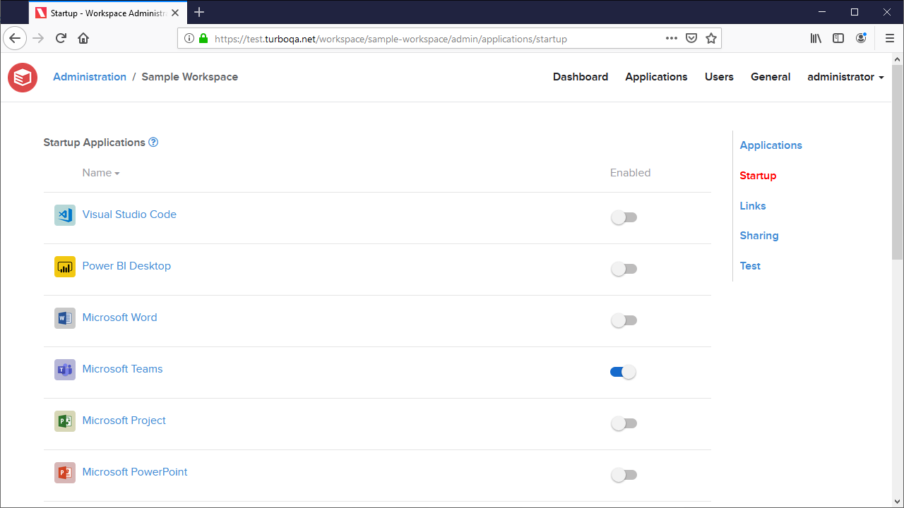

The **Startup** page allows administrators to configure the startup behavior for installed workspace applications.

The **Startup Applications** table lists all workspace applications and and their startup settings. Applications with startup enabled will run automatically when the application is installed to the device. This setting is disabled by default.

When an application is marked as a startup application, commands that install that application to the device such as `turbo subscribe --register` and `turbo subscription register` will run the application automatically. The application is launched by shell executing the default shortcut. If the application has no shortcuts then the application will not be launched. For more information on configuring shortcuts with Turbo Studio, see [Desktop Integration Settings](../../studio/working-with-turbo-studio/configuration.html#desktop-integration-settings)

### Workspace Links

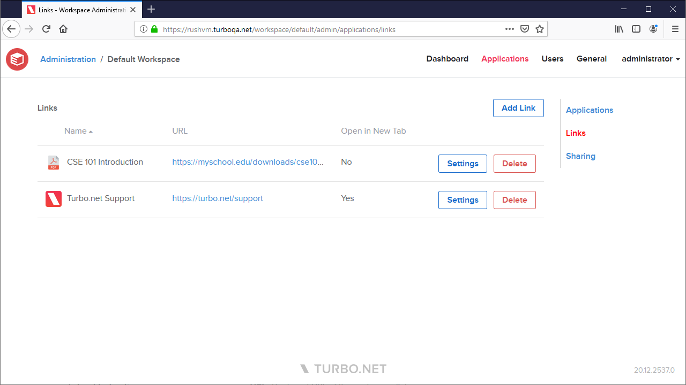

The **Links** page allows administrators to create and customize web links for end users to open URLs from their dashboard. These links appear under the **Links** tab on the portal dashboard.

To create a new workspace link, click the **Add Link** button and enter your preferred options:

- **Name**: The name that will be displayed to end users on the portal.
- **URL**: The target URL of the workspace link. If a URL is not include a protocol, then "https://" will be prepended automatically.
- **Open in New Tab**: If enabled, the link will be opened in a new browser tab. Otherwise, the link will be opened in the current browser tab.
- **Icon**: The icon that will be displayed to end users on the portal. The icon must be a valid image type and at most 1MB in size. We recommend using a square icon that is at least 60px x 60px. If no icon is configured, a default icon will be displayed.

### Sharing a Workspace Application

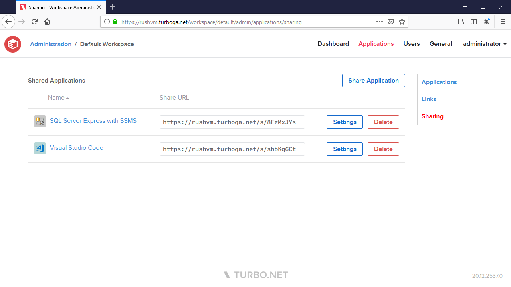

The **Sharing** page allows administrators to create shareable URLs for end users to run applications without having to log into the portal.

To create a new shareable URL, first create a non-system API key using the [API Key administration page](../../server/administration/hub.html#managing-api-keys).

Next, click the **Share Application** button and select your preferred launch options:

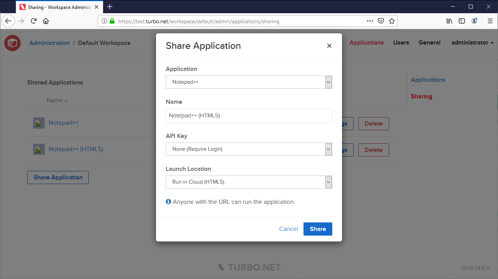

- **Application**: The workspace application that will be launched.
- **Name**: A display name for the share link. This name is only displayed on the workspace administration site to help differentiate share links.
- **API Key**: The API key that will be used to authentication anonymous users who use this share link. If None is selected, user's will authenticate using their logged in credentials. The API Key Name must be added to the Workspace User Permissions as a User or the shared application will fail to launch due to insufficient permissions.
- **Launch Location**: The location where the application will be launched.

To test your link, open an incognito browser window without logging into Turbo.net and paste the URL into the browser address bar. The application should run without requiring a login. Please be aware that the Share URLs use an API Key that allows access to your organization's applications and should be kept secure within the organization.

If you wish to modify or revoke your Share URL, you may do so by clicking **Settings** button on the appropriate Share URL.

### Testing Workspace Applications

The **Test** page allows administrators to perform multiple workspace applications launches simultaneous with various test configurations. Each application is launched in the HTML5 client with a unique temporary profile. These tests can, for example, simulate heavy application server loads and identify load related issues.

The following form fields are described below:

- **Application**: The application that will be launched. Applications must belong to the current workspace to be selectable.
- **Instances**: The number of application instances that will be launched. Each application instance is assigned an incrementing ID that creates a unique session. The ID is specified by the `instance` URL query parameter in the HTML5 client. The test will always start at instance ID 0, which will reuse any existing test sessions. This allows the tester to know exactly how many sessions of the application is running.
- **Server Assignment**: The rules that dictate the application servers to which the test workload is assigned.

  - **Auto**: The application server will be assigned without restriction based on the resource allocation strategy configured in the domain.
  - **Application Server**: The selected appliation server will be assigned.
  - **Server Tag Rules**: Filters the application servers that can be assigned the application instance according to their tags. A server must satisfy all of the supplied tag rules to qualify for launch.

    Tag name and values are case-insensitive. If no rules are provided then a server will be assigned without tag restriction.

Additional supported query params on the HTML5 client:

- **cache-mode**: A number that determines which caches will be enabled or disabled for this launch. Missing or empty will launch with all caches enabled. The cache mode value uses the following bitmasks to determine the cache behavior:
  - **1** (0b01): Launch with the portal caches disabled
  - **2** (0b10): Launch with the broker caches disabled
  - **3** (0b11): Launch with both portal and broker caches disabled
- **no-logoff**: Determines the remote session behavior on browser tab closure. By default, the remote session will be logged off on tab closure. If this query parameter is present, the remote session will instead disconnect and will logoff according to the configured Streaming settings.

Clicking the **Run** button will execute the test, opening an HTML5 client browser tab for each application instance.

**NOTE**: Some browsers may attempt to popup block the test instances. If your browser notifies you about blocked popups, please allow them for the Turbo Server administration site.

#### Diagnosing Test Results

The following section describes some resolutions to common issues when testing an application.

**Application launches are slow with some instances that fail to start**

Check the HTML5 client's browser console logs. If the PUT session request fails with 502 error, then the Broker may not be responding in time due to a resource constraint. Increase the number of hub and application servers to improve the performance.

**Application launches are slow with instances in session closed state**

Check the CPU and memory usage on the application server when launching a large number of instances. If the sessions are bound by the CPU, they may not start in a timely manner resulting in the RDP protocol to disconnect. Increase the number of application servers or CPU cores on the application server.

### Workspace Storage

The **Storage** page allows administrators to manage storage-related workspace settings, such as storage scopes.

**Workspace Scopes** allow you to customize the way storage provider connections are displayed within a workspace on the portal dashboard. By configuring a scope to point to a specific folder in a storage provider connection, that folder will appear as the root folder for users who have access to that connection.

Currently, Turbo Drive does not support the use of scopes. Instead, it will display the root folder for each connection directly.

#### Storage

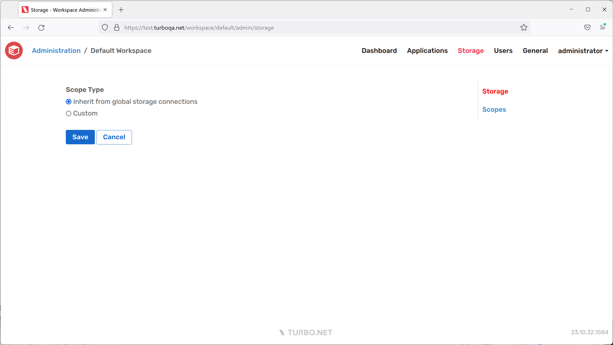

The **Storage** page allows the administrator to configure the scope type for this workspace. The available options include:

- **Inherit**: The workspace will inherit storage scopes from global storage connections. This means that for each storage provider connection, the root folder will be visible to users. Scopes cannot be customized in this mode.
- **Custom**: The workspace will not inherit any storage scopes. Only the scopes that are explicitly added to the Scopes page will be visible to users. Global storage connections will not be displayed by default, but per-user storage connections will still be displayed by default.

#### Scopes

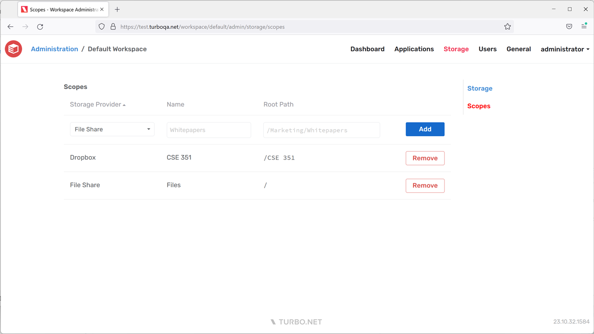

The **Scopes** page allows administrators to customize workspace storage scopes. The form will only be enabled if the workspace scope type is set to **Custom**. The administrator can choose an existing storage provider, assign a display name that will be shown to end-users, and specify the path that will serve as the root folder for the scope.

The root path must be a valid, root-relative file path such as `/Courses/CSE 351`. For id-based storage providers such as Google Drive, the root path is the folder id such as `/1ns1zZkUgiU9Phjg1LR8ZEJc5Xb2yD2qy`.

### Workspace Users

The **Users** page allows administrators to manage user-related settings, assign user and group entitlements, and manage channels.

Please note that changing or removing an existing workspace permission may take up to 5 minutes to be reflected on the portal site. During this time, a user that is upgraded from User to Administrator may not see the workspace listed in the account dropdown or be able to access the workspace administration site. Likewise, a user that was downgraded or removed may still see the workspace listed in their account dropdown, however they will not be able to access the workspace administration site. The user may logout then login to see the change immediately.

#### General

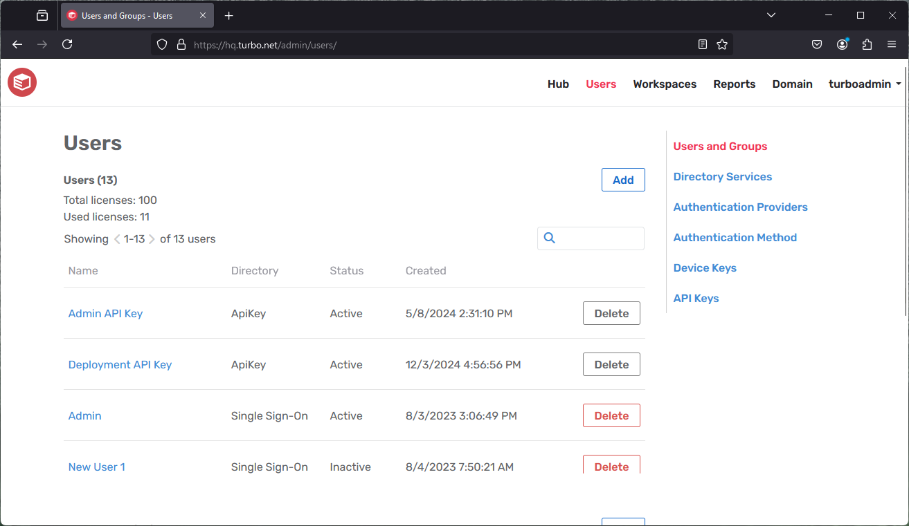

The users **General** page allows the administrator to configure the following settings:

- **Default Item Permission**: The default user entitlement for workspace items. If this setting is disabled, workspace items will not be visible to users unless they have been granted access, such as through channel membership. Permission is enabled by default.
- **Default Active Directory Domain**: Sets the default Active Directory domain used to login when launching applications in the cloud with non-temporary profiles.

#### Permissions

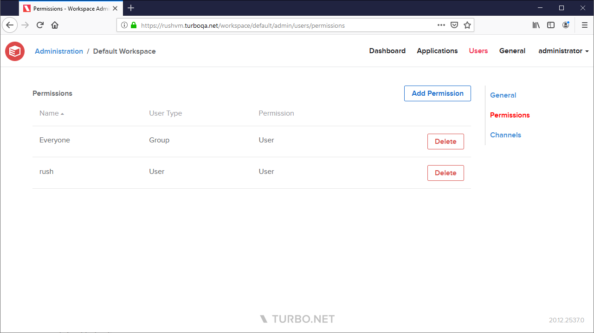

The users **Permissions** page lists all user and user group permissions that have been added to the workspace and provides management options such as adding and deleting permissions. The following permissions are available:

- **User** - Grants read access to the worksapce dashboard.
- **Read-Only Administrator** - Grants read access to the workspace APIs, in addition to access granted by **User**.
- **Administrator** - Grants full access the workspace administration site and workspace APIs, in addition to access granted by **Read-Only Administrator** and **User**.

#### Channels

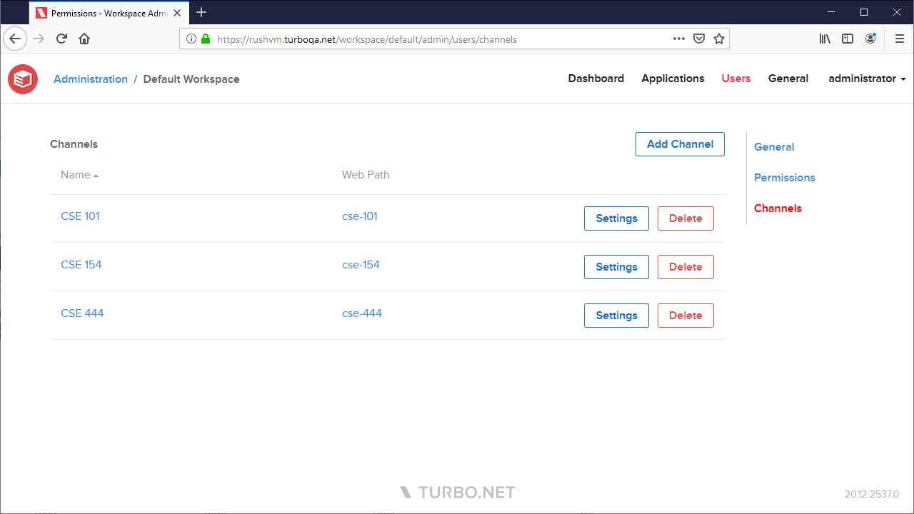

A channel is a collection of workspace items such as applications, links, and files that are made available to a configurable list of users and groups. Channels are visibile on the Turbo Server portal to users with sufficient permissions.

The users **Channels** page lists all channels that have been added to this workspace and provides management options such as adding and deleting channels.

Channels can be managed from the following channel settings pages:

##### General

The channel **General** page allows the administrator to configure the following settings:

- **Display Name**: The name that will be displayed to end users on the portal.
- **Web Path**: The web path that uniquely identifies this channel, used to form the channel URL.

##### Items

The channel **Items** page lists all workspace items that have been added to the channel and allows the administrator to add and remove workspace items.

To add a workspace item to a channel link, click the **Add** button and select the workspace item type that you wish to add. The add dialog will list all items of the corresponding type that exist in the workspace. Items must be added to the workspace before they can be added to a channel.

##### Users

The channel **Users** page lists all user and user group permissions that have been added to the channel and provides management options such as adding and deleting permissions. Granting **User** permissions will allow that user or user group to access the channel, while granting **Administrator** permissions will allow that user or user group to access the channel administration page on the portal.

The **Everyone** group is automatically added with **User** permissions when the channel is created.

If the **Default Item Permission** workspace setting is enabled, all channel items will be visible from the workspace dashboard regardless of channel membership.

### Workspace General

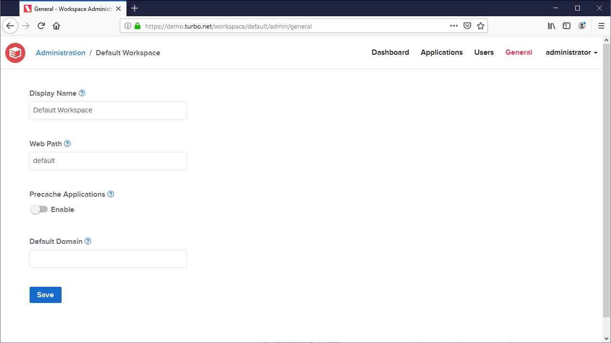

- **Display Name**: The display name of the workspace.
- **Web Path**: Folder name consisting of letters and numbers used to form the workspace URL.
- **Precache Applications**: Controls whether this workspace is automatically cached to the Application Server.
- **Access Local User Folders**: Allows workspace applications to access the host device's local user folders, such as Desktop, Downloads, Documents, Music, Pictures, and Videos.

  The **Reset** action will reset all workspace applications in this workspace to **Inherit from Workspace** local user folder access.

- **File Isolation**: Determines the level of file visibility and access that workspace applications have from the vm to the host environment. By default, local launches use Full isolation and cloud launches use Write Copy isolation.

  The **Apply to All Applications** action will reset all workspace applications in this workspace to **Inherit from Workspace** file isolation.

- **VM Settings**: Configures advanced virtual machine configuration settings that affect application runtime behavior.

  The **Apply to All Applications** action will reset all workspace applications in this workspace to **Inherit from Workspace** VM settings.

#### URL Handlers

Desktops and mobile devices handle URLs by launching an application registered to the URL's scheme (often described as a protocol handler). For example, HTTP or HTTPS URLs are opened by the device's natively installed web browser.

Organizations may require that URLs that match a specific scheme and optional authority plus path should be opened by a Turbo application instead of by the device's native application.

The scheme and host of the URL determines the application used to run the URL. Turbo Client opens a Turbo application associated with that URL. URL paths are pattern matched using a pattern string along with a match mode to launch different Turbo applications or passed through to the native application protocol handler.

Turbo Client registers the protocol handlers in the OS for the user's Workspaces that contain Workspace URL handlers. Once the URL handler is triggered by the OS by a user action such as clicking on a URL link or typing in the command prompt, the Turbo application launches with the URL as the parameter as if the application was installed and registered as the native protocol handler.

The supported launch methods are remote HTML5, remote native, and local if the platform requirements are met.

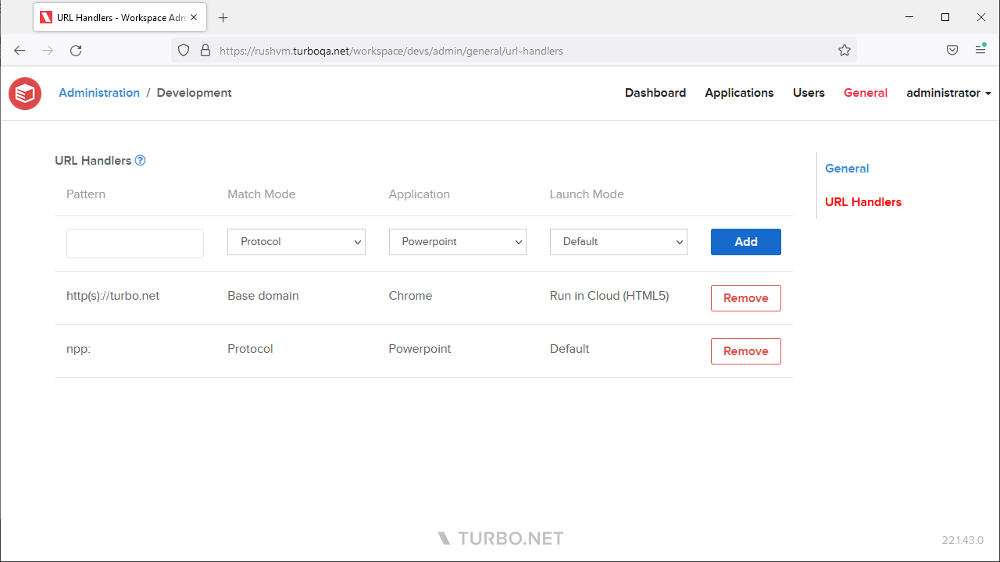

The following table describes the match modes used by the Workspace URL handlers:

Here's the table converted to markdown:

| Match Mode   | Description                                                                                                                                                                               |
|--------------|-------------------------------------------------------------------------------------------------------------------------------------------------------------------------------------------|
| Protocol     | Matches if the protocol matches. If http or https, match uris with either HTTP or HTTPS schemes. Pattern should be valid uris with just the scheme e.g. https:, turbo:, magnet:           |
| Base Domain  | Matches the top level and second level doman names.                                                                                                                                       |
| Host         | Matches the full host, including the subdomain and port.                                                                                                                                  |
| Starts With  | URLs are matched if they start with the pattern string.                                                                                                                                   |
| Exact        | URLs are matched if they are equal to the pattern string.                                                                                                                                 |

Examples of patterns and matched URLs:
Here's the table converted to markdown:

| Match Mode   | Pattern                     | Results                                                                                                                                                                                                                                                                                   |
|--------------|-----------------------------|-------------------------------------------------------------------------------------------------------------------------------------------------------------------------------------------------------------------------------------------------------------------------------------------|
| Protocol     | https:                      | ✅ http://turbo.net ✅ https://turbo.net ❌ mailto:support@turbo.net                                                                                                                                                                                                                  |
| Base Domain  | https://turbo.net           | ✅ http://turbo.net ✅ https://app.turbo.net ✅ https://docs.turbo.net ❌ https://yahoo.com                                                                                                                                                                                        |
| Host         | https://app.turbo.net       | ✅ http://app.turbo.net ✅ https://app.turbo.net ❌ https://docs.turbo.net                                                                                                                                                                                                            |
| Starts With  | https://app.turbo.net/run   | ✅ http://app.turbo.net/run ✅ https://app.turbo.net/run ✅ https://app.turbo.net/run?id=5 ❌ https://app.turbo.net ❌ https://app.turbo.net/docs                                                                                                                               |
| Exact        | https://app.turbo.net/run   | ✅ http://app.turbo.net/run ✅ https://app.turbo.net/run ❌ https://app.turbo.net/run/ ❌ https://app.turbo.net/run?id=5                                                                                                                                                          |

#### File Associations

File associations allow user's files and registered desktops to open the specified file types with a workspace application.

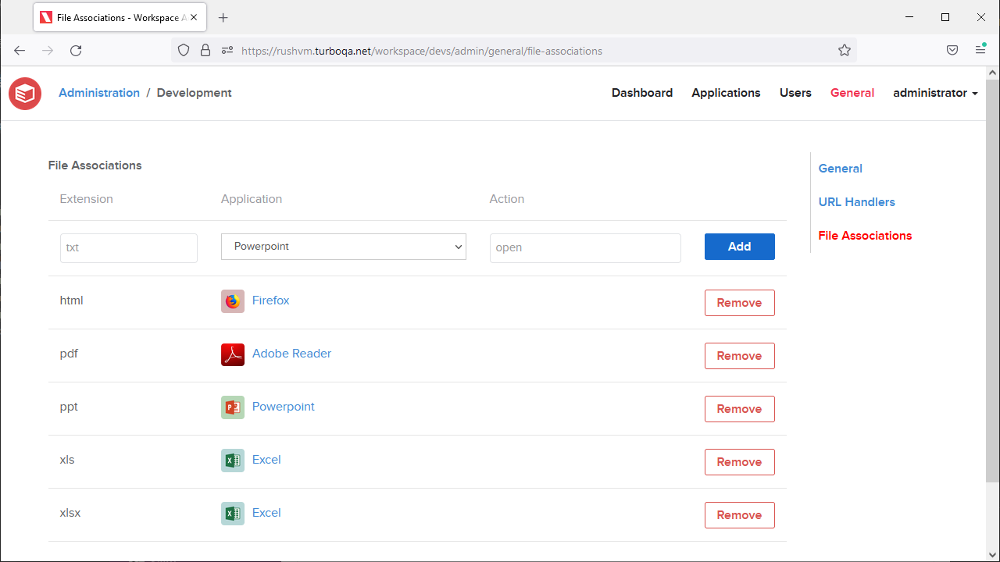

- **Extension** - The file extension that maps a file to a workspace application. The extension must be non-empty. Extensions are case-insensitive and are normalized on submission.
- **Application** - The workspace application that will be launched for files with the matching file extension.
- **Action** - The action that will be performed on the file, such as `open` or `edit`. This field is optional.

The equivalent command to open the file via Turbo CLI is `turbo run <application> --startup-file=<file> --startup-verb=<action>`.

Administrators must ensure the application is configured to handle the verb for the give file type, see [Studio Desktop Integration](../../studio/working-with-turbo-studio/desktop.html#desktop-integration).
