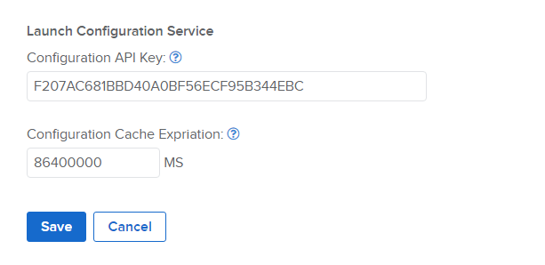
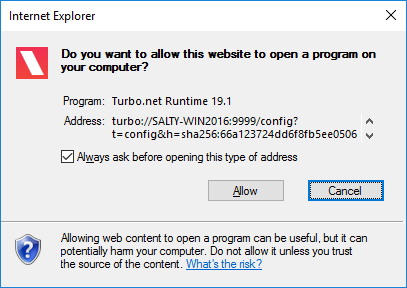
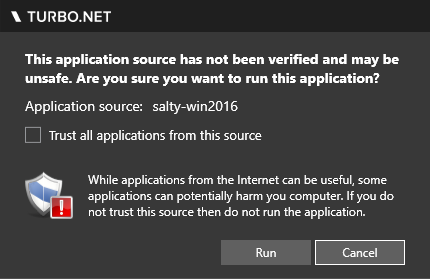

# Launch Configuration Web Service

The **launch configuration web service** provides storage for application configurations which may be used to execute applications from a custom web portal using turbo urls. If the Turbo Portal is used as your application portal, this service is not necessary.

### Enabling the Launch Configuration Web Service

The launch configuration service may be configured using the [API Keys](../../server/administration/hub.html#managing-api-keys) form on the admin site.



In this example, the authentication key is set to `F207AC681BBD40A0BF56ECF95B344EBC`. This value is required to be passed to all POST requests to the service in the `X-Config-Api-Key` HTTP header. The authentication key can be any string value but should be something long and randomly generated.

**NOTE:** It is important that this authentication key be kept secret to prevent unauthorized users from generating malicious application configurations. Any usage of the key or the code to submit a configuration must be done on the web portal's **server side** code (not in the browser client where a user can retrieve the key).

### Submitting a Application Configuration

To submit an application configuration, a simple web POST such as shown in the follow example may be used:

```
// Create an application configuration object using either the workspace application id or repository id.

// Example 1: Use a workspace application id to create an application configuration with the workspace application settings as defaults.
// This example assumes a workspace application with the id `716b5ebc-6588-4c54-b74b-4506bbc968d3` already exists. The application id may be found in the URL path of the workspace application's settings page.
var appConfig = { appId: "716b5ebc-6588-4c54-b74b-4506bbc968d3" };

// Example 2: Use a repository id to create an application configuration with default settings.
// This example assumes a repository with the id `gnu/wget` already exists. The repository id may be found in the administration site repository settings page.
var appConfig = { repoId: "gnu/wget", "v": 1, verb: "run", isolation: "write-copy" };

// submit the application configuration to the service
var request = new XMLHttpRequest();
request.open("POST", "http://[hub-server]/start/app");
request.setRequestHeader("Content-Type", "application/json");
request.setRequestHeader("X-Config-Api-Key", "F207AC681BBD40A0BF56ECF95B344EBC");
request.send(JSON.stringify(appConfig));
request.onreadystatechange = function () {
   if(request.readyState === 4) {
      if(request.status === 200) {
         console.log(request.responseText);
      }
      else {
         console.log("request failed with status code: " + request.status);
      }
   }
};
```

Submit a POST request to the web service with the configuration json string, note the required request headers of `Content-Type` and `X-Config-Api-Key`. The response json contains a set of turbo urls that can be used to execute the application from the browser, for example:

```
{
   "url": "turbo://[hub-server]/start/app?t=config&h=sha256:66a123724dd6f8fb5ee050644a5494795fed2a1901d0c56def4030d8a6a26175&scheme=http&v=2",
   "urlInternal": "turbo://[hub-server]/start/app?t=config&h=sha256:66a123724dd6f8fb5ee050644a5494795fed2a1901d0c56def4030d8a6a26175&scheme=http&v=2"
}
```

Once submitted, the configuration will be available for the configured timeout period. This can be set on the server administration website (the default is 24-hour). The timeout is reset whenever the configuration is retrieved.

You may also lookup configs from the launch configuration service by performing a GET request on the same URL with an HTTP/S scheme, for example:

```
http://[hub-server]/start/app?h=sha256:66a123724dd6f8fb5ee050644a5494795fed2a1901d0c56def4030d8a6a26175&scheme=http&v=2
```

### Executing an Application Configuration

```
// open turbourl to config
var url = "turbo://[hub-server]/start/app?t=config&h=sha256:66a123724dd6f8fb5ee050644a5494795fed2a1901d0c56def4030d8a6a26175&scheme=http&v=2";
window.open(url);
```

To execute a submitted configuration file, you must use a turbo protocol url. Your web portal can open these turbo urls to attempt to execute the configuration. The turbo protocol is handled by the Turbo Client if installed and will execute the configuration that it points to.

The first time you attempt to open a turbo url, the browser will show a security message like the following (each browser is different). The user can choose to hide future messages for turbo urls.



After the turbo url is allowed by the browser, a security message from the Turbo Client will be shown (see below). This message is to ensure that the user trusts the hub that the container is coming from. It is important that user do not execute containers from untrusted hubs. The user can choose to run this instance or trust all instances from the same hub.



After this the user will be prompted to login if necessary. Once logged in (or if login is not necessary), the container will execute.

### Application Configuration JSON Format

```
{
   // The configuration JSON format version, defaults to the latest.
   "v": 1,

   // Hub repository image. A repoId or appId is required.
   "repoId": "mozilla/firefox",

   // The application ID. A repoId or appId is required.
   "appId": "716b5ebc-6588-4c54-b74b-4506bbc968d3",

   // Specifies a version of the repo to run.
   "appVersion": "3.5",

   // Specifies the display name title for this application session.
   "appTitle": "Firefox 3.5",

   // Container name generated for the application
   "containerName": "Firefox",

   // Enables vm diagnostics
   "enableDiagnostics": false,

   // The turbo command used to execute the application. Possible values are "try", "run", and "new". Required.
   "verb": "try",

   // Options for installing the application.
   "integrationFlags": 0,

   // Whether network isolation is enabled in the container. Optional, default is false.
   "isolateNetwork": false,

   // The isolation mode to run in. These are the same as those that can be passed to turbo run commands with `--isolate` flag. Optional, default is "full".
   "isolation": "full",

   // Allows merge access to special user folders such as documents. Optional, default is false.
   "mergeUser": false,

   // List of paths to mount during the session
   // Example: [{"sourceContainerId": <string>, "sourcePath": <string>, "targetPath": <string>}]
   "mounts": [],

   // List of network routes
   // Example: [{"rule": <string>, "type":<string>}]
   "routes": [],

   // Active directory permissions
   "adConfig": {"domainPermissions": [], "groupPermissions": []},

   // A list of network mappings. Optional, default is empty.
   // Example: routes:[{"rule":"ip","type":"deny"},{"rule":"ip://*.turbo.net","type":"allow"}],
   "routes": [],

   // A list of additional image repository IDs that are permanently layered in to the container. Optional, default is empty.
   // Example: layers: [{"repoId":"npp/notepadplusplus","enabled":true}],
   "layers": [],

   // Overrides the default startup file. Optional, default is no override.
   "startupFile": "cmd.exe",

   // Overrides the default startup verb. Default is 'open'.
   "startupVerb": "open",

   // Command line parameters that are passed to the startup file of the container. Optional, default is empty.
   // Example: cmdLineArgs: "echo test",
   "cmdLineArgs": "",

   // Automatically synchronizes the application state and settings with the Turbo Hub server. Optional, default is false.
   "sync": true,

   // Enables pre-caching of application DLL and EXE files on the Application Servers’ local disk for faster loading. Optional, default is false.
   "enableAssemblyCache": false,

   // Specifies drive visibility in the virtual application using the format: <*|V:|-V:>[,...]. Optional, default is *,-T:.
   "hideDrive": "*,-T:",

   // Specifies user's display name where appropriate
   "overrideUserDisplayName": "user",

   // The VM version is a version string that specifies which Turbo VM version will be used for execution. Optional, default is latest.
   "vm": "19.6.1427.29"
}
```
