# Duo with SAML 2.0

Turbo Server can be configured to allow users to log in via Duo Single Sign-On SSO using the SAML 2.0 authentication protocol.

For prerequisites and additional information about the SAML 2.0 authentication protocol, please refer to the [SAML 2.0 Prerequisites](../../server/authentication/saml.html#prerequisites) section.

### Configure Duo

The following section describes how to integrate Turbo Server with Duo using SAML 2.0.

First, ensure that you have configured Single Sign-On in Duo Administrator per the documentation at [https://duo.com/docs/sso-generic#configure-single-sign-on](https://duo.com/docs/sso-generic "https://duo.com/docs/sso-generic").

From your Duo Administration panel, go to the **Applications > Protect an Application page**.

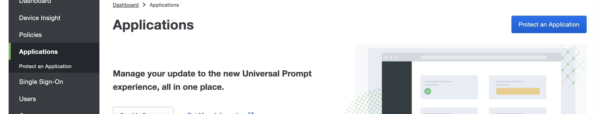

Search for **Generic SAML Service Provider** and click **Protect**.

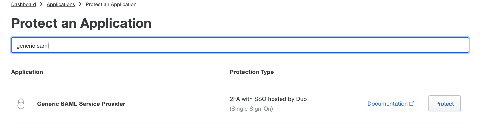

You now have a new SAML Service Provider Created for the Turbo Server SSO authentication. Record the **Entity ID**, **Single Sign-On URL**, and **Single Sign-Out URL** values and click the **Download certificate** button to save the certificate file for later use.

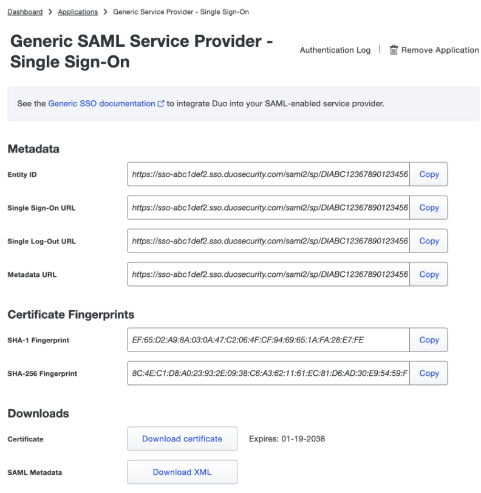

Configure the SAML settings for the SAML integration in Duo:

- **Entity ID:** Turbo
- **ACS URL:** https://example.company.com/auth/saml/return
- **Single Logout URL:** https://example.company.com/auth/saml/logout
- **Service Provider Login URL:** https://example.company.com/auth/saml/login

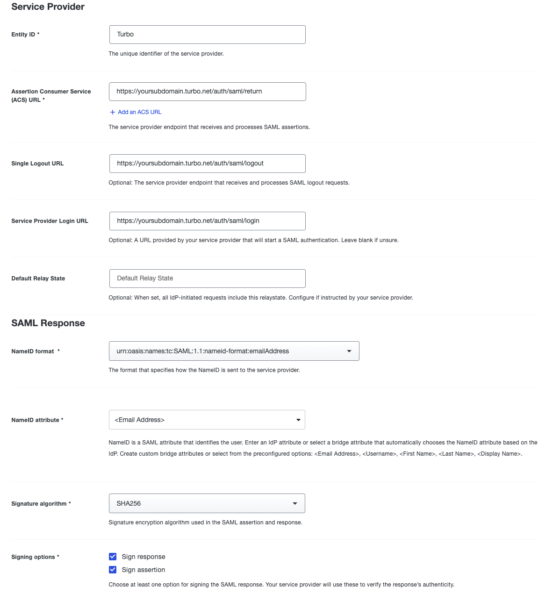

Map Attributes:

- **IDP Attribute:** First Name  
  **SAML Response Attribute:** http://schemas.xmlsoap.org/ws/2005/05/identity/claims/givenname
- **IDP Attribute:** Last Name  
  **SAML Response Attribute:** http://schemas.xmlsoap.org/ws/2005/05/identity/claims/surname

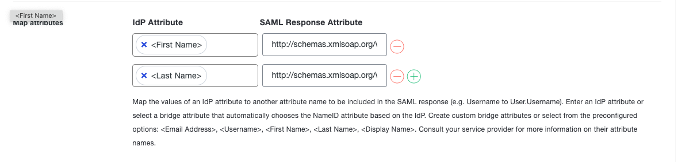

Role Attributes (this is where you will map the group attribute):

- **Attribute name:** http://schemas.xmlsoap.org/claims/group  
  **Service Provider’s Role:** Name of Group to use in Turbo (i.e Turbo-Apps)  
  **Duo Groups:** Duo users you want to link to that Role in Turbo (i.e TestGroup1)

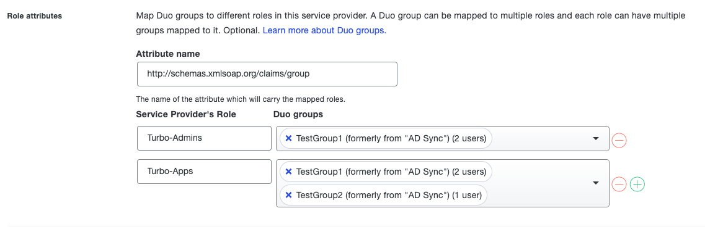

Enter the **Name** for your application and click **Save**.

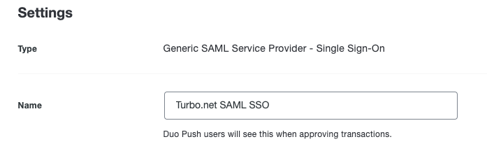

### Configure Turbo Server

Open the Turbo Server administration site and navigate to the **Users > Authentication Method page**.

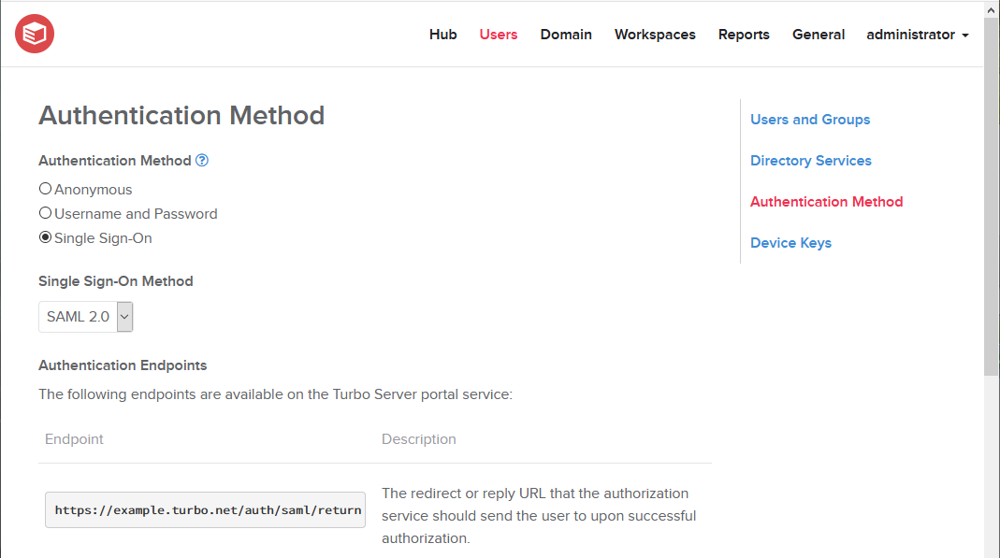

Set the **Authentication Method** to **Single Sign-On**.

Set the **Single Sign-On Method** to **SAML 2.0**.

Configure the following fields:

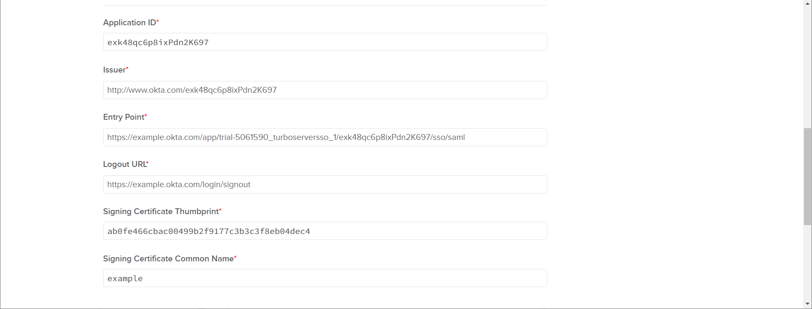

- **Application ID**: Enter the Duo application ID. This value is identified in the last segment of the **Entity ID Metadata** value from Duo that was recorded earlier.  
  Example: DIABC12367890123456
- **Issuer**: Enter the Duo application ID. This value is identified in the last segment of the **Entity ID Metadata** value from Duo that was recorded earlier.  
  Example: DIABC12367890123456
- **Entry Point**: Enter the **Single Sign-On URL** value from Duo that was recorded earlier.  
  Example:
  https://sso-abc1def2.sso.duosecurity.com/saml2/sp/DIABC12367890123456/sso
- **Logout URL**: Enter the **Single Log-Out URL** value from Duo that was recorded earlier.  
  Example: https://sso-abc1def2.sso.duosecurity.com/saml2/sp/DIABC12367890123456/slo
- **Signing Certificate Thumbprint**: Enter the thumbprint value that is listed in the SAML Signing Certificate under **Details > Thumbprint**.
  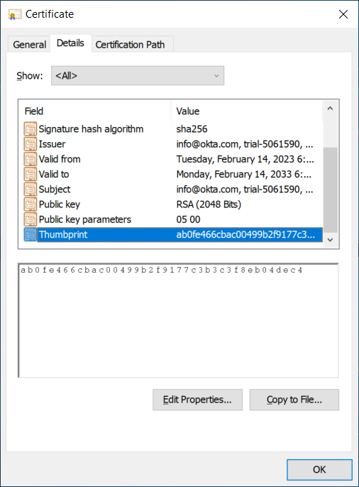
- **Singing Certificate Common Name**: Enter the common name value that is listed in the SAML Signing Certificate under **Details > Subject > CN**.

### Install SAML Signing Certificate on Turbo Hub

The SAML Signing Certificate is used by Turbo Server to ensure that the SAML response is signed by the expected identity provider. This certificate was downloaded in the previous steps and must be manually installed on the Hub server.

Login to the system where the Turbo Hub role is installed on as an administrator. Install the certificate with the following steps:

1. Select **Run** from the **Start Menu** and enter **mmc**.
2. Click on **File** then click **Add/Remove Snap In**.
3. Select the **Certificates** option then click **Add**.
4. Select **Computer account**, select **Local computer**, and then complete the dialog.
5. Click on the new **Certificates** Snap In, then click **All Tasks > Import...**
   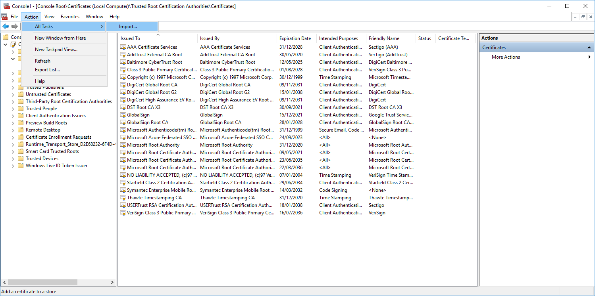
6. Select **Local Machine** and click **Next**.
   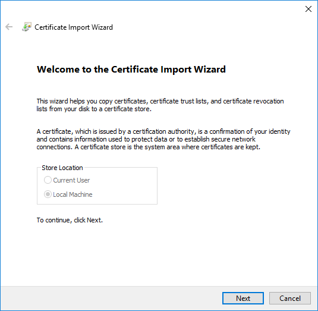
7. Select your SAML Signing Certificate and click **Next**.
   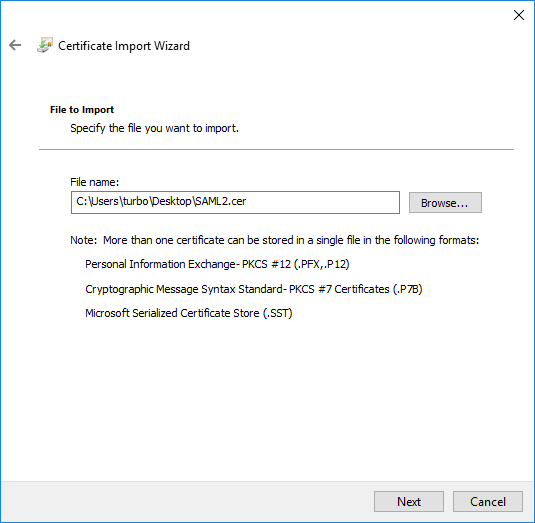
8. Select **Place all certificates in the following store**, select **Trusted Root Certificate Authorities**, and then click **Next**.
   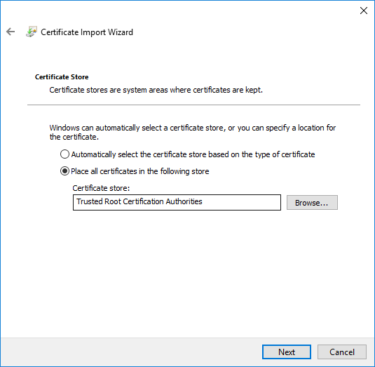
9. Complete the rest of the import wizard with the default options.

Once installed, Turbo Server portal logins should now complete successfully.

### Troubleshooting

Please refer to the [SAML 2.0 Troubleshooting](../../server/authentication/saml.html#troubleshooting) section.
