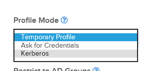
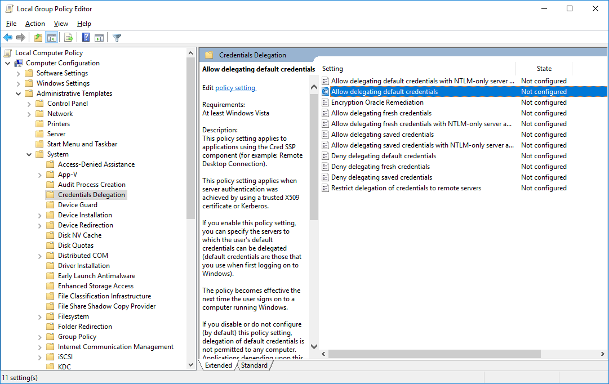
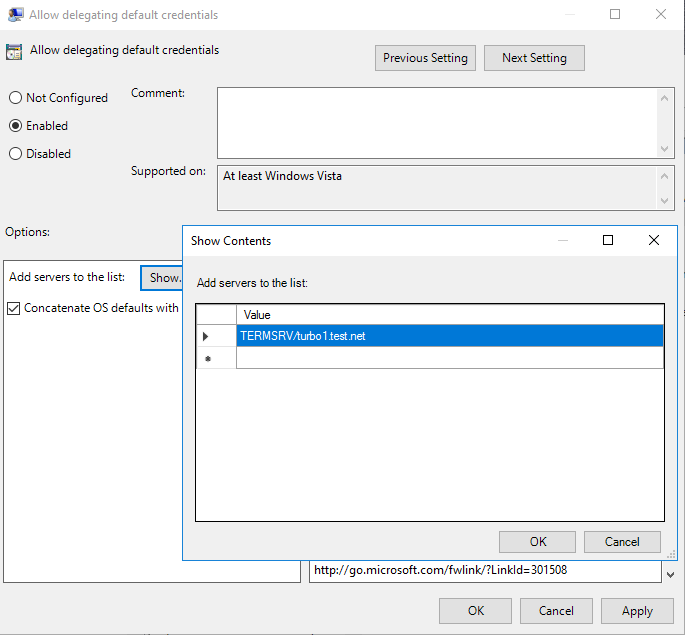

# Kerberos

Turbo Server applications can be configured to allow user credential delegation using the Kerberos protocol in order to avoid multiple logins when launching a web application.

Azure AD SSO requires all servers in the farm to use https in order to keep users data secure. Make sure SSL is enabled during installation or install SSL from the /admin/servers/ page.

### Configure Turbo Server

To enable Kerberos delegation during application launches, navigate to the workspace administration site and push the **Settings** button on the application for which the feature is desired. On the application's **General Settings** page, scroll down to **Profile Mode** and select **Kerberos** from the dropdown.

This feature is currently only implemented for the Windows native client. HTML5 and mobile clients will behave as if the **Ask for Credentials** profile mode is selected.

### Configure Client Machines

Each client machine where users will connect to the Application Server requires the **Credentials Delegation** policy to be configured and the **SSL gateway** be disabled on the Turbo Client.

In the Group Policy Editor, go to **Computer Configuration > Administrative Templates > System > Credentials Delegation > Allow delegating default credentials**.

Check the **Enabled** checkbox and press the **Show...** button. For each Application Server that is in the Turbo Server farm, add an entry in the following format: `TERMSRV/[server]`, where _server_ is the fully qualified domain name of the Application Server. For example, if the domain name is _test.net_ and the Application Server name is _turbo1_, then the correct entry value would be `TERMSRV/turbo1.test.net`.

Add `"enableRdpGateway":"false"` to **C:\Users\\_username_\AppData\Local\Turbo\Containers\settings.json** while maintaining proper JSON syntax.

Example **settings.json**:

    {"enableRdpGateway":"false","settingsVersion":3}

Run **turbo config** to verify **SSL gateway** is disabled:

    > turbo config
    Domain URL: https://turbo.net/
    Turbo Drive (T: drive): Enabled
    SSL gateway: Disabled
    Image cache size: unlimited
    Image GC interval: never
    Image GC expiration: 90 days
    Trusted sources:
      https://turbo.net
      http://turbo.net

When **SSL gateway** is disabled the client system will connect to the application servers directly.
