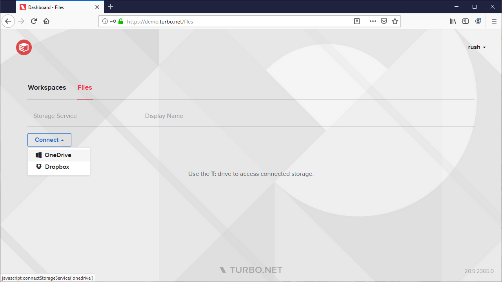
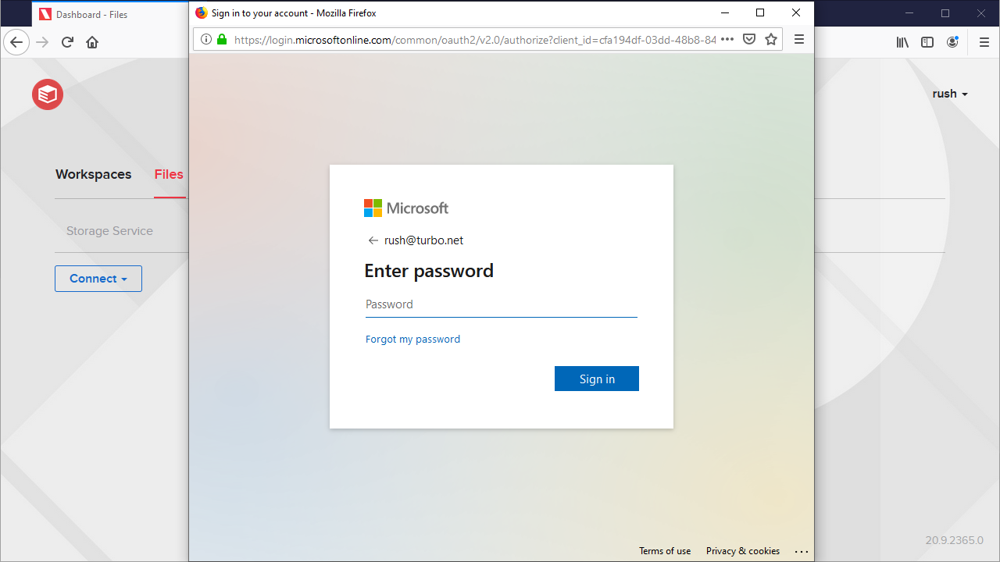
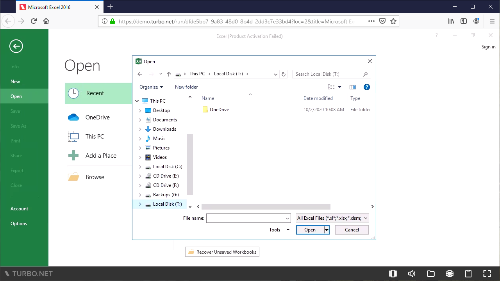

# End User Guide

To enable cloud storage for end users, they must add their cloud storage account using the Portal interface. Applications launched in the cloud by the end users will automatically map their cloud storage folder to the T: drive.

The following is a setup-by-step user guide to connect and access files from the cloud:

1. From your Portal, click on **Files** to manage the cloud storage services connected to your account. Click on the **Connect** button and select your desired cloud storage service to link the storage service to your account.

   

2. You will be asked to authenticate your account with the storage service. Once the authentication succeeds, the storage service status will show as connected.

   

3. Files from the storage service will now be available under the **T:\\** drive for applications running in the cloud.

   

4. Files can also be launched directly from the file browser on the portal. When launching a file, it will open using either a remote or local Turbo application associated with its file extension. The file will be temporarily downloaded to a virtual downloads folder and automatically opened by the corresponding application. Once the application is closed, all files stored in the downloads folder will be automatically uploaded to the T: drive.

### Access from Local Launches

Cloud storage integration requires WinFsp drivers which are automatically installed on the application server, but not is not included in the Turbo Client installer for end users. Download and install [WinFsp 1.4.19016](https://github.com/billziss-gh/winfsp/releases/download/v1.4/winfsp-1.4.19016.msi) if you wish to launch local with the same T: drive integration.

If WinFsp drivers are not installed, T: drive will automatically map to the local OneDrive folder.

### Hidden Files

A file is considered hidden if it has the hidden attribute or if the name contains a hidden file prefix (e.g. "~$" for temporary office files).

T: Drive does not upload hidden files to cloud storage. This policy applies to all operations involving hidden files, including creation, editing, moving, and deletion. If a non-hidden file is modified in such a way that it becomes hidden, it will no longer be synced and no further updates will be uploaded.

T: Drive does download hidden files from cloud storage. These can exist if a user manually uploaded files with the hidden attribute via the Files API (for supported providers), or if a user manually added hidden files to the filesystem storage provider root path (for filesystem providers).

### Troubleshooting

#### Upload failed due to quota limit

This error occurs when the total size of your files exceeds the user storage quota limit on the connected storage provider. Please try deleting some of your files and try again.

#### Upload failed due to insufficient permissions

This error occurs when you do not have permission to upload a file to the current folder. Please try uploading to a different folder, or contact your administrator about granting you permission to that folder.

#### Upload failed due to restricted file type

This error occurs when the file type of the uploaded file is not allowed by the connected storage provider. Please change your file to a different file type and try again.

#### Upload failed due to file size limit

This error occurs when the size of the uploaded file exceeds the maximum file upload size configured on the connected storage provider. Please try reducing the file size, such as by compressing the file, and try again.

#### The connection to OneDrive expired. Please reconnect OneDrive to Turbo.net.

The administrator may have changed a setting that requires users to reconnect to the cloud storage provider. Log in to the portal and reconnect the corresponding cloud storage provider from the **Files** tab.

#### Tdrive does not start or launching a file from the Portal exits immediately.

An antivirus may be preventing the TDdrive driver to launch correctly. Please disable any antiviruses on the system and try again.
