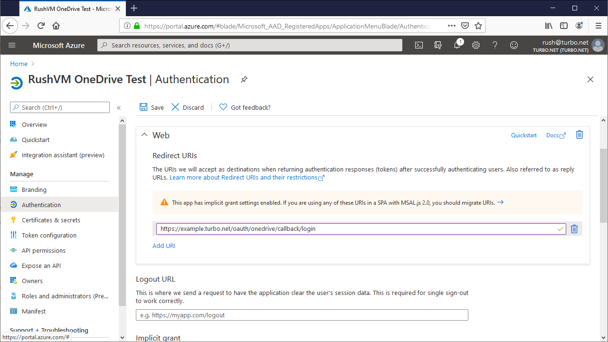
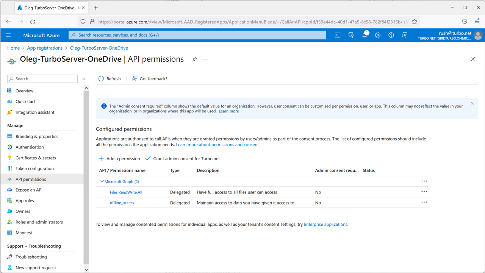
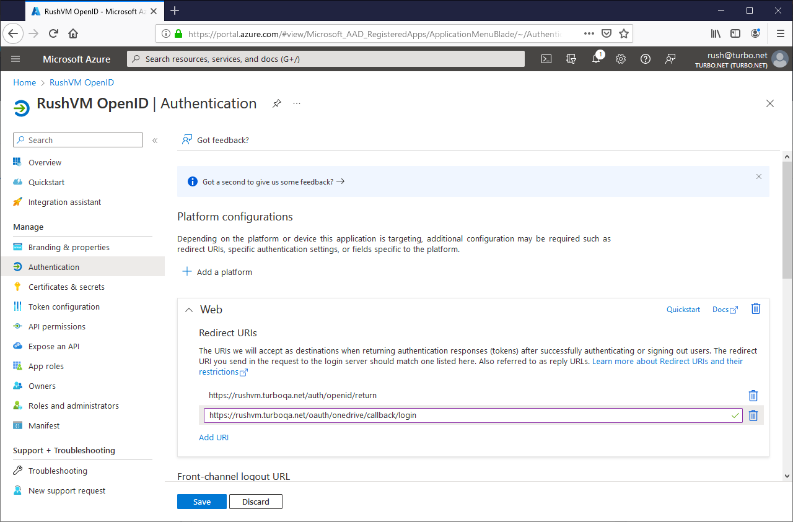
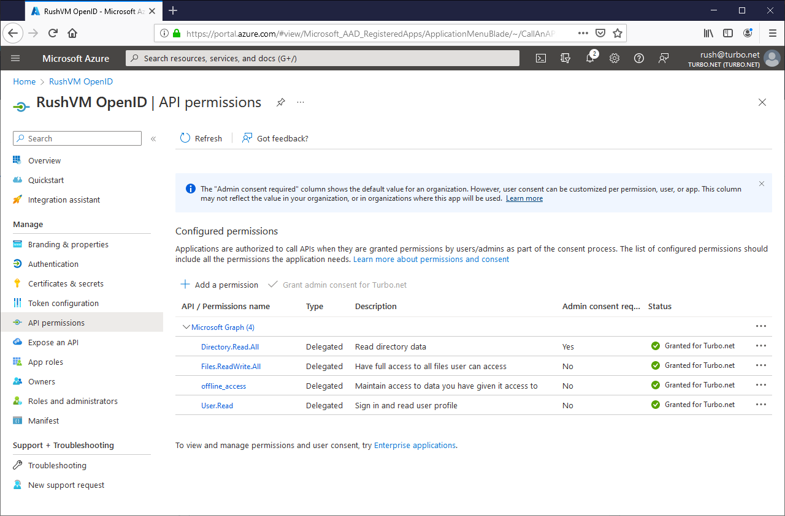

# OneDrive

To allow users to connect their OneDrive accounts and access them while running their applications, you must first configure a OneDrive application registration. This OneDrive application controls the permissions, branding, and routing for the OneDrive SSO.

If you are using [Azure Active Directory with OpenID Connect](../../server/authentication/azuread-openid-connect.html) Authentication, you may configure OneDrive to automatically connect on login by using the same application registration. See [Automatically Connect OneDrive](#setup-the-onedrive-application-update-an-existing-application)

### Setup the OneDrive Application

#### Create a new OneDrive Application

The following section describes how to create a new OneDrive application that can be integrated with Turbo Server.

1. Follow the [Microsoft docs](https://docs.microsoft.com/en-us/onedrive/developer/rest-api/getting-started/app-registration) to set up a OneDrive application registration. If you are using Turbo Server 22.4 or earlier, make sure to select one of the **Multitenant** supported account types when creating the application registration.

2. Add the following Redirect URLs:

   - `https://{Web Service Root}/oauth/onedrive/callback/login`

   

3. Enable the following Delegated Permissions:

   - `Files.ReadWrite.All`
   - `offline_access`

   

#### Update an Existing Application

The following section describes how to update an existing [Azure Active Directory with OpenID Connect](../../server/authentication/azuread-openid-connect.html) application to automatically connect OneDrive when users login to the Portal using Single Sign-On.

1. Add the following Redirect URL:

   - `https://{Web Service Root}/oauth/onedrive/callback/login`

   

2. Enable the following Delegated Permissions:

   - `Files.ReadWrite.All`
   - `offline_access`

   

### Configure Turbo Server

Next, Turbo Server must be configured to use the newly created OneDrive application. Once configured, users may connect their OneDrive account from the portal settings.

1. Go to the Turbo Server Administration site **Integrations** > **Storage Providers** page.
2. Click on **Add**.
3. Select **OneDrive** as the storage type.
4. Enter the OneDrive **Application Id** into the corresponding **Client Id** field.
5. Enter the OneDrive **Application Secret** into the corresponding **Secret** field.
6. Select the **Supported account types** you selected when creating the application registration. If you selected single tenant, enter the OneDrive **Directory ID** into the corresponding **Directory ID** field.
7. **Save** your settings. Setting changes may take a couple minutes to take affect.

### Troubleshooting

The following section contains solutions for issues with regards to setting up cloud storage.

**Issue:**

User sign in results in error message "[The Azure Application] is not configured as a multi-tenant application. Usage of the /common endpoint is not supported for such applications created after ‘[Some date]’. Use a tenant-specific endpoint of configure the application to be multi-tenant."

**Solution:**

This error occurs when the OneDrive integration is configured with **Multitenant** supported account types, but the OneDrive application registration was created with **Single tenant** supported account types.

Open the [OneDrive storage provider settings page](../../server/administration/integrations.html#storage-providers) and ensure that the **Single tenant** supported account type was selected.

In server 22.4 an earlier, only multitenant application registrations were supported.

**Issue:**

When the user is prompted to grant permission they’re warned about the domain being "unverified".

**Solution:**

This document explains how to resolve the unverified message:

[How to: Configure an application's publisher domain](https://docs.microsoft.com/en-us/azure/active-directory/develop/howto-configure-publisher-domain)

The setting is located in Azure Portal > App registrations > Branding > Publisher Domain

**Issue:**

User sign in results in error message "AADSTS50011: The reply url specified in the request does not match the reply urls configured for the application: '[Application ID]'."

**Solution:**

Ensure the correct Redirect URI is set. The setting is located in Azure Portal > App registrations > Authentication > Redirect URIs.

**Issue:**

User sign in results in error message "Need admin approval".

**Solution:**

Follow the instructions to [grant admin consent](https://docs.microsoft.com/en-us/azure/active-directory/manage-apps/grant-admin-consent#grant-admin-consent-in-app-registrations) for the Turbo OneDrive app registration for the entire tenant.

Alternatively if you would like each user to agree to consent, follow the instructions to [configure how end-users consent to applications](https://docs.microsoft.com/en-us/azure/active-directory/manage-apps/configure-user-consent).

**Issue:**

The OneDrive folder does not appear in the T: drive. User has tried disconnecting and reconnecting to the storage provider but the issue persists.

**Solution:**

The Hub server is unable to reach the OneDrive services. This is typically caused by a proxy or firewall misconfiguration or other network issues. To resolve, ensure the https://login.microsoftonline.com/common/oauth2/v2.0/token URL is accessible from the Hub server.
