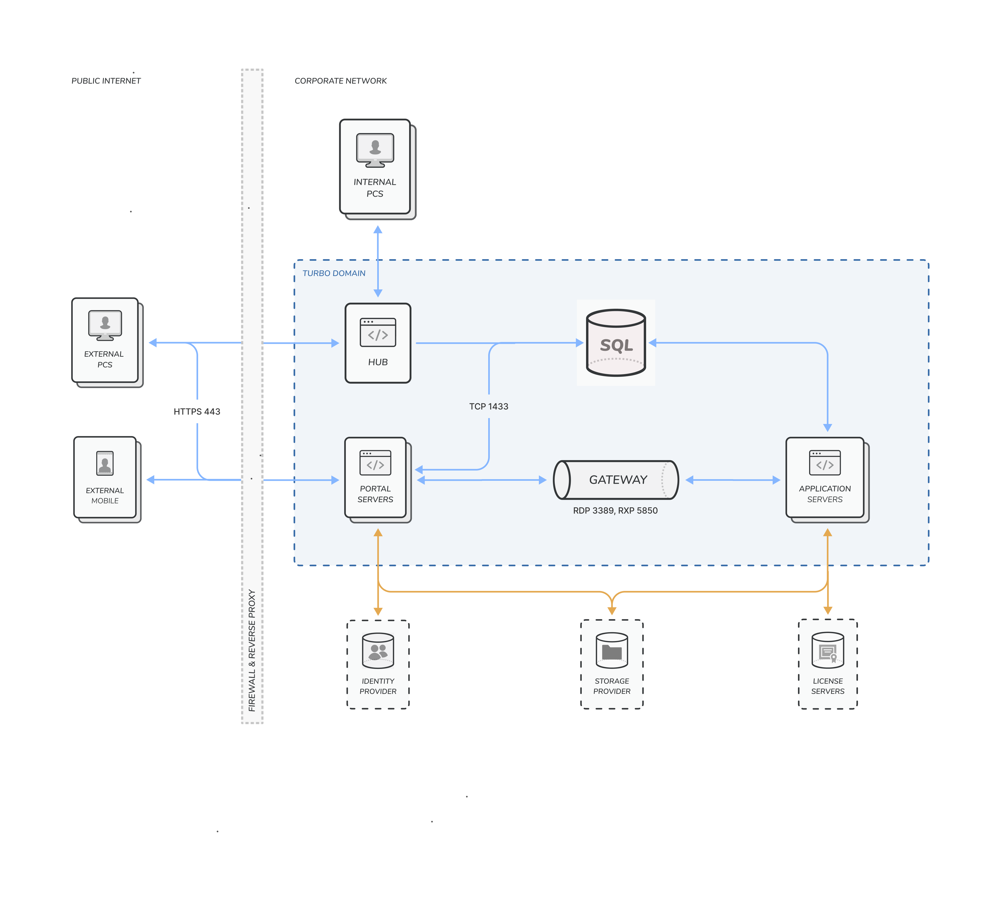

## Turbo Server

Turbo Server is an application deployment platform that enables you to launch applications instantly from websites, portals and client desktops (Windows, MacOS, iOS, Android, or any HTML5 browser).

Unlike traditional deployment methods, applications streamed from Turbo Server do not require download, installation, rebooting, administrative privileges, or separate setup steps.

Turbo Application Server allows you to run application workloads on a server for your users. Turbo Application Server can source applications from the Turbo.net Hub or an on-premises Turbo Hub Server.

### Getting Started

Turbo Server is available for deployment on-premises, as well as in the cloud via the Turbo Server Azure Marketplace Image (AMI).

For more information on setting up Turbo Server on-premises, please refer to the [On-Premises](../../server/setup-and-deployment/deploying-on-premises.html) documentation.

For more information on setting up Turbo Server in Azure, please refer to the [Azure Marketplace Image (AMI)](../../server/setup-and-deployment/deploying-to-azure.html) documentation.

### Architecture

There are four major server roles in a Turbo Server deployment:

- The **Hub Server** stores all application images and user session data. The Hub may be hosted in the Turbo.net cloud or run in a customer managed cloud or on-premises server. On-premises Hub servers can federate containers to and from other Hubs.

- The **Portal Server** hosts the application web portal where users can log in to view and launch applications, open files, and manage Turbo resources. A portal server also provides API services allowing other client types to interact with the Turbo environment.

- One or more **Application Servers** runs containerized applications and streams sessions to clients. A typical deployment uses multiple application servers in a _pool_ to handle load volumes and provide redundancy. Application servers can be hosted in the cloud or on-premises.

- The **Broker Service** controls how remote applications are executed in the application server pool and routes client requests to the appropriate servers.

If Turbo is used to deliver applications to endpoints or third-party streaming products for execution, only the Hub Server or a standard file server is required.

#### Network Diagram

### Technology

#### Turbo Streaming

Turbo Application Server allows an application to be executed in an application server pool while streaming the application to the client machine.

Native clients are available for Windows, Mac, iOS, and Android. An HTML5 client is also available allowing any HTML5-capable web browser to access applications.

Using Turbo container technology on the application servers allows for increased user density and less maintenance than traditional remote desktop solutions.

#### Features

Turbo Server enables you to accomplish the following goals:

- Host containers on the web. You can stream Turbo containers from the Turbo Streaming Server portal site, custom external sites via HTML, or third-party collaborative web portals such as Microsoft SharePoint, IBM WebSphere, and Novell Teaming.

- Provide your organization with a single access point to your application portfolio. Instead of moving desktop-to-desktop to upgrade or install software, you can publish an application to Turbo Streaming Server's portal site; this provides licensed end-users with immediate access and full functionality.

- Launch applications faster over the Internet and intranets. Streamed applications launch immediately without the need to download. Turbo Streaming does not require any special ports or proprietary protocols.

- Empower a mobile workforce. Turbo containers require no installation or administrative privileges, meaning they can launch from anywhere, even on secure, locked-down desktops such as airport and hotel kiosks.

- Run multiple versions of applications side-by-side without conflicts or dependencies. Turbo containers run in isolated sandboxed environments. This enables you to avoid conflicts and dependency issues associated with natively-installed applications.

- Migrate with confidence to Microsoft Windows 11 or Windows 10. Turbo enables you to run legacy applications as they stand on newer operating systems, including Microsoft Windows 7 and 8/8.1, without the need to recode, retest, or reinstall.

#### Supported Platforms

Turbo Server is compatible with the following platforms:

- Microsoft Windows Server 2022
- Microsoft Windows Server 2019
- Microsoft Windows Server 2016
- Microsoft Windows Server 2012 R2
- Microsoft Windows 11 Enterprise multi-session (Azure)
- Microsoft Windows 10 Enterprise multi-session (Azure)

Turbo Server supports x64 (64-bit) processor architectures.

End users can access Turbo Server from Microsoft Windows 11, Microsoft Windows 10, Microsoft Windows 8.1, Microsoft Windows 8, and Microsoft Windows 7 platforms. Turbo Portal Server supports Microsoft Edge, Chrome, Safari, Firefox, Opera, and other HTML5-compliant browsers.

**Note:** Internet Explorer 11 is partially supported by the server administration site and is not supported by the portal dashboard. If you are experiencing problems with Internet Explorer 11 on the sever administration site, be sure to disable compatibility mode. This feature is enabled automatically for intranet sites and serves to emulate Internet Explorer 7 which is not supported by the administration site.
