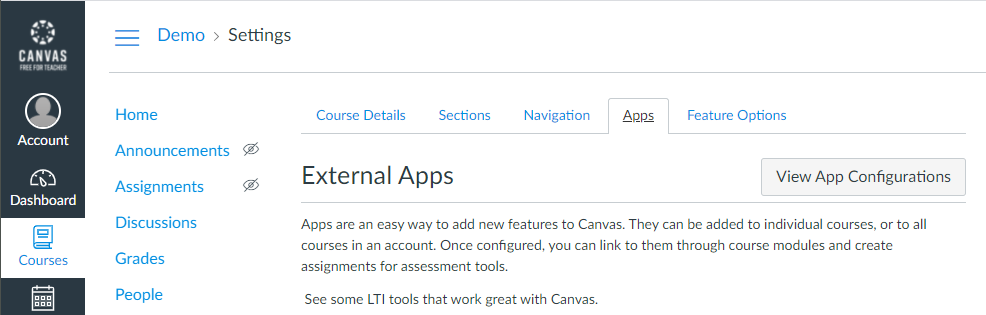
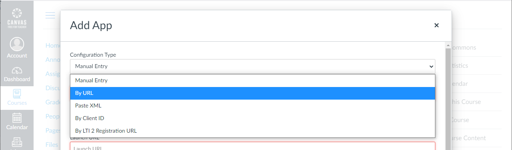
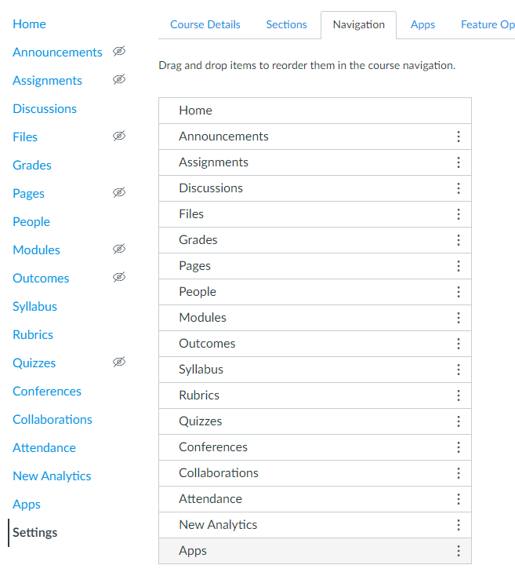

# Canvas LMS Integration

Configuring Turbo Server with Canvas allows students and instructors to access their Portal Dashboard with one click from Canvas. Turbo Server functionality is added to Canvas LMS as an external application from the Canvas user interface.

Turbo Server uses the open Learning Tools Interoperability (LTI) specification (version 1.0) to communicate with Canvas.

### Getting Started

Canvas requires the following to connect to Turbo Server Application:

- Consumer Key
- Shared Secret
- Config URL

The values can be obtained from the Turbo Server administration site. Navigate to **Integrations > Learning Management Systems (LMS) > [LMS Provider]**.

The Turbo Server must be publically accessible for the Canvas service to connect to it.

### Adding Turbo to Canvas

A canvas account can be created at [https://canvas.instructure.com](https://canvas.instructure.com/ "canvas.instructure.com").

Turbo can be linked with an individual course by an instructor or with all courses by a Canvas Administrator. Navigate to the Course or Administrator Account you wish to link.

Adding Turbo to an Administrator Account will require a single setup for all courses. Every instructor will see the option to enable Turbo in their Course Navigation.

Navigate to the desired course. Go to **Settings > Apps**.

Click on **View App Configurations** and then **+App**. Change the **Configuration Type** dropdown to **By URL**.

Enter the information from the Turbo Server administrator site:

- Consumer Key
- Shared Secret
- Config URL

Click on Submit and refresh the page (**F5** in browser). The Turbo application will now be available in the course navigation tab.

### Enabling Turbo in the Course Navigation

Turbo can be enabled or disabled for each individual course. Whether the Turbo application is enabled by default is controlled by the **Show in Course Navigation** setting in the LMS provider settings in Turbo Server (default is enabled).

1. Navigate to the desired course.
2. Go to **Settings > Navigation**.
3. Find the Turbo Server application in the course navigation list. The item will appear as the name given by **Link Text** under the connected LMS provider settings in Turbo Server (default is "Apps"). Note that after adding the external application, you will need to refresh the page (**F5** in browser) to see the item.
4. Drag the item up to the list of shown items or down to the list of hidden items.
5. Press **Save**.

