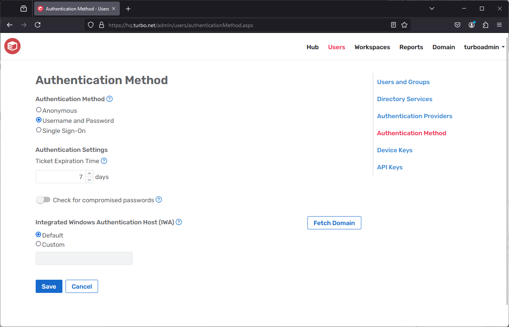

# User Settings

The **Settings** pages allows users to manage a variety of user-related settings, such as their cloud storage connections and remote authentication.

This page is accessible from the Portal via the **Settings** link in the user dropdown.

### Storage

The **Storage** page allows users to manage their cloud storage connections. Once connected, files from that cloud service will be made available in the Portal Files browser. Furthermore, applications launched in the cloud will automatically map their cloud storage folder to the T: drive.

For more information on connecting storage services and accessing files, see the [End User Guide](../../server/cloud-storage/end-user.html#end-user)

### Authentication

The **Authentication** page allows users to save Windows login credentials that will be used to login to the application server when launching cloud applications with Ask authentication. Users may also save their Windows login credentials when launching an application in the HTML5 client by checking the "remember me" checkbox on the login form.

Credentials are encrypted and stored in local browser storage and are never stored on the server. Users must re-enter their credentials on new browsers, devices, and Turbo login sessions.

If the stored credentials are invalid, an authentication error will be shown and the user will be asked to re-enter their credentials. Credentials may be removed from the settings page at any time.

This feature is not available in Internet Explorer 11 or below. The Turbo Server must have SSL enabled to use this feature.
