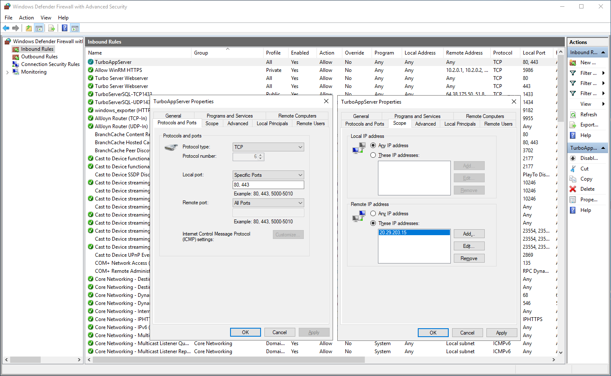
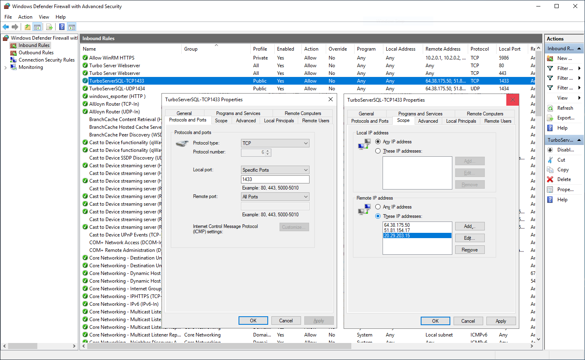
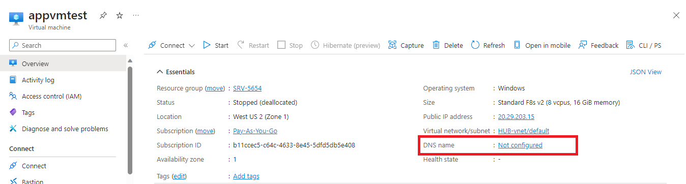
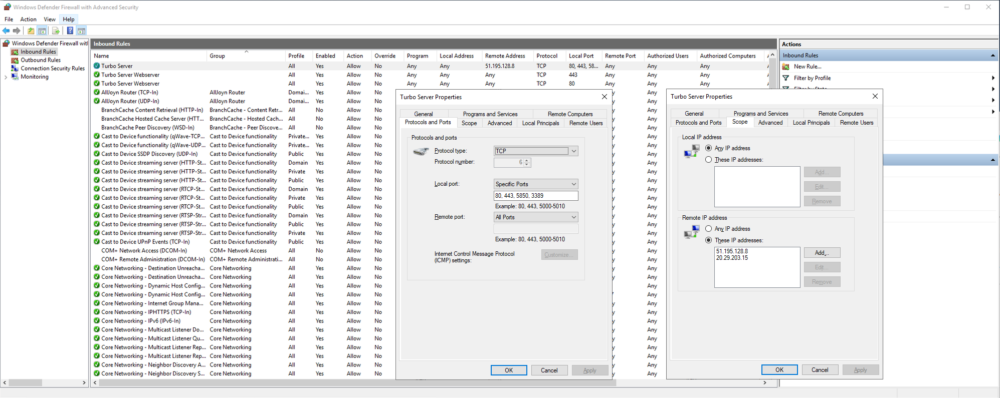
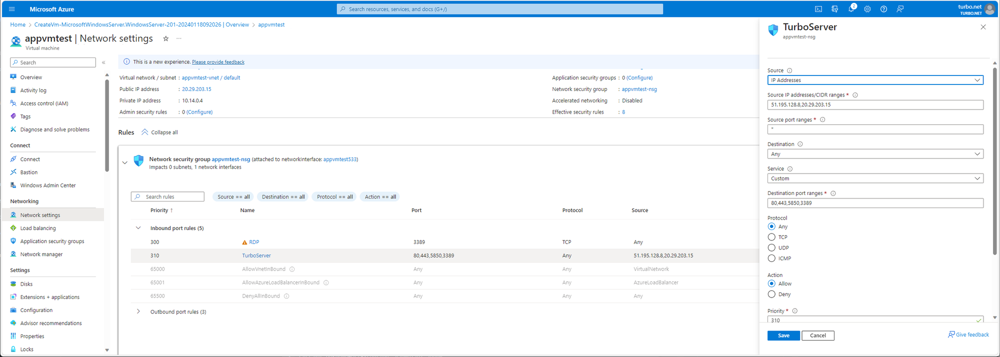
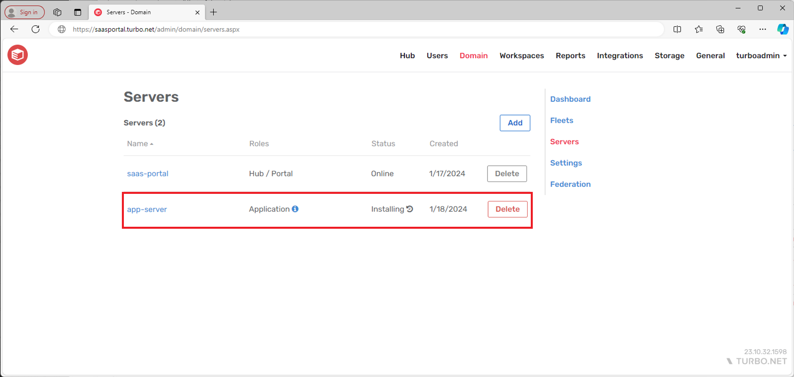
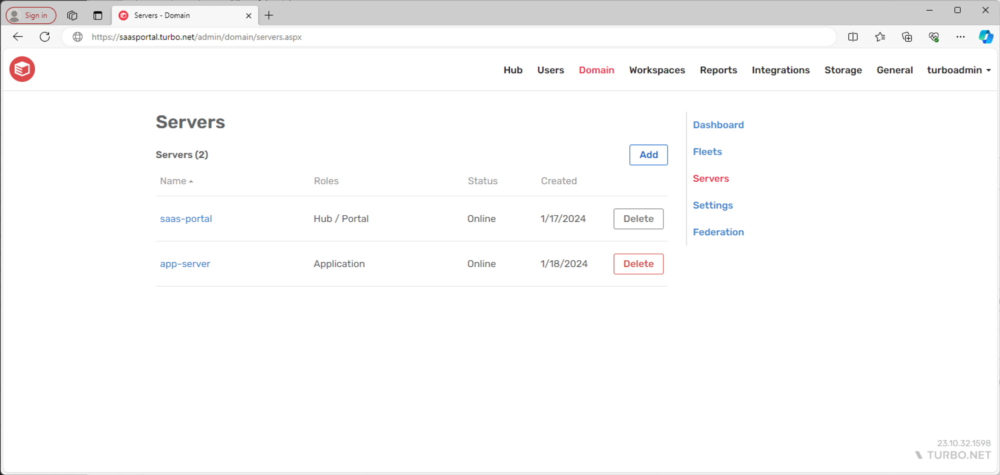
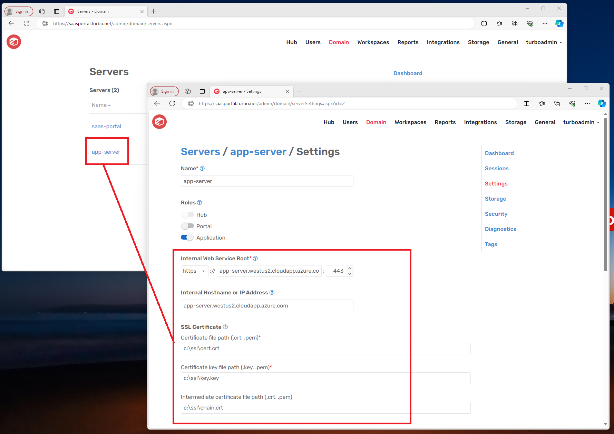
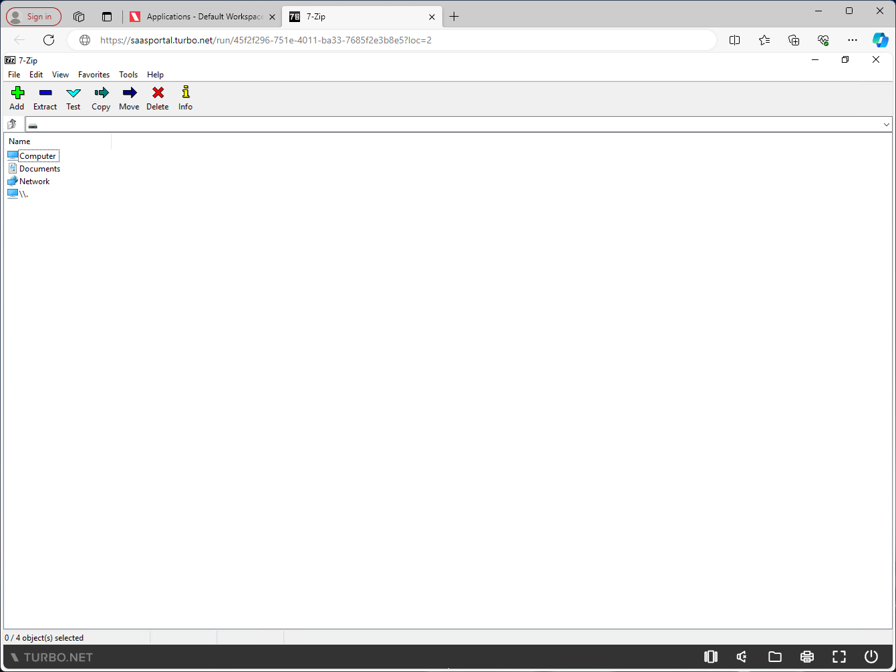

# Deploying External Application Server

Turbo Server administrators may join an external Turbo Application Server to their Turbo on-prem or SaaS Portal to enable the Run in Cloud launch options for applications.

For customers using the Turbo SaaS Portal, skip to the section on how to [Configure the External Application Server](deploying-external-application-server#configure-the-external-application-server).

### Configurating the Portal

Follow these steps to configure the Turbo Portal system.

1. RDP to the Turbo Portal system.
2. Open **Windows Defender Firewall with Advanced Security > Inbound Rules**.
3. Create a rule to allow **inbound TCP ports 80 and 443** from the Application Server's public IP. This will allow the Application Server to communicate with the Portal service.

Note that if you use an external firewall or hosting the Turbo Portal on a cloud hosting service such as Microsoft Azure or Amazon AWS, you will need to open the ports there as well.

### Configuring the Database

Follow these steps to configure the Turbo Server database.

1. RDP to the database system. In some environments, the database may be installed on the same system as the Turbo Portal.
2. Open **Windows Defender Firewall with Advanced Security > Inbound Rules**.
3. Create a rule to allow **inbound TCP port 1433 and inbound UDP port 1434** from the Application Server's public IP. This will allow the Application Server to access the Turbo Server database and join the Turbo Server Domain.

Note that TCP port 1433 and UDP port 1434 are the default ports for Microsoft SQL Server. Your database may be configured to use different ports and you should open those instead.

### Configure the External Application Server

Follow these steps to configure the Turbo Application Server.

1. Create a public DNS record for your Application Server’s public IP.  
   Note that some cloud hosting providers allow you to configure DNS names for the VMs. Example in Microsoft Azure:
   
2. Generate an SSL certificate for your Application Server’s public DNS name.  
   Certificates must be in PEM format.  
   **They key file must not be encrypted with a password.**
3. RDP to the Application Server system.
4. Create a service account for the Turbo Server service and grant it administrator privileges.
5. Place the SSL certificate and key files on the Application Server in a secured folder that is only accessible to the service account created in step 4.
6. Open **Windows Defender Firewall with Advanced Security > Inbound Rules** and create a rule to allow inbound ports **80,443,5850,3389** for the public IPs of the Turbo Portal and Application Server.  
   If you are using the Turbo SaaS Portal, Turbo will provide you with the public IP for the Portal.
     
   Note that if you use an external firewall or hosting the Turbo Portal on a cloud hosting service such as Microsoft Azure or Amazon AWS, you will need to open the ports there as well. Example in Microsoft Azure:
   
7. Install .NET Microsoft 4.8 Framework if not already installed.
8. Download the Turbo Server from [turbo.net/download](https://turbo.net/download).  
   The installer must be for the same version as the SaaS Portal.
9. Run the Turbo Server installer:  
    - When prompted, copy and paste your Turbo Server license. - On the Server Roles page, select **Farm** and only check the **Application** role. - On the Database Setup page, enter the connection strings to your Turbo Server database.  
   If you are using the Turbo SaaS Portal, Turbo will provide you with the connection strings to use here. - On the Service account page, enter the service account credential from step 4.
10. When the Turbo Server installer is complete, the Application Server will appear in the **Admin Portal > Domain > Servers** page.  
    It will take another 10-15 minutes for the Application role to complete installation and the Application Server will automatically reboot during this process.  
    
11. After the Application role has completed installation, the Application Server will show as Online.  
    
12. Finish configuring the Application Server to enable the SaaS Portal to communicate with it.  
     - Go to the **Admin Portal > Domain > Servers** and click on the Application Server name. - Set the **Internal Web Service Root** and **Internal Hostname or IP Address** to the public DNS name of the Application Server from step 1. - Set the **SSL Certificate** paths to your certificate, certificate key, and certificate chain from step 5.
    
13. You should now be able to use the Run in Cloud launch mode to start an application.  
    
