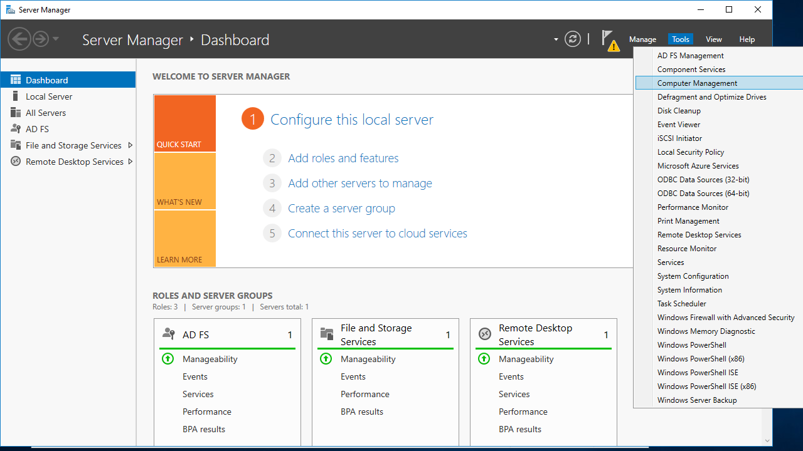
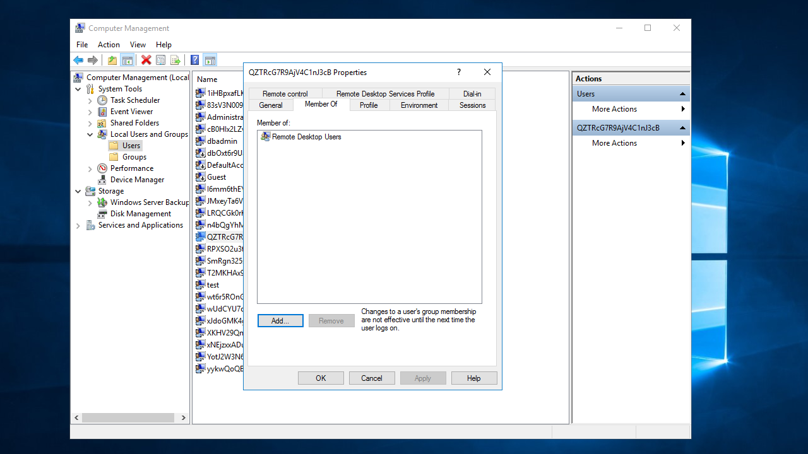
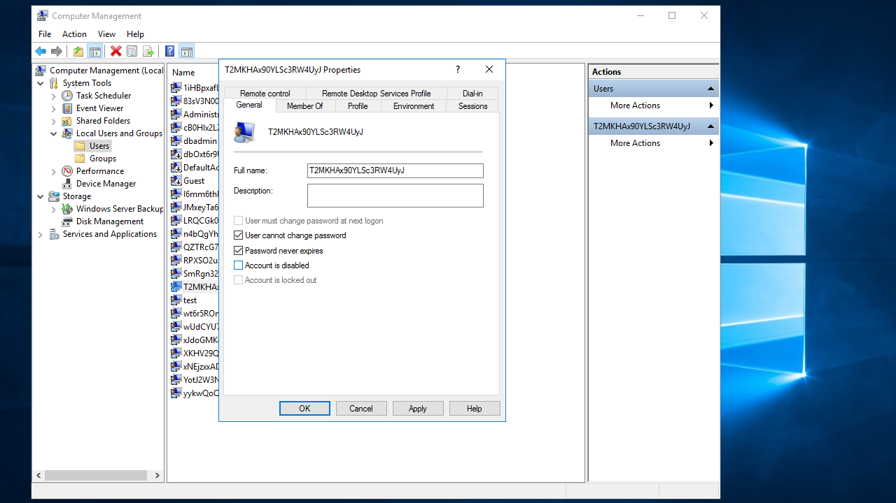
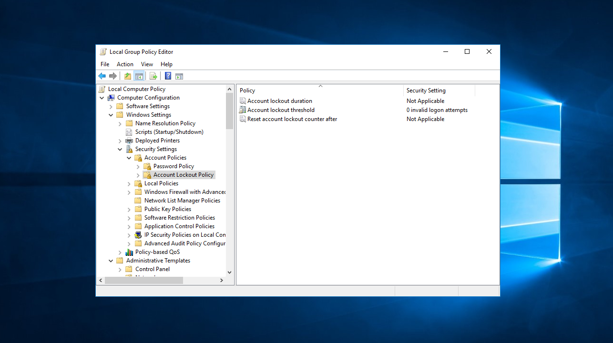
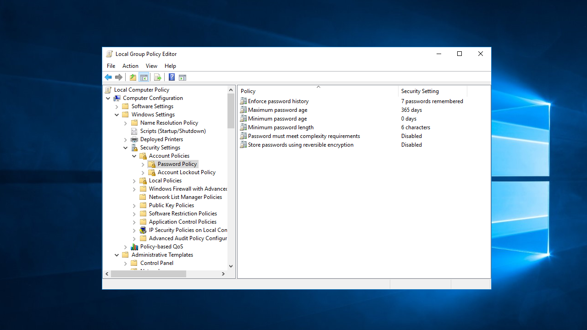
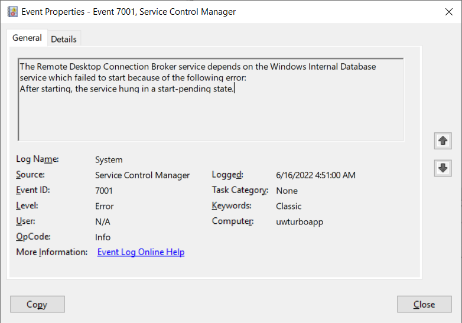

# Application Streaming

The following documentation describes commonly encountered issues when streaming a remote application using Run In Cloud (HTML5/Native) and how to resolve them.

#### Application immediately closes after initial splash screen in Cloud HTML5 or Cloud Windowed mode

Microsoft RemoteApp disconnects sessions after the initial window is shown then dismissed, and no subsequent windows are shown after a short timeout. Remove any custom splash screens that may cause the timeout to happen, as Turbo will automatically detect the first shown window and delay the timeout as appropriate. If the application itself has transition delays between its windows, then a custom solution may be required. Please contact support@turbo.net. See the [Microsoft Documentation](https://docs.microsoft.com/en-us/troubleshoot/windows-server/remote/remoteapp-sessions-disconnected) for more information.

If the window timeout is not the issue, follow the following diagnostics steps:

1. Go to the [administration reports](../../server/administration/reports.html#administration-reports).
2. Look for the event that matches the failed launch in either the **Application Sessions** or **User Sessions** report.
3. Sign in to the corresponding application server and inspect the client launch logs located in the user's _%LOCALAPPDATA%\Turbo\Logs_. You can identify the Windows user in the browser console logs in the HTML5 client.
4. If the logs do not provide any useful information, try launching the application locally using the Turbo CLI with the [diagnostics flag](../../reference/command-line/run.html).
5. Examine the corresponding VM logs in the sandbox located in _%LOCALAPPDATA%\Turbo\Containers\sandboxes\[sessionId]\logs_.
6. Contact support if you cannot determine the cause of the issue.

#### Users are unable to launch more than one application at a time

This behavior is determined by the [Restrict Remote Desktop Services users to a single Remote Desktop Services session](https://admx.help/?Category=Windows_10_2016&Policy=Microsoft.Policies.TerminalServer::TS_SINGLE_SESSION) Group Policy setting on the Application Server that is running the applications.

If this setting is enabled, users who log on remotely by using Remote Desktop Services will be restricted to a single session (either active or disconnected) on that server. If the user leaves the session in a disconnected state, the user automatically reconnects to that session at the next logon.

If this setting is disabled, users are allowed to make unlimited simultaneous remote connections by using Remote Desktop Services.

To allow users to run multiple applications concurrently, ensure that this group policy setting is disabled.

#### Applications take a long time to start during application server user profile logon

The application server generate temporary windows profiles and should be fast to logon after the temporary profile has been created. If using kerberos or ask for login mode, the application servers may attempt to load the user profile from the network using roaming profiles or user profile disks. This is unecessary since Turbo will handle the application data caching and sychronization under the [application settings](../../server/administration/workspaces.html#workspace-applications). [Disable roaming profiles](https://social.technet.microsoft.com/Forums/windows/en-US/86ba95ad-7367-4985-83d6-4b218c3a31c4/disable-roaming-profiles?forum=win10itprosetup) and [user profile disk](https://workspot.zendesk.com/hc/en-us/articles/214741786-Working-with-User-Profile-Disks-and-Best-Practices).

#### Application launches and synchornization is slow

The hub server or application servers may be running anti virus scans. Log in to the servers and check the server CPU / disk utilization.

#### Applications launch with non-tunneled connections, but stay at starting/connecting with tunneled connections

Tunneled connections send application streaming traffic through the Broker service. This extra network hop may cause issues depending on your environment's network and security settings. By default, both HTML5 and native streaming clients use tunneled connections.

Please check your antivirus and load balancing software for packet filtering or software whitelists that may be blocking Turbo traffic, and check their logs for more detailed information about the blocked traffic. If this problem persists, please contact Turbo support.

#### The service is not available. Please try again or contact your administrator for assistance. NResult error code: -1

The RDS connection failed with error. Open the application server's log file in C:\Program Files (x86)\Turbo Server\Logs\rdpproxy.log.

The following log indictates the failure was caused by blocking NTLM traffic on the server:

```
12:20:15.569 000033fc [rdpNego         ] state: NEGO_STATE_FINAL
12:20:15.569 000033fc [rdpNego         ] Negotiated NLA security
12:20:15.569 000033fc [rdpNego         ] nego_security_connect with PROTOCOL_NLA
12:20:15.569 000033fc [rdpTls          ] TLS handshake started
12:20:15.632 000033fc [rdpTls          ] TLS handshake finished
12:20:15.632 000033fc [nla             ] SPNEGO failed with NTSTATUS: 80090302
12:20:15.632 000033fc [rdp             ] rdp err -2146893054
12:20:15.632 000033fc [rdp             ] unhandled -2146893054, returning generic fail
12:20:15.632 000033fc [rdpNego         ] Failed to connect with NLA security
12:20:15.632 000033fc [rdpConnection   ] Error: protocol security negotiation or connection failure -1
```

To resolve the issue, configure the server according to the [Network Security](../../server/security/security.html#network) documentation.

#### Cloud HTML5 client application launches are interrupted by a reconnection message

The HTML5 client opens a websocket connection to the Broker service that streams the application session. If this websocket is closed unexpectedly, the HTML5 client will attempt to reconnect and show a reconnecting message to the user.

This websocket connection uses the Domain URL configured in Turbo Server. If the Domain URL points to a load balancer, then this connection is subject to the load balancer's request timeout configurations. If this request timeout is equal to or less than the HTML5 client websocket keep-alive interval (30s), then the websocket connection will be closed prematurely and a reconnection will occur. For example, the Azure Application Gateway has a Backend [Request time-out](https://docs.microsoft.com/en-us/azure/application-gateway/configuration-http-settings#request-timeout) setting that controls this timeout.

If you are expericing this issue and you are using a load-balanced Domain URL, please ensure that the request timeout configurations are greater than 30s to resolve this issue. We recommend a timeout of at least 60s.

#### Websocket Tunnel Reconnection Error

<!-- Jump target for Turbo Server doc links. Any doc links released in Server must have a corresponding jump link to correctly scroll the the relevant section. -->

<a href="#" id="turbo-server-websocket-tunnel-reconnection-error" class="hash-link"></a>

The remote application tunnel failed to reconnect due to too many reconnection attempts.

Occurs when the client machine cannot access the Application server. For example, the client machine may be experiences a network issue or the Application server service may be down.

Please check your network connection and wait a few minutes, then relaunch the application. If the error persists, logon to the Application server and check that the **Turbo.AppServer** service is running.

The WebSocket connection may also be blocked by your [load balancer or proxy](../../server/network-and-load-balancing/network-and-load-balancing.html#troubleshooting). To test the WebSocket connection required for the connection, open a browser console and run the following JavaScript:

```
// replace wss with ws if your domain does not use SSL
var ws = new WebSocket("wss://{domainUrl}/tunnelws/debug");
ws.addEventListener("open", (event) => {
  console.log("open", event);
  ws.send("connected");
});
ws.addEventListener("message", (event) => {
  console.log("message", event);
});
// see the messages
```

Finally close the WebSocket from the console:

```
ws.close()
// see the socket closed in broker logs
```

#### Websocket Events Unauthorized

<a href="#" id="turbo-server-websocket-events-unauthorized" class="hash-link"></a>

The events websocket failed to authenticate.

Occurs when the user's Portal login session is missing or invalid. For example, the user's login session may be expired, or the authentication key used to sign the user's login session may have changed.

To resolve this issue, please log out and back into the Portal and then relaunch the application.

#### Websocket Events Error

<a href="#" id="turbo-server-websocket-events-error" class="hash-link"></a>

The events websocket connection could not be established.

Occurs during Portal service interruptions or connection errors. Please ensure that the portal is available and accessible by your browser.

#### Session Creation Repo Not Found

<a href="#" id="turbo-server-session-creation-repo-not-found" class="hash-link"></a>

The requested repository could not be found. Please ensure that the repository exists on the Hub server.

You may manage your repositories from the administration site [Hub page](../../server/administration/hub.html).

#### Session Creation Session Not Found

<a href="#" id="turbo-server-errors-session-creation-session-not-found" class="hash-link"></a>

The remote session could not be found.

Occurs if the remote session is not present in the Broker cache. Please relaunch the application to create a new remote session.

#### Session Creation No RDP Hosts Available

<a href="#" id="turbo-server-errors-session-creation-no-rdp-hosts-available" class="hash-link"></a>

No application servers are currently available. Occurs when there are no application servers running, or when the Broker service cannot access the application servers. Please refer to the [Application Server troubleshooting](../../server/troubleshooting/application-server.html#application-server-is-unavailable) documentation to diagnose.

#### Session Creation Bad Request

<a href="#" id="turbo-server-errors-session-creation-bad-request" class="hash-link"></a>

The remote session could not be created due to invalid arguments.

Occurs when the application configuration is missing or invalid.

#### Session Creation Configuration Error

<a href="#" id="turbo-server-session-creation-configuration-error" class="hash-link"></a>

The remote session could not be created due to a Portal configuration error.

This error occurs when the Portal is not configured with a Broker URL.

#### Session Creation Unauthorized

<a href="#" id="turbo-server-errors-session-creation-unauthorized" class="hash-link"></a>

The remote session could not be created due to an authentication failure.

Occurs when the user's Portal login session is missing or invalid. For example, the user's login session may be expired, or the authentication key used to sign the user's login session may have changed.

To resolve this issue, please log out and back into the Portal and then relaunch the application.

#### Session Creation Not Found

<a href="#" id="turbo-server-errors-session-creation-not-found" class="hash-link"></a>

The remote session could not be created because the Broker service could not be found.

Please ensure that the Broker is available and accessible by the portal.

#### Session Creation Timed Out

The remote session could not be created due to a request timeout. This can occur if the Broker service is slow or unresponsive or if there is a network issue between the Portal and Broker services.

Please ensure that the Broker is available and accessible by the Portal and then relaunch the application.

#### Session Creation Unavailable

<a href="#" id="turbo-server-errors-session-creation-unavailable" class="hash-link"></a>

The remote session could not be created due to Broker service availablility.

Occurs when the Broker service is restarting.

Please wait a few minutes for the Broker service to become available and then relaunch the application.

#### Session Creation User Creation Failed

<a href="#" id="turbo-server-session-creation-user-creation-failed" class="hash-link"></a>

The remote session could not be created due to a user creation error. To resolve this issue, please follow these troubleshooting steps:

1. Check the connectivity between the Broker service and the Application Server. The Application Server might be slow or unresponsive, or there could be a network issue between the two services. Please refer to the [Application Server troubleshooting](../../server/troubleshooting/application-server.html#application-server-is-unavailable) for more information.

2. Make sure that the Application Server service account has sufficient permissions. The user creation process requires permission to create or update user accounts for RDP access.

3. Ensure the Application Server is licensed for RDP connections.

4. Ensure that the Turbo Server service on the Application Server is running.
   - The service may have been stopped manually and not started again.
   - The service may have failed to start after a system restart due to a timeout if the system is running slow because of insufficient compute resources.
   - The service may fail to start if the service user cannot read the Group Policy settings. Typically, a Domain Admin will need to troubleshoot and resolve this issue, but one cause is a corrupted Group Policy file at `C:\Windows\System32\GroupPolicy\Machine\Registry.pol` which can be resolved by renaming the file and running `gpupdate` to refresh the GPO settings on the machine. This issue is identified by the following exception in Event Viewer on service start:

```
Application: TurboServer-Service.exe
Framework Version: v4.0.30319
Description: The process was terminated due to an unhandled exception.
Exception Info: System.IO.FileLoadException
   at Turbo.Server.Service.GroupPolicy.IGroupPolicyObject.OpenLocalMachineGPO(UInt32)
   at Turbo.Server.Service.GroupPolicy.ComputerGroupPolicyObject..ctor(Turbo.Server.Service.GroupPolicy.GroupPolicyObjectSettings)
   at Turbo.Server.Service.GroupPolicy.ComputerGroupPolicyObject+<>c__DisplayClass3_0.<SetPolicySettings>b__0()
   at System.Threading.ExecutionContext.RunInternal(System.Threading.ExecutionContext, System.Threading.ContextCallback, System.Object, Boolean)
   at System.Threading.ExecutionContext.Run(System.Threading.ExecutionContext, System.Threading.ContextCallback, System.Object, Boolean)
   at System.Threading.ExecutionContext.Run(System.Threading.ExecutionContext, System.Threading.ContextCallback, System.Object)
   at System.Threading.ThreadHelper.ThreadStart()
```

#### Session Creation Error

<a href="#" id="turbo-server-errors-session-creation-error" class="hash-link"></a>

The remote session could not be created due to an unknown server error.

Occurs when the application or broker server is unavailable. Please refer to the [Application Server troubleshooting](../../server/troubleshooting/application-server.html#application-server-is-unavailable) documentation to diagnose.

#### Launch Configuration Bad Request

<a href="#" id="turbo-server-errors-launch-configuration-bad-request" class="hash-link"></a>

The launch request could not be created due to invalid arguments.

Occurs when the application configuration is missing or invalid.

#### Launch Configuration Unauthorized

<a href="#" id="turbo-server-errors-launch-configuration-unauthorized" class="hash-link"></a>

The launch request could not be created due to an authentication failure.

Occur when the user's Portal login session is missing or invalid. For example, the user's login session may be expired, or the authentication key used to sign the user's login session may have changed.

To resolve this issue, please log out and back into the Portal and then relaunch the application.

#### Launch Configuration Not Found

<a href="#" id="turbo-server-errors-launch-configuration-not-found" class="hash-link"></a>

The launch request could not be created because the API service could not be found. Please ensure that the API service is available and accessible by the portal.

#### Launch Configuration Timed Out

The launch request could not be created due to a request timeout. This can occur if the Broker service is slow or unresponsive or if there is a network issue between the Portal and Broker services.

Please ensure that the Broker is available and accessible by the Portal and then relaunch the application.

#### Launch Configuration Unavailable

<a href="#" id="turbo-server-errors-launch-configuration-unavailable" class="hash-link"></a>

The launch request could not be created due to API service availablility.

Occurs when the API service is restarting.

Please wait a few minutes for the API service to become available and then try relaunching the application.

#### Launch Configuration Error

<a href="#" id="turbo-server-errors-launch-configuration-error" class="hash-link"></a>

The launch request could not be created due to an unknown server error.

#### Turbo Client Not Found

<a href="#" id="rdp-errors-turbo-client-not-found" class="hash-link"></a>

The remote application failed to launch because the Turbo Client was not found on the application server. The Turbo Client may be missing due to an installation failure, a change to the Turbo Client install or path, or missing registry keys for RemoteApp.

To resolve this issue, please reinstall the Turbo Server on the application server. After install, the Turbo Client install directory should be added to the Windows PATH and it should contain "turboplay.exe".

Ensure the following registry keys are on the system:

```
[HKEY_LOCAL_MACHINE\SOFTWARE\Microsoft\Windows NT\CurrentVersion\Terminal Server\TSAppAllowList\Applications\turbo]
"CommandLineSetting"=dword:00000001
"Path"="C:\\Program Files (x86)\\Turbo\\Cmd\\turbo.exe"
"turboplay"=""

[HKEY_LOCAL_MACHINE\SOFTWARE\Microsoft\Windows NT\CurrentVersion\Terminal Server\TSAppAllowList\Applications\turboplay]
"CommandLineSetting"=dword:00000001
"Path"="C:\\Program Files (x86)\\Turbo\\Cmd\\turboplay.exe"
"turboplay"=""

[HKEY_LOCAL_MACHINE\SOFTWARE\Microsoft\Windows NT\CurrentVersion\Terminal Server\TSAppAllowList\Applications\turbow]
"CommandLineSetting"=dword:00000001
"Path"="C:\\Program Files (x86)\\Turbo\\Cmd\\turbow.exe"
"turboplay"=""
```

### RDP Error Code Reference

The following are RDP logon or disconnection errors that can cause the connection to the remote application to fail. These error codes may be found in the **Details** section on the HTML5 launch error page.

#### disconnectReasonByServer

<a href="#" id="rdp-errors-disconnectreasonbyserver" class="hash-link"></a>

Remote disconnection by server.

This may indicate that the Windows user does not have permission to login remotely to the application server. Please make sure that the Windows user is part of the **Remote Desktop Users** group:

1. Log on to the application server.
2. Open **Server Manager** and click on **Tools** > **Computer Management**.
   
3. From the **Computer Management** window, click on **Local Users and Groups** > **Users**.
4. Right-click on the user that was listed in the HTML5 error details and click **Properties**.
5. Click on the **Member Of** tab and check that the **Remote Desktop Users** group is listed.
   
6. If the group is not listed, click **Add** and enter `Remote Desktop Users`, then click **OK**.

#### disconnectReasonLicensingFailed

<a href="#" id="rdp-errors-disconnectreasonlicensingfailed" class="hash-link"></a>

Occurs when license negatiation failed due to an expired or invalid RDS license. Please make sure that the RDS license installed on the application server is valid.

For information on setting up RDS licensing, please refer to the [Microsoft documentation](https://docs.microsoft.com/en-us/windows-server/remote/remote-desktop-services/rds-client-access-license).

#### ERRINFO_RPC_INITIATED_DISCONNECT

<a href="#" id="rdp-errors-errinforpcinitiateddisconnect" class="hash-link"></a>

The disconnection was initiated by an administrative tool on the server in another session.

Occurs when an administrator manually disconnects the user, or a script running as an administrator disconnects the user.

#### ERRINFO_RPC_INITIATED_LOGOFF

<a href="#" id="rdp-errors-errinforpcinitiatedlogoff" class="hash-link"></a>

The disconnection was due to a forced logoff initiated by an administrative tool on the server in another session.

Occurs when an administrator manually logs off the user, or a script running as an administrator logs off the user.

#### ERRINFO_IDLE_TIMEOUT

<a href="#" id="rdp-errors-errinfoidletimeout" class="hash-link"></a>

The idle session limit timer on the server has elapsed.

This timeout is controlled by the **Set time limit for active but idle Remote Desktop Services** Group Policy setting. The default value set by Turbo Server is `21600000` milliseconds.

To configure this timeout, see [Streaming](../../server/administration/general.html#streaming) for more information.

#### ERRINFO_LOGON_TIMEOUT

<a href="#" id="rdp-errors-errinfologontimeout" class="hash-link"></a>

The active session limit timer on the server has elapsed.

This timeout is controlled by the **Set time limit for active Remote Desktop Services sessions** Group Policy setting. The default value set by Turbo Server is `21600000` milliseconds.

To configure this timeout, see [Streaming](../../server/administration/general.html#streaming) for more information.

#### ERRINFO_DISCONNECTED_BY_OTHERCONNECTION

<a href="#" id="rdp-errors-errinfodisconnectedbyotherconnection" class="hash-link"></a>

Another user connected to the server, forcing the disconnection of the current connection.

Only one connection is allowed at a time per user per application per application server.

To resolve this issue, close all open connections by the user and then relaunch the application.

#### LOGON_FAILED_BAD_PASSWORD

<a href="#" id="rdp-errors-logonfailedbadpassword" class="hash-link"></a>

The logon failed because the logon credentials are not valid.

For non-temporary user authentication, such as Ask and Kerberos, this indicates that the user provided an incorrect password.

For temporary user authentication, this indicates that the temporary login credentials cached by the Broker service differ from the Windows login credentials. This may occur due to manual accounts changes, or due to a Broker service error causing the login credentials to get out of sync.

To resolve the issue:

1. Restart the Turbo Server service on all Portal instances to clear the Broker service cache.
2. If the error persists, delete the temporary Windows account and then restart the Turbo Server services on the Portal(s) again. The Broker service will recreate the temporary user the next time the user runs an application.

#### STATUS_LOGON_FAILURE

<a href="#" id="rdp-errors-errinfologontimeout" class="hash-link"></a>

The attempted logon is not valid. This is due to either an incorrect user name or incorrect authentication information.

For temporary user authentication, this indicates that the temporary login credentials cached by the Broker service differ from the Windows login credentials. This may occur due to manual accounts changes, or due to a Broker service error causing the login credentials to get out of sync.

To resolve the issue:

1. Ensure the Turbo.AppServer service is running on the application server. Restart the service if it was running but encountering an error.
2. Restart the Turbo Server service on all Portal instances to clear the Broker service cache.
3. If the error persists, delete the temporary Windows account and then restart the Turbo Server services on the Portal(s) again. The Broker service will recreate the temporary user the next time the user runs an application.

#### STATUS_PASSWORD_MUST_CHANGE

<a href="#" id="rdp-errors-statuspasswordmustchange" class="hash-link"></a>

The user must update their password to continue logging on.

To manually remove this login requirement from a user:

1. Log on to the application server.
2. Open **Server Manager** and click on **Tools** > **Computer Management**
   
3. From the **Computer Management** window, click on **Local Users and Groups** > **Users**.
4. Right-click on the user that was listed in the HTML5 error details and click **Properties**.
5. Uncheck the **User must change password at next logon** setting.
   

#### SSL_ERR_ACCOUNT_DISABLED

<a href="#" id="rdp-errors-sslerraccountdisabled" class="hash-link"></a>

The Windows account that is running the remote application session is disabled.

To manually enable a user:

1. Log on to the application server.
2. Open **Server Manager** and click on **Tools** > **Computer Management**.
   
3. From the **Computer Management** window, click on **Local Users and Groups** > **Users**.
4. Right-click on the user that was listed in the HTML5 error details and click **Properties**.
5. Uncheck the **Account is disabled** setting.
   

#### SSL_ERR_ACCOUNT_LOCKED_OUT

<a href="#" id="rdp-errors-sslerraccountlockedout" class="hash-link"></a>

The Windows account that is running the remote application session is locked out.

Account lockout is controlled by the **Account lockout threshold** Group Policy setting. If you wish to change your account lockout behavior, please update your Group Policy setting:



To manually update a user's lockout status:

1. Log on to the application server.
2. Open **Server Manager** and click on **Tools** > **Computer Management**.
   
3. From the **Computer Management** window, click on **Local Users and Groups** > **Users**.
4. Right-click on the user that was listed in the HTML5 error details and click **Properties**.
5. Uncheck the **Account is locked out** setting.
   

#### SSL_ERR_PASSWORD_EXPIRED

<a href="#" id="rdp-errors-sslerrpasswordexpired" class="hash-link"></a>

The Windows account that is running the remote application session has an expired password.

Account password expirations are controlled by the **Maximum password age** Group Policy setting. If you wish to change your account password expiration behavior, please update your Group Policy setting:



To manually set a user's password to never expire:

1. Log on to the application server.
2. Open **Server Manager** and click on **Tools** > **Computer Management**
   .
3. From the **Computer Management** window, click on **Local Users and Groups** > **Users**.
4. Right-click on the user that was listed in the HTML5 error details and click **Properties**.
5. Check the **Password never expires** setting.
   

#### Users are unable to see the HTML5 file upload explorer

HTML5 file integration may not function properly if the down-level domain is entered along with a UPN. Please ensure the user enters the correct login format when running applications that require login, e.g: domain\user, user@domain.com.

#### The server denied the connection

The launch fails because the **Remote Desktop Connection Broker** service is not running or has not fully initialized yet.

When this occurs, errors will be present in Event Viewer at **Server Roles\Remote Desktop Services1**.

Possible causes:

- The service needs to finish initializing after a system reboot.
- The service has been stopped.
- The service may fail to start on reboot due to sluggish performance.
- The service cannot allocate the required memory.



Resolution:

Ensure this service is started and operating properly.
