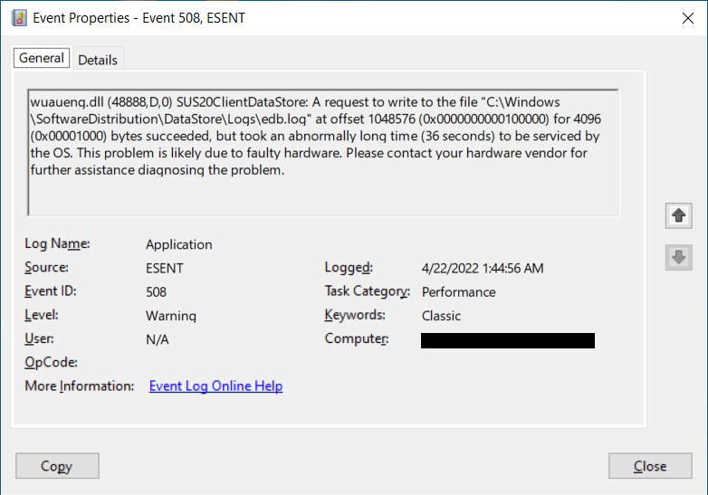

# Performance

## Applications take too long to launch

Ensure there are enough application servers to service peak loads. See the [Server Prerequisites documentation](https://turbo.net/server/setup-and-deployment/prerequisites#prerequisites).

## Applications occasionally freeze up

Ensure the applications do not exhibit this behavior running natively, or virtually on an idle server that meets the hardware requirements. If the issue only occurs under load, check **Windows Task manager** and the **Performance Monitor** to see if additional hardware resources are required.

If memory, CPU, and disk utilization appear normal, check the **Event Viewer** logs for hardware related errors. For example, while disk usage may appear normal, there may be disk failures reported as Windows events, which show up as errors or alerts in the **Performance** category. See examples below:

This may also coincide with any hardware changes that have been made recently.
