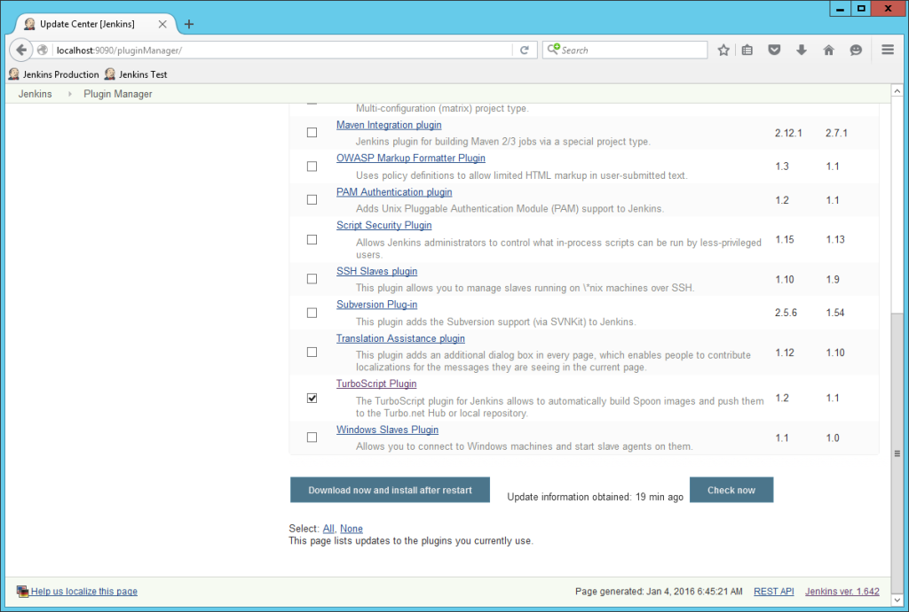
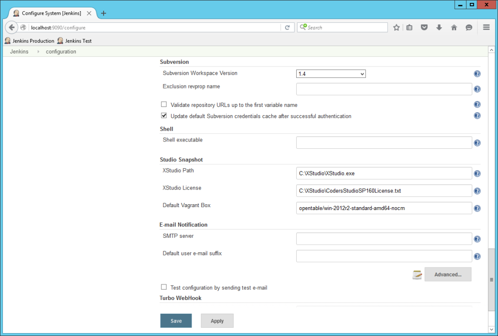
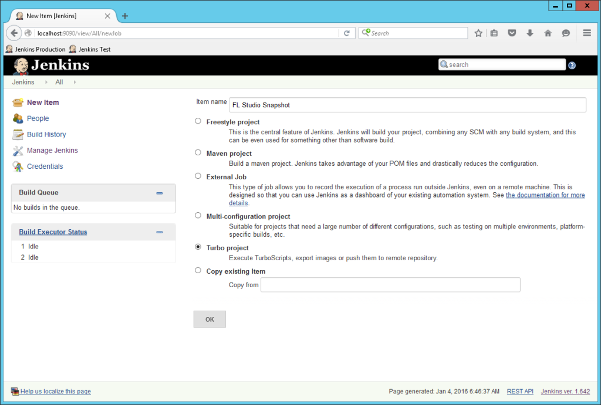
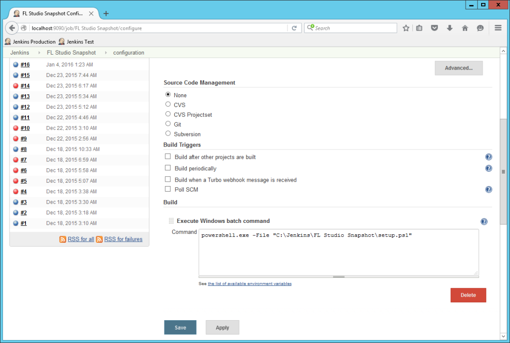
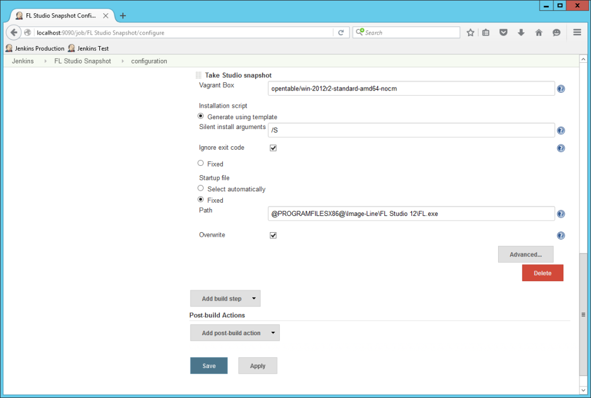
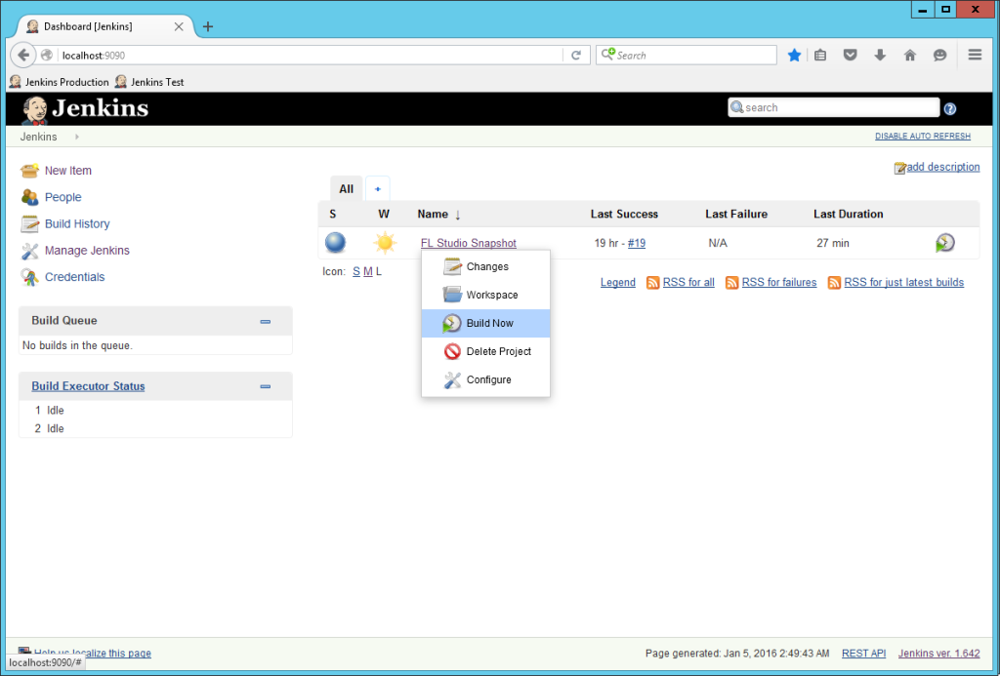

## Using Turbo Studio Snapshot

While many application can be installed directly into Turbo containers through a normal install process or be built using a TurboScript, some applications require the use of snapshots to create a working image.

Snapshotting is a technique for creating images of virtual applications by detecting file system and registry modifications made during installation.

Here we will discuss how to create an automated pipeline for creating snapshot-based application images using Turbo Studio, [Vagrant](https://www.vagrantup.com/) and [Jenkins](https://jenkins.io/). Jenkins is an automation server used to manage automated processes. Vagrant is a tool used to manage virtual machine instances (in our case, VirtualBox).

### The Basics

Creating a virtual application image using snapshots is a multi-step process. It includes taking a snapshot of a clean operating system image before installing an application, performing the installation, and taking the second snapshot after the setup completes. Extra time is required for managing a virtual machine or downloading the application installer. Overall, building application images via snapshot manually is time consuming, so the process benefits dramatically from scaling via automation.

The [TurboScript plugin for Jenkins](https://wiki.jenkins-ci.org/display/JENKINS/TurboScript+Plugin) provides a build step to automate creating snapshot-based application images. With a small amount of configuration Jenkins can perform all tasks necessary to create an application image via snapshot:

- Boot a clean virtual machine
- Take the before snapshot
- Install an application
- Take the after snapshot
- Build an application image
- Import an application image to the local repository on the host machine
- Delete the virtual machine

Features available off the shelf in Jenkins help to further customize the workflow by triggering a build by an external event, downloading an application installer or publishing an image to the Turbo.net Hub.

As an example, we will show how to create a Jenkins build project for [FL Studio](https://www.image-line.com/flstudio/), a popular music production system.

### Initial Setup

The configuration presented below was tested using Jenkins 2.134, Vagrant 1.7.4, and VirtualBox 4.3 installed on Windows 8.1 and Windows Server 2012 R2.

First, install [Jenkins for Windows](https://jenkins.io/download/), [Vagrant](https://www.vagrantup.com/downloads.html), [VirtualBox](https://www.virtualbox.org/wiki/Downloads), and [Turbo Studio](https://turbo.net/download).

The TurboScript plugin for Jenkins uses PowerShell to call external tools like Vagrant and Turbo Studio. To enable execution of PowerShell scripts on the Jenkins host machine, run the command below in an elevated command prompt:

```
> powershell -Command Set-ExecutionPolicy RemoteSigned
```

### Configure Jenkins

Open the Jenkins Plugin Manager and install the latest version of **TurboScript Plugin**.



Go to the Jenkins configuration page and scroll down to the **Studio Snapshot** section.



Specify the file paths to **XStudio.exe** in the Turbo Studio install directory and a license file on Jenkins host machine. If you installed Turbo Studio using default settings, **XStudio.exe** can be found in the **C:\Program Files (x86)\Turbo.net\Turbo Studio 18** folder.

Optionally, you may want to change the default virtual machine used to take snapshots. Boxes are downloaded from Vagrant's Service. The list of boxes is available [here](https://app.vagrantup.com/boxes/search).

### Create the Build Project

Go to the Jenkins dashboard and create a new **Turbo Project**. Name it **FL Studio Snapshot** and click **OK**.



Create a PowerShell script file which downloads the latest FL Studio installer. You can copy the code snippet below:

```
(New-Object System.Net.WebClient).DownloadFile(
    "http://support.image-line.com/redirect/FLStudio_Installer",
    "install.exe")

 $versionInfo = (Get-Item -Path "install.exe").VersionInfo

 $tag = ("{0}.{1}.{2}.{3}" -f $versionInfo.FileMajorPart,
     $versionInfo.FileMinorPart,
     $versionInfo.FileBuildPart,
     $versionInfo.FilePrivatePart)

 "flstudio:$tag" | Set-Content "image.txt"
```

Optionally, the script may create an **image.txt** file in the current working directory. The file should contain the name of the output image. It is considered a best practice to include a product version. In the sample code above the product version is extracted from file attributes.

Save the script file on the Jenkins host machine and execute it in a build step.

To add a build step, use the **Execute Windows batch command** option.



Specify the following command in the build step configuration:

```
powershell.exe -File "path_to_the_script"
```

Next, add a build step **Take Studio snapshot** and setup it in the following way:



Select the **Generate using template** option for installation script.

Specify **/S** to force a silent install.

Select the **Ignore exit code** checkbox.

Use a **Fixed** startup file set to **@PROGRAMFILESX86@\Image-Line\FL Studio 12\FL.exe**. For most applications, the default startup file selection made by Turbo Studio is sufficient.

Optionally, select the **Overwrite** checkbox if you want Jenkins to continue the build in case an image with the same version is already available in the Turbo.net Hub. Otherwise, the build will be aborted.

Save the build project and go back to the main Jenkins dashboard.

### Trigger the Build

Open the context menu next to project name and click **Build Now**.



The build should finish in approximately half an hour. The FL Studio image will be saved in a local repository. If you want to publish it to the Turbo Hub, simply add the build steps **Login to Turbo Hub** and **Push Turbo image**.
