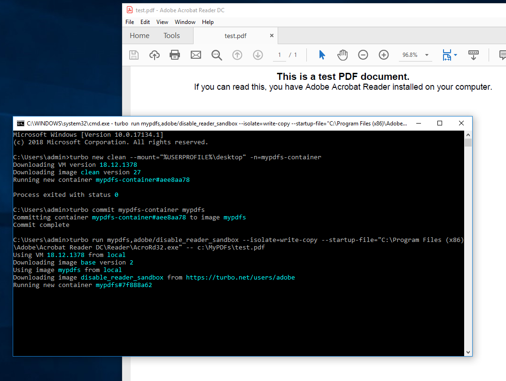

# Integration with Native Applications

Often it is desirable to integrate containers with application toolchains that are installed natively on the machine. Turbo containers have the flexibility to allow this kind of integration. Below we will walk through how to open a .PDF file defined in a container with Adobe Reader which is installed natively on the system.

### Opening with native Adobe Reader

We will start by creating a simple container image which has a .PDF in it that we will want to open. I will source the .PDF from a file on my desktop and copy it into a new folder called "MyPDFs".

```
# start the new container, mounting the directory where the files will be sourced from
> turbo new clean --mount="%USERPROFILE%\desktop" -n=mypdfs-container

# inside the new container, create a folder and copy the files in
(container)> mkdir c:\MyPDFs
(container)> copy "%USERPROFILE%\desktop\test.pdf" c:\MyPDFs
(container)> exit

# now commit the container to a new image
turbo commit mypdfs-container mypdfs
```

Now that we have the new container image **mypdfs**, let's use it with a natively installed Adobe Reader instance. Since the container will need to be able to view the native machine in order to "see" the Adobe Reader files, we will run in **Write-Copy** isolation mode. In this mode, the native machine is visible to the container but any attempts to write to the native machine will be redirected to the container's sandbox.

Also note the use of **adobe/disable-reader-sandbox**. This is used for compatibility of the Adobe Reader instance inside the container.

```
> turbo run mypdfs,adobe/disable-reader-sandbox --isolate=write-copy --startup-file="C:\Program Files (x86)\Adobe\Acrobat Reader DC\Reader\AcroRd32.exe" -- c:\MyPDFs\test.pdf
```



### Running Native Microsoft Edge or Google Chrome in Container

When the Microsoft Edge browser is running, it creates a lockfile at `%LOCALAPPDATA%\Microsoft\Edge\User Data\lockfile`. If the lockfile is merge-isolated, it would prevent another instance of Microsoft Edge from starting in the container. The same issue applies to Google Chrome, but the lockfile will be at its respective folder at `%LOCALAPPDATA%\Google\Chrome\User Data\lockfile`.

To workaround this problem, set the container isolation to **Write-Copy** or **Full**.
If you are using Turbo Server, this can be configured under **File Isolation** in the [Workspace Application Settings](https://hub.turbo.net/docs/server/administration/workspaces#workspace-applications).
If you are using Turbo Client CLI, set this using the `--isolate=write-copy` or `--isolate=full` flag in your turbo [run](https://hub.turbo.net/docs/reference/command-line/run) or [installi](https://hub.turbo.net/docs/reference/command-line/installi) command.

If you need to use **Merge** container isolation for your application scenario, you can use one of our pre-configured isolation layers, which sets the User Data folder to Write-Copy in order to passthrough the user settings to the contianer or Full to start a fresh browser session in the container.

- turbobuild/isolate-edge-wc
- turbobuild/isolate-edge-full
- turbobuild/isolate-chrome-wc
- turbobuild/isolate-chrome-full

Note that if you use Write-Copy isolation and a native browser instance is running, starting the browser in a container will show a message that it closed unexpectedly on the first launch. This occurs because the browser tracks shutdowns in the `%LOCALAPPDATA%\Microsoft\Edge\User Data\Default\Preferences` file and Write-Copy isolation will pick up the value from the native instance that is not shut down. This does not occur on subsequent launches because the file is faulted into the sandbox and separate from its native counterpart.
