# Working with Containers

Turbo containers can be created in several ways:

1. Using Turbo Studio to create a container from scratch or by importing an existing application
2. Using the command line interface to create a container from a Dockerfile
3. Using the command line interface to create a container from an MSI installer

### Creating a Container from an MSI

The command line interface can create containers from MSI installers. This is useful for applications that are distributed as MSI files.

If an MSI install fails try creating the container using [Turbo Studio](/studio/working-with-turbo-studio/getting-started).

```
# Install an MSI
> turbo try --cmd msiexec /i "c:\path\to\installer.msi"
```

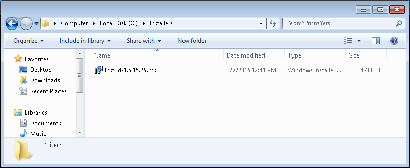

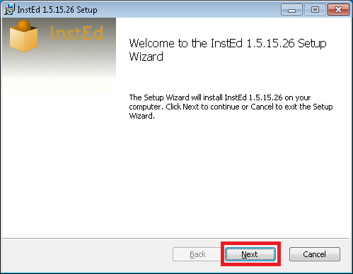

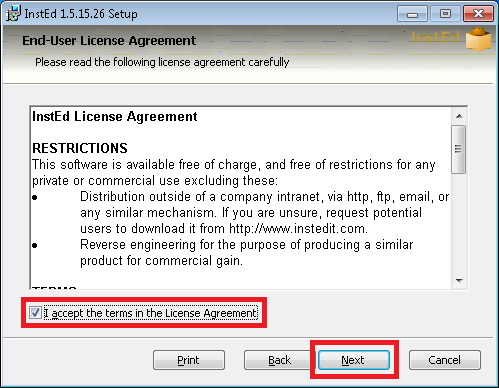

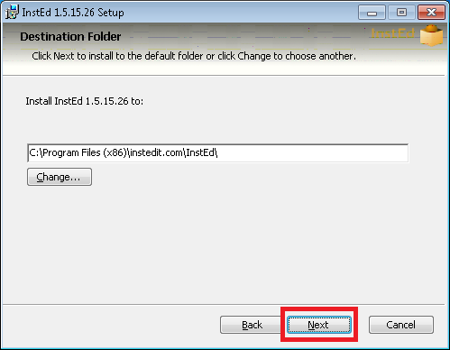

Once you finish editing a container it can be saved and distributed in the form of images. For more information on images read on [here](/deploying/turbo-server).

### Editing a Container

The container editor allows you to modify the filesystem and registry of a container.

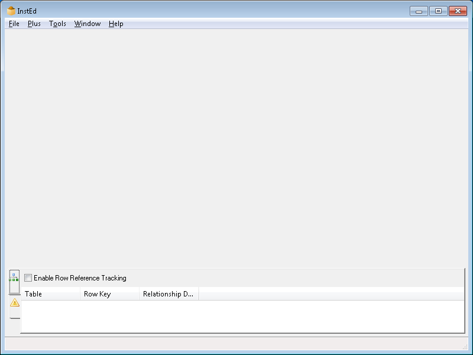

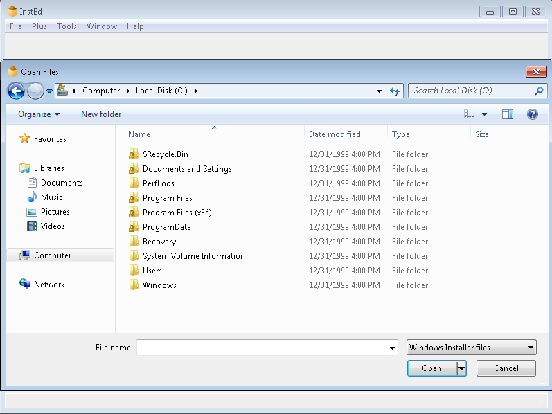

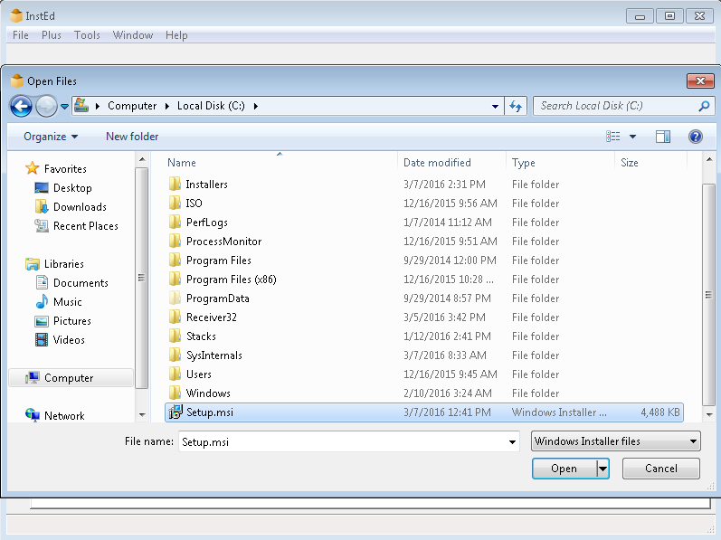

### Publishing to Turbo.net

Once you have created a container you can publish it to Turbo.net.

First sign in to your Turbo.net account:

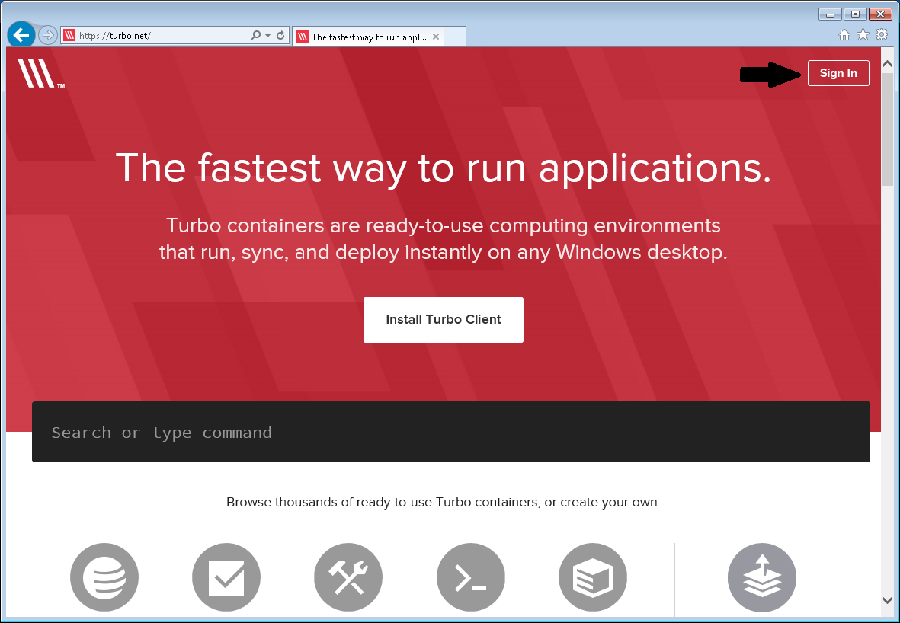

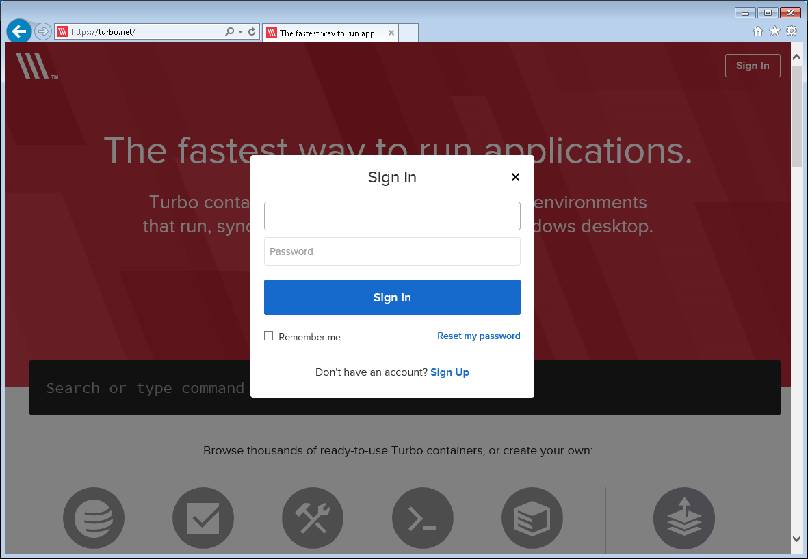

Then publish your container:

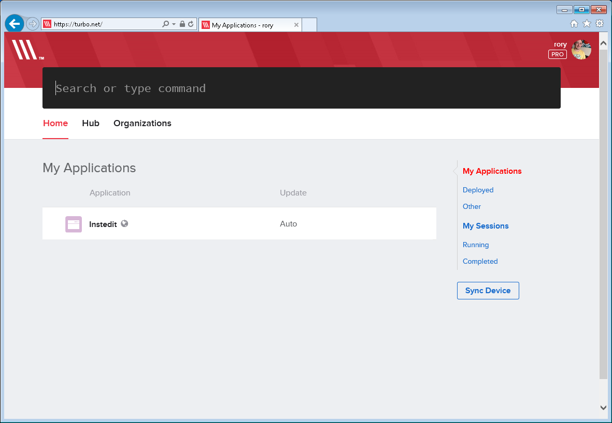

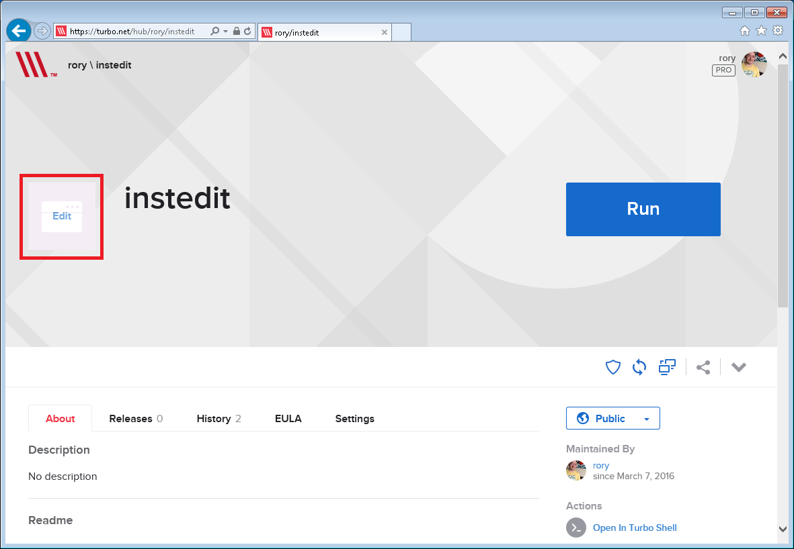

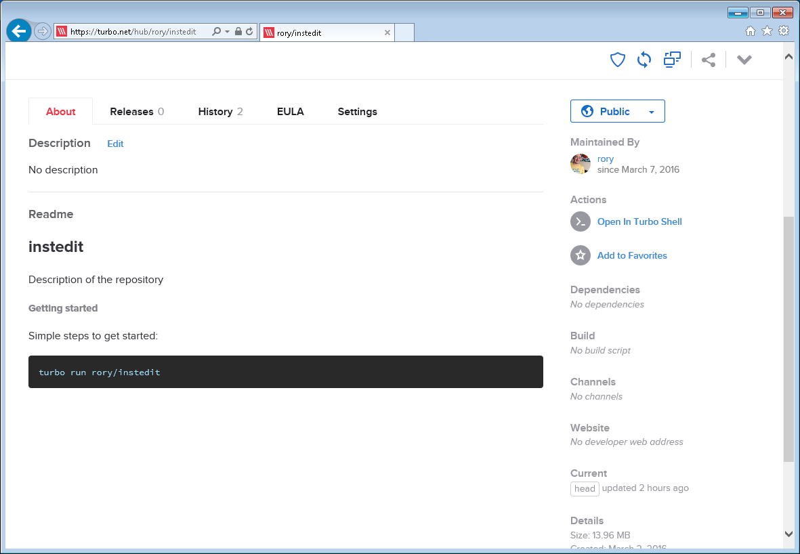

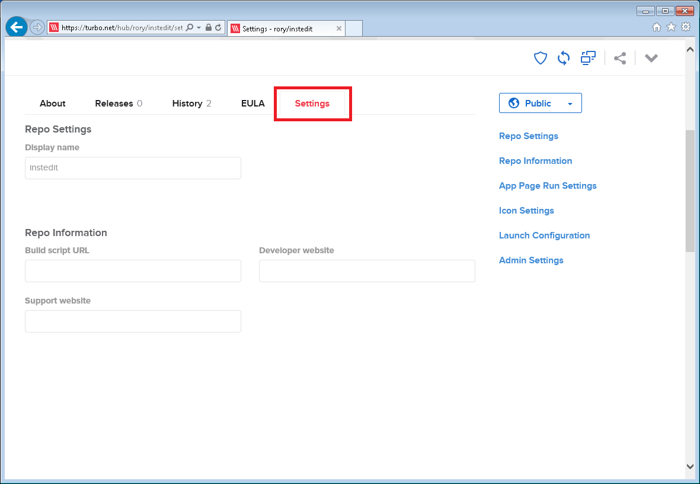

Optionally under **Repo Information** enter a build script URL if you have one. For more information on how to create a build script read on [here](/studio/scenarios/turbonet-build-scripts).

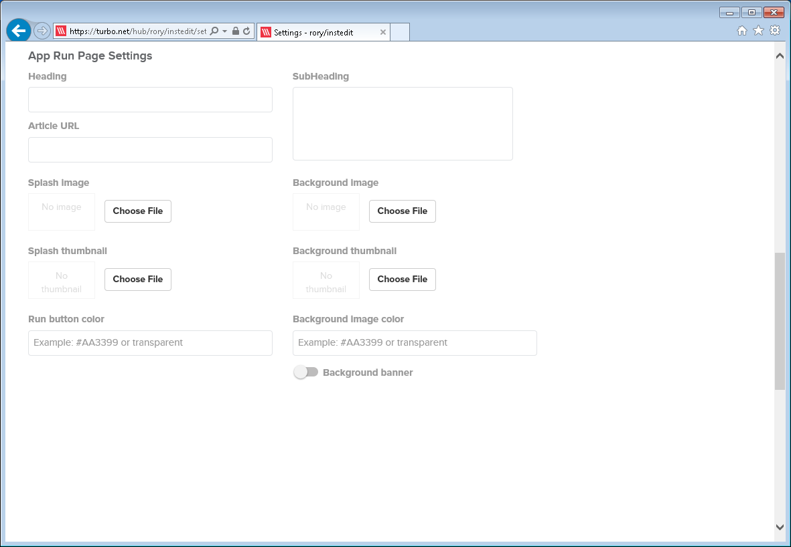

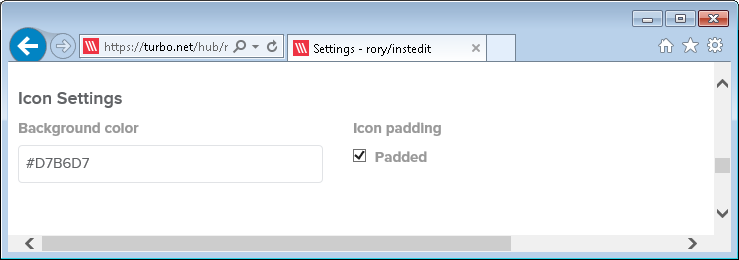

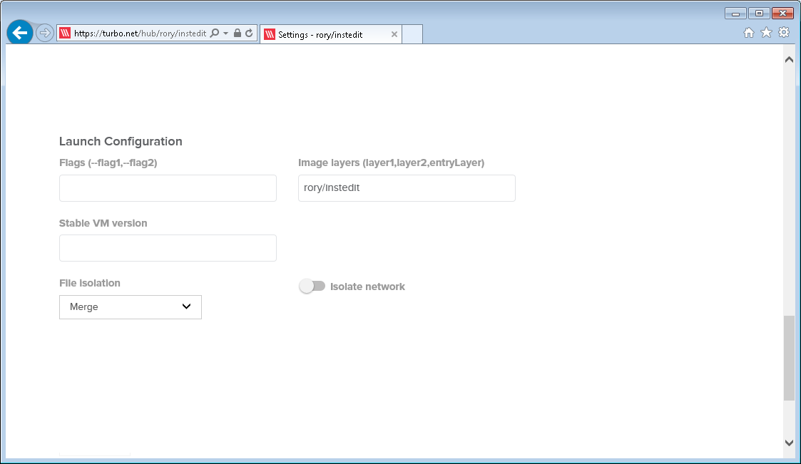

Navigate to **Launch Configuration**. If any additional flags are required for the application to function enter these here. For a list of available flags read [here](/vm/runtime-settings).

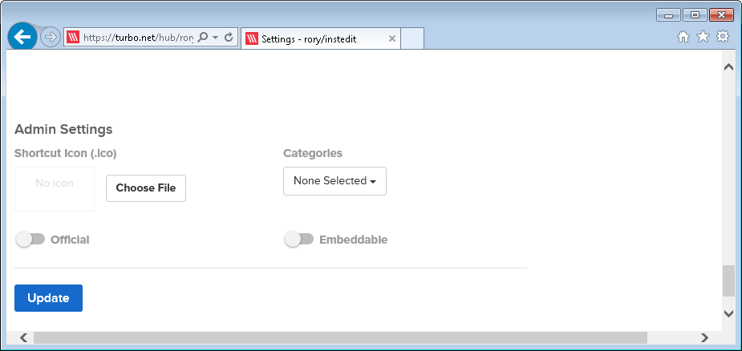

### Container States

Containers can be in one of several states:

```
03bddd8bef   spoonbrew/clean   cmd           8/14/2014 1:03   Stopped
52hd888xa3   local/server-app  startup.bat   8/14/2014 1:00   Running
```

- **Running**: The container is currently executing
- **Stopped**: The container has exited and can be restarted
- **Committed**: The container has been saved as an image
