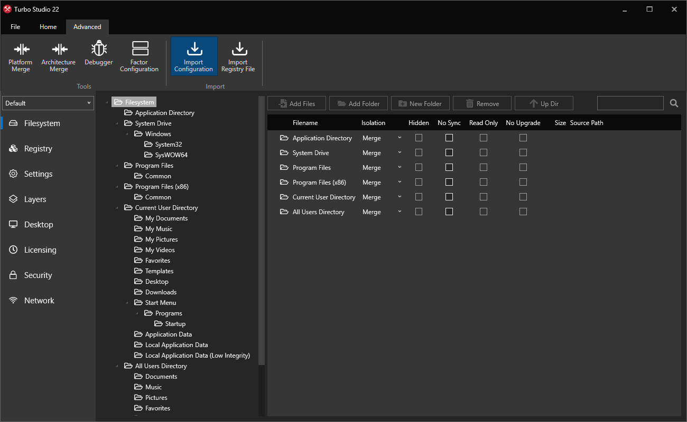

# Import Configuration

The following section details the **Import Configuration** feature available in Turbo Studio. Import Configuration is used to import application packages in various formats into a Turbo Studio configuration that can be built and [deployed](../../deploying/overview/overview.html) to your endpoints.

Supported application package formats are: Microsoft App-V package (.appv), ThinApp configuration (.ini), Microsoft Installer (.msi), and ZENworks application package (.axt).

### Import Wizard



To import an application package into Turbo Studio, please follow these steps:

1. Open Turbo Studio and click on the **Advanced** tab in the task bar
2. Click the **Import Configuration** button
3. Select **File** import type and then click **Next**
4. Browse to the **Configuration file** to import and then click **Next**
5. Browse to the **Destination folder** to where the output will be stored and then click **Next**
6. Wait for the import process to complete. This may take a few minutes.
7. Review the import summary for any warnings and then click **Finish**

Once the import is complete, the configuration will be saved to your destination folder and opened in the Turbo Studio editor.

### App-V Import

Support for App-V packages is currently in beta and is available in Turbo Studio 22.9+.

To import an App-V package, follow the import wizard to the **Select source configuration file** step and select an `.appv` file. Once the import completes, the import summary will display a list of Turbo configuration files that were created as part of the import process. These Turbo configration files include:

- **MyApp.xappl**: The **base configuration** file that contains all virtual files, virtual registry objects, application entry points, and metadata from the App-V package.
- **MyApp_Config.xappl**: The **extensions configuration** file that contains all extension points from App-V package. This include shortcuts, shell extensions, file assocations, and other extension points contained in the App-V package manifest.

Next it is recommended to open each `.xappl` file in Turbo Studio and click **Build** to create the Turbo images. You may also **Build and Run** the base configuration to confirm that the application launches correctly.

The following sections describe how to import dynamic configurations and how to deploy the newly built Turbo images to users.

#### Dynamic Configurations

Support for App-V dynamic configurations is currently in beta and is available in Turbo Studio 22.11+.

Dynamic configurations allows package publishers to customize how their packages run for users or machines without rebuilding the entire package. Turbo supports this same functionality through **layering**.

When importing an App-V package, the importer will look for any `.xml` files in the same directory that are valid dynamic configurations by checking their root element tag name and xmlns. Any valid dynamic configurations will be imported and the following Turbo configuration files will be output:

- **MyApp_UserConfig.xappl**: A **user configuration** file corresponding to each user configuration file located in the App-V package folder.
- **MyApp_DeploymentConfig_User.xappl**: A **deployment user configuration** file corresponding to each deployment configuration file located in the App-V package folder. This includes all user configurations from the deployment configuration.
- **MyApp_DeploymentConfig_Machine.xappl** A **deployment machine configuration** file corresponding to each deployment configuration file located in the App-V package folder. This includes all machine configurations from the deployment configuration.

It is recommended to open each `.xappl` file in Turbo Studio and click **Build** to create the Turbo images.

#### Deploying imported App-V images

Turbo images created from the App-V import process can be deployed by running the **installi** command. Different user and machine configurations can be achieved through the use of **layering**.

For example to deploy an imported App-V package with default extensions to the current user, the extensions image can be layered on top of the base image:

```
turbo installi MyApp,MyApp_Config
```

Once installed, the current user will see shortcuts, file assocations, shell extensions, and other extension points defined in the extensions image. Opening a shortcut, clicking a file with an matching file assocation, or clicking a shell extension will launch the application in the Turbo virtual environment.

We recommend using the following layer combinations to simulate App-V deployments:

- **MyApp,MyApp_Config**: Layers the base image with the default extensions. Equivalent to publishing the App-V package without dynamic configs
- **MyApp,MyApp_UserConfig**: Layers the base image with user extensions. Equivalent to publishing the App-V package with a dynamic user configuration.
- **MyApp,MyApp_DeploymentConfig_Machine,app_DeploymentConfig_User**: Layers the base image with machine extensions. Equivalent to publishing the App-V package with a dynamic deployment configuration.
- **MyApp,MyApp_DeploymentConfig_Machine,app_UserConfig**: Layers the base image with user and machine extensions. Equivalent to publishing the App-V package with a dynamic user configuration and a dynamic deployment configuration.

For more information on deploying applications with Turbo, see [Deploying to a Desktop](../../deploying/to-a-desktop/to-a-desktop.html).

#### App-V Import Known Issues

App-V packages may define multiple application entry points rather than a single startup file. If the App-V package defines a single application entry point then it will be set as the startup file in the Turbo configuration, otherwise no default startup file will be set and the user should select one manually in Turbo Studio after import.

Dynamic configurations registry key deletions are implemented in the Turbo configuration with Hide isolation. Any registry keys with Hide isolation will also hide native registry key of the same name. This differs from the App-V dynamic configuration which will only remove the registry key from the virtual registry.

UserScripts and MachineScripts are not imported automatically. Scripts with application startup and shutdown triggers may be added manually in Turbo Studio from the **Settings > Startup > Scripts** menu.

### Known Issues

Some application package formats may include settings that are not available in the Turbo Studio configuration or vice versa. After importing application packages, the Turbo Studio configuration should be reviewed and tested.

For example, applications that require advanced settings such as **Chromium Virtualization** must be applied manually in Turbo Studio after import.
