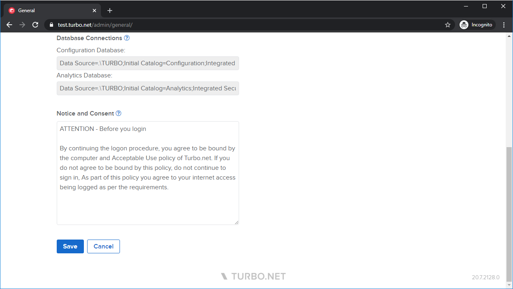
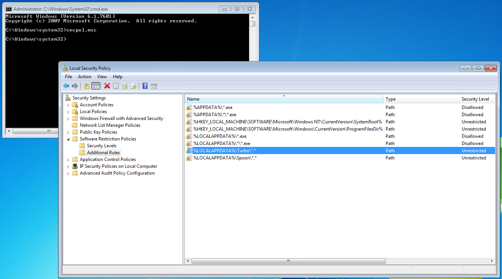

# Antivirus and Security Software

Turbo applications are compatible with all major antivirus and security software vendors. However, there are many configurations of these which can cause errors, hangs, or false positives in Turbo applications. If encountering issues, a good first step is to disable any security software to rule it out as a possible cause. If disabling the security software fixes the issue, further analysis is required to determine if there is indeed a security compromise or if it is an incompatability with your application.

### Add Turbo Folders To Whitelist

Whitelist the following Turbo Client folders in your security software to avoid issues caused by security hooks and false positive detections:

- Turbo Client folder for current user: `C:\Users\*\AppData\Local\Turbo`
- Turbo Client folder for all users: `C:\Program Files (x86)\Turbo`
- Turbo Client repository folder for all users: `C:\ProgramData\Turbo`

On your Turbo Server systems, whitelist the Turbo Server installation folder:

- Turbo Server installation folder: `C:\Program Files\Turbo Server`

### Sophos Endpoint Protection

In some configurations, Sophos Endpoint Protection application hooks can cause hangs in Turbo applications. If this is the case, exclusions can be added to prevent Sophos from inserting itself into the containerized application.

Add the Turbo folders from the section above to the exclusions for [Real-time and scheduled scans](https://docs.sophos.com/central/customer/help/en-us/ManageYourProducts/GlobalSettings/GlobalExclusions/ExclusionVariablesWindows/index.html) as well as [Exploit Mitigation and Activity Monitoring](https://docs.sophos.com/central/customer/help/en-us/ManageYourProducts/GlobalSettings/GlobalExclusions/ExploitExclusions/index.html):

- Turbo Client folder for current user: `C:\Users\*\AppData\Local\Turbo\**`
- Turbo Client folder for all users: `C:\Program Files (x86)\Turbo\**`
- Turbo Client repository folder for all users: `C:\ProgramData\Turbo\**`
- Turbo Server installation folder: `C:\Program Files\Turbo Server\**`

If the system is encountering issues with DynamicShellcode false positive detections preventing the execution of the Turbo container, disable the **Dynamic shellcode protection setting** in your policy.



If exclusions are not possible, the incompatibility may be mitigated by precaching the Turbo VM engine assemblies to disk rather than loading dynamically at runtime. This is done by executing the bootstrap executable with `/XPrecache=vm` (ex: "turbo-studio.exe /XPrecache=vm" or "turbo-xvm.exe /XPrecache=vm"). This will write vm.dll to the same folder as the bootstrap executable where it will be loaded on container launch. This feature is available on bootstrap executables that were built with Turbo Studio v23.6 or greater.

### CylancePROTECT

CylancePROTECT has a known incompatibility with Turbo when the device policy has **Memory Protection > Exploitation > System DLL Overwrite** setting enabled and set to **Block** or **Terminate**.


To resolve the incompatibility, customers can disable the setting by changing it to **Alert** or **Ignore**, or add the following path exclusions in the **Memory Actions** tab:

- Turbo Client folder for current user: `C:\Users\**\AppData\Local\Turbo\**\*`
- Turbo Client folder for all users: `C:\Program Files (x86)\Turbo\**\*`
- Turbo Client repository folder for all users: `C:\ProgramData\Turbo\**\*`
- Turbo Server installation folder: `C:\Program Files\Turbo Server\**\*`


### BeyondTrust Privilege Guard

Customers who have BeyondTrust Privilege Guard should add Managed Hook and Driver Exclusions for the Turbo folders listed above and the Turbo Client installer.

### Application Restriction Software

Turbo applications may be blocked by system security settings or third-party security software.

#### Software Restriction Policies

When Turbo applications are blocked by [Software Restriction Policies](https://docs.microsoft.com/en-us/windows-server/identity/software-restriction-policies/software-restriction-policies), users may observe an error that the program is blocked by group policy (0x800704EC) in a dialog or in the Turbo Client logs.

```
This program is blocked by group policy. For more information, contact your system administrator. (Exception from HRESULT: 0x800704EC)
   at System.Runtime.InteropServices.Marshal.ThrowExceptionForHRInternal(Int32 errorCode, IntPtr errorInfo)
   at Turbo.Vm.VirtualProcess.x12cb12b5d2cad53d(VirtualAppSession x1789a265a1108ddf, String xec0f124a7b85667a, VirtualAppStartInfo x650dda3e03fb5a9e, Boolean xa6a8bc5bc368bc71, Boolean x07100de31e1be915, IDictionary`2 x966cca5672ec6936)
   at Turbo.Vm.VirtualAppSession._xcf1682d7276daad0(String xc6e100ad3a65deca, String xaf6a3319e1db77a1, String xb7644b5d9a43f566, String x98b7b04a664dbfaf, String x29544171d168e2c9, String x69f8fd408366b54c, IDictionary`2 x966cca5672ec6936)
   at Turbo.Client.Manager.Pipeline.Execution.x731f69fa672a5774.x160a0bf4de8f6bd0(String xc6e100ad3a65deca, String xaf6a3319e1db77a1, String x9bf12c1ae17c44a0)
   at Turbo.Client.Manager.ClientRequest.ExecuteDownload(String sArguments, Boolean fForceArguments)
```

To resolve the issue, add an exemption in the Software Restriction Policies for the Turbo Client folders by creating the following rules:

- Name: %LOCALAPPDATA%\\Turbo\\\*.\*
  Type: Path
  Security Level: Unrestricted
- Name: C:\\Program Files (x86)\\Turbo\\\*.\*
  Type: Path
  Security Level: Unrestricted



#### Windows Applocker

When Turbo applications are blocked by [Windows Applocker](https://docs.microsoft.com/en-us/windows/security/threat-protection/windows-defender-application-control/applocker/applocker-overview), users may observe an error that the program is blocked by group policy (0x800704EC) in a dialog or in the Turbo Client logs.

Administrators will also see an event in **Event Viewer\\Applications and Services Logs\\Microsoft\\AppLocker** when a software is blocked.

To resolve the issue, add an exemption in the AppLocker Executable Rules for the Turbo Client folders by creating the following rules:

- Permission: Allow
  User or group: Everyone
  Condition: Path: C:\\Users\\\*\\Appdata\\Local\\Turbo\\\*
- Permission: Allow
  User or group: Everyone
  Condition: Path: C:\\Program Files (x86)\\Turbo\\\*
- Permission: Allow
  User or group: Everyone
  Condition: Path: C:\\ProgramData\\Turbo\\\*

#### Symantec Endpoint Protection

For customers who use Symantec Endpoint Protection, the system administrator should review the security configuration under **SEP Manager > Application and Device Control policy > Application Control** to ensure that Turbo applications are not being blocked.
