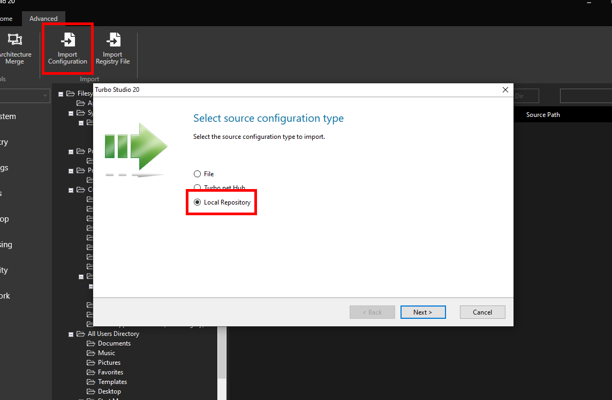
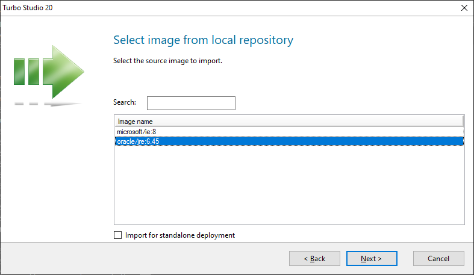
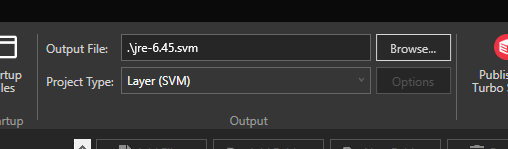
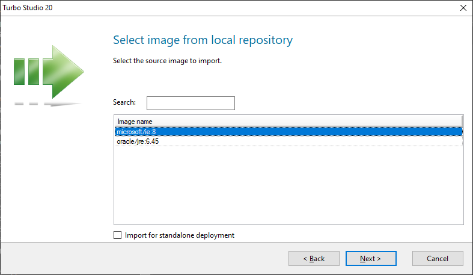
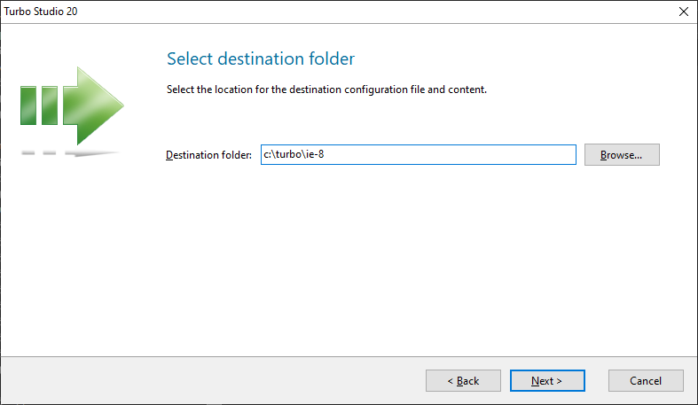
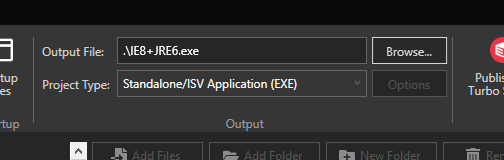
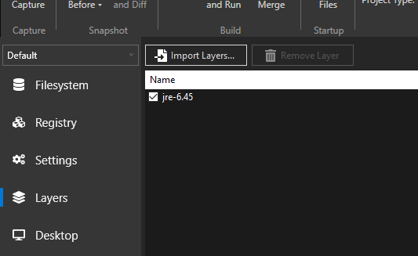
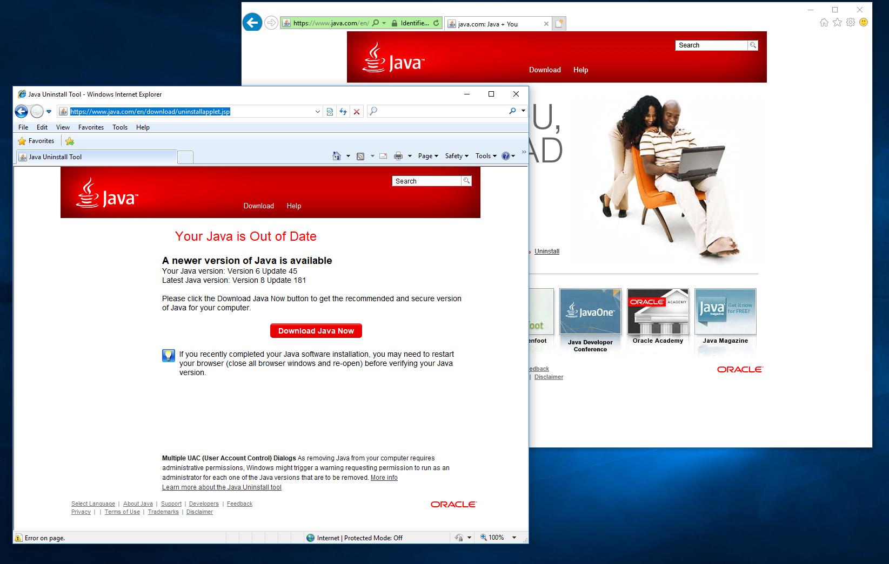

## Legacy Internet Explorer and Java

A common use case in enterprise environments is using legacy Internet Explorer browser with old versions of Java. Many line of business web applications and plugins no longer work with the latest browsers. Using a legacy browser container can solve that problem and still allow your users to have all the latest operating system patches.

Below is a step-by-step guide showing how to build a standalone executable that packages Internet Explorer 8 with Java 6.

Begin by installing the Turbo Client and Turbo Studio. You can get the latest version of each [here](https://turbo.net/download).

With the Turbo Client installed, pull the images that we need from the Turbo.net hub:

```
# pull internet explorer 8
> turbo pull ie:8

# pull java 6
> turbo pull jre:6
```

Now we will need to import those images into Turbo Studio to use. Starting with our Java 6 image, import the image from the local repository.



Select **oracle/jre:6.45**.



Save the imported image to a location on your machine. Here, **c:\turbo\jre-6.45** was chosen.


Once the import is complete, set the **Project Type** to "Layer (.svm)" and set the **Output File** to "jre-6.45.svm". Save and build. You will now have **c:\turbo\jre-6.45\jre-6.45.svm**.



Now we need to import our Internet Explorer 8 image. Import from the local repository and select **microsoft/ie:8**.



Save the imported image to **c:\turbo\ie-8**.



Change the **Output File** to "IE8+JRE6.exe" (or any other appropriate name for your scenario).



Add jre-6.45.svm to your layers library by clicking the **Layer** button and then **Import Layers...**. Select **c:\turbo\jre-6.45\jre-6.45.svm**. Select **jre-6.45** in the layers list.



Save and build. Below is an image of our new IE8+JRE6 standalone executable running side-by-side with native Internet Explorer 11 on Windows 10.


