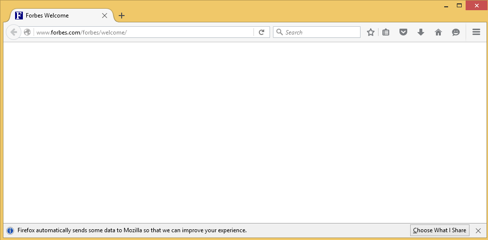

## IP Routing

Turbo container IP routing can be used to map container network ports to those on the native machine. This is possible using the **--route-add** flag.

The syntax for the **--route-add** flag is **&lt;protocol&gt;://&lt;containerPort&gt;:&lt;hostPort&gt;**. For example, to map container TCP port 8080 to host port 80, you would use the command flag `--route-add=tcp://8080:80`.

In addition, the **ip** protocol is supported which applies routing to _all_ IP-based communication. For example, the command `--route-block=ip` blocks all IP traffic. Subsequent **--route-add** flags can be appended to whitelist specific IP addresses.

It is also possible to map a container port to a random high host port for security purposes or to avoid binding conflicts. This port can subsequently be queried with the **turbo netstat** command. To map container TCP port 4321 to a high random host port, use the flag `--route-add=tcp://4321:0`. The **0** here represents a randomly assigned high port.

### Sample: PuTTY Whitelisting

PuTTY is a popular free Telnet client for Windows. To create a PuTTY container with all outbound access blocked except to IP address 10.0.0.34:

```
> turbo new putty --route-block=ip --route-add=ip://10.0.0.34
```

Now let’s reroute all traffic from **1.1.1.1** to **10.0.0.34**, making it possible to connect to host at **10.0.0.34** typing address **1.1.1.1** in PuTTY:

```
> turbo new putty --route-block=ip --route-add=ip://10.0.0.34 --route-add=ip://1.1.1.1:10.0.0.34
```

It is also possible to block or map IP _ranges_ using the CIDR notation. For example, the following command allows PuTTY in the container to connect only to hosts in the **192.168.1.0/24** network:

```
> turbo new putty --route-block=ip --route-add=ip://192.168.1.0/24
```

To disallow connection to a set of specific set of IP addresses or ranges (“blacklisting”), simply specify them in the **--route-block** parameter:

```
> turbo new putty --route-block=ip://10.0.0.34
```

The **--route-add** and **--route-block** command flags are also supported within the **commit** command, so it is easy to save custom network stacks into deployable images.

### Host Name-based IP Restrictions

This syntax also allows specifying host names instead of IP addresses. Often using a human-readable domain name is easier to setup, more readable, and is automatically maintained across IP address changes. When a host name is specified, it is treated as if its IP address had been specified. Cases where multiple IP addresses are resolved — including IPv6 — are handled properly. Note however that you cannot specify a host name on the right side of a route-add mapping since the result would be ambiguous if the host name resolved to multiple IP addresses.

For example, to run a Chrome container allowing only access to the **turbo.net** and **blog.turbo.net** domains, you can use the command:

```
> turbo new --route-block=ip --route-add=ip://turbo.net --route-add=ip://blog.turbo.net chrome https://turbo.net
```

Wildcards are supported in host name routing. For example, to unblock turbo.net and all of its subdomains, use the command:

```
> turbo new --route-block=ip --route-add=ip://*.turbo.net chrome https://blog.turbo.net
```

Taking this a step further, to run a Chrome container disallowing access to the **facebook.com** domain and all of its subdomains:

```
> turbo new --route-block=ip://*.facebook.com chrome
```

### Creating IP Routing Layers

If you need to apply the same set of IP routing rules across multiple applications, it is inconvenient to repeat them each time you create a container. In this situation, you can create a layer containing the appropriate IP routing rules and apply it to all of the applicable containers.

For example, to create a layer that blocks access to all IP addresses except the **turbo.net** domain, the network **192.168.1.0/24**, and **127.0.0.1**, first create a container with the rules:

```
> turbo new --name=network-blocking-container --route-block=ip --route-add=ip://turbo.net --route-add=ip://192.168.1.0/24 --route-add=ip://127.0.0.1
```

We then commit the routing container to a new image called **network-blocking-layer**:

```
> turbo commit network-blocking-container network-blocking-layer
```

We can now use this layer together with any image:

```
> turbo new network-blocking-layer,firefox https://turbo.net
> turbo new network-blocking-layer,putty -ssh 192.168.1.1
```

These applications can in turn be committed to a new image that is ready for deployment:

```
> turbo commit firefox firefox-restricted
> turbo run firefox-restricted
```

### IPv6 Routing

IPv6 address are also supported by this network syntax. The colons in IPv6 addresses causes conflicts with this syntax however. To solve this, IPv6 addresses in Turbo commands are enclosed in square brackets.

For example, to block the localhost address, use the command:

```
> turbo new putty --route-block=ip://[::1]
```

To block all IP traffic except the link local IPv6 space. Notice we can use the CIDR notation to specify a range of addresses.

```
> turbo new putty --route-block=ip --route-add=ip://[fe80::c218:85ff:febd:5c01/64]
```

To redirect traffic from a specific IPv6 address to localhost:

```
> turbo new putty --route-block=ip --route-add=ip://[2001:cdba::3257:9652]:[::1]
```

### Routing Files

While working with long routing lists (eg to block advertising or other undesired sites) it is inconvenient to add many **--route-block** and **--route-add** flags to command line or TurboScript file. To simplify this, we use the **--route-file** flag.

The routing file has a simple INI-style syntax:

```
[<protocol-action>]
Host-address
```

The header contains the definition for how the below addresses should be interpreted. Supported protocols are **ip**, **tcp**, and **udp** and supported actions are **add** and **block**.

To block/unblock all IP addresses we can use the **0.0.0.0** literal or **\***.

For example, a routing file that blocks all IP traffic except turbo.net/spoon.net addresses:

```
[ip-block]
*
[ip-add]
*.turbo.net
*.spoon.net
```

The route file can be used with all other container management commands. For example:

```
> turbo try firefox --route-file=routes.txt --name=turbo-firefox
```

It can also be used during commit to persist routing settings into an image:

```
> turbo new firefox --name=fx
> turbo commit fx turbo-firefox –route-file=routes.txt
```

And can be included in a TurboScript build command:

```
> turbo build turbo.me --route-file=routes.txt
```

### Blocked Site Routing

IP routing can also be used to reroute traffic from blocked sites to an internal network. As an example, we will reroute all traffic from **nytimes.com** to an internal containerized web server.

First, we run a preconfigured Apache server that binds to local port **80**:

```
> turbo new apache/apache-samples --detach
```

Next, we run **firefox** with routing enabled:

```
# route nytimes.com traffic to local web server
turbo new firefox --route-add=ip://*.nytimes.com:127.0.0.1
```

After typing nytimes.com in browser it shows our custom page, instead of original site:


### Sample: Creating Single Site Browsers

Turbo’s IP routing capabilities can be used to create custom browsers that allow access only to a specific site or set of sites. A simple solution was shown in previous articles, eg:

```
> turbo new firefox --route-block=ip --route-add=ip://*.turbo.com --route-add=ip://*.spoon.com
```

The above command works for simpler websites, but more advanced websites use resources from multiple external sources. We need to allow access to those external sites for the site to load properly.

To simplify the process of creating a routing file for this scenario, we have published a PowerShell script to help. In this example we will show how to obtain this script and use it to create a **forbes.com** limited browser.

First, download the script from **turboapps** repository: [route-file-builder.ps1](https://github.com/turboapps/tools/blob/master/scripts/route-file-builder.ps1)

Example script usage:

```
PS> Route-file-builder.ps1 -urls “http://turbo.net”

PS> Route-file-builder.ps1 -urls (“http://turbo.net”, “http://spoon.net”) -routeFile c:\path\to\routes.txt
```

When the **-routeFile** flag is not passed, output is printed to the console.

The script runs the container in the background with a fully blocked network and iteratively unblocks hosts that the website tries to connect to.

Let’s run it for **forbes.com**:

```
PS > .\route-file-builder.ps1 -urls forbes.com -routeFile c:\s\forbes-routes.txt
Security warning
Run only scripts that you trust. While scripts from the Internet can be useful,
this script can potentially harm your computer. If you trust this script, use
the Unblock-File cmdlet to allow the script to run without this warning
message. Do you want to run C:\s\route-file-builder.ps1?
[D] Do not run [R] Run once [S] Suspend [?] Help (default is "D"): R
Running browser...
Did everything work correctly? (y/n):
```

In every iteration, the script opens **firefox** to the **forbes.com** site. After closing the browser it asks the user if the site was displayed correctly. Repeat the process until the web page displays correctly.



In the first iteration firefox is not displaying anything, so we choose **n**

```
Running browser...
Did everything work correctly? (y/n): n
Running browser...
Did everything work correctly? (y/n): n
Running browser…
Did everything work correctly? (y/n): y
```

After the fourth iteration the site is displayed correctly. Now we answer yes and script ends.


Now we can open the **forbes-routes.txt** file and check all the unblocked hosts:

```
[ip-add]
*.forbes.com
127.0.0.1
tiles.r53-2.services.mozilla.com
tiles.services.mozilla.com
location.services.mozilla.com
i.forbesimg.com
a1586.g1.akamai.net
self-repair.mozilla.org
shavar.services.mozilla.com
shavar.prod.mozaws.net
aus5.mozilla.org
aus5.external.zlb.scl3.mozilla.com
safebrowsing.google.com
sb.l.google.com
services.addons.mozilla.org
olympia.prod.mozaws.net
versioncheck-bg.addons.mozilla.org
blocklist.addons.mozilla.org
ocsp.digicert.com
search.services.mozilla.com
tiles-cloudfront.cdn.mozilla.net
www.googletagmanager.com
b.scorecardresearch.com
stats.g.doubleclick.net
tags.bluekai.com
consent.truste.com
contextual.media.net
rt.liftdna.com
www.googletagservices.com
cs9.wac.phicdn.net
tracking-protection.cdn.mozilla.net
connect.facebook.net
content.dl-rms.com
h.nexac.com
forbescount.xmlshop.biz
a1.vdna-assets.com
ml314.com
load.amexp.exelator.com
ox-d.forbesbidder.servedbyopenx.com
partnerad.l.doubleclick.net
us-ads.openx.net
ib.adnxs.com
ssum.casalemedia.com
medianet-d.openx.net
qsearch.media.net
[ip-block]
0.0.0.0
```

As an additional step, it is possible to manually cleanup the list (eg remove the Mozilla sites) and prepare a minimal working configuration.

The routing data can later be committed into a new image with `turbo commit --route-file` command.
